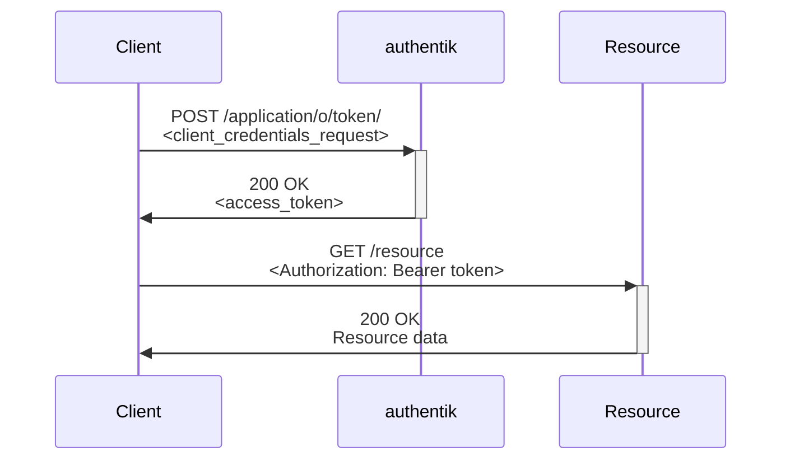

The OAuth 2.0 specification includes the client credentials grant which allows machine-to-machine (M2M) communication authentication, bypassing user involvement. In authentik, machine clients do not authenticate using the typical `client_id` + `client_secret`. This is due to OAuth providers only being able to have a single secret at any given time.

Hence identification is based on a username, and authentication is based on app password tokens.



## Static authentication

All user account types; internal, external and service account, can be used for authentication. These can be created manually beforehand or [automatically during authentication](#automatic-service-account-creation).

authentik treats a grant type of `password` the same as `client_credentials` to support applications which rely on a password grant. Scopes, if required, must be defined in the request, and follow the same behaviour as other OAuth requests.

### Example request

An example request:

```http
POST /application/o/token/ HTTP/1.1
Host: authentik.company
Content-Type: application/x-www-form-urlencoded

grant_type=client_credentials&
client_id=<client_id>&
username=<username>&
password=<app_password>&
scope=profile
```

This will return a JSON response with an `access_token`, which is a signed JWT token. This token can be sent along with requests to other hosts, which can then validate the JWT based on the signing key configured in authentik.

### Base64 encoded username and app password

It's also possible to encode the username and app password of the user to authenticate with, separated with a colon, into a base64 string and pass it as `client_secret` value, for example:

```http
POST /application/o/token/ HTTP/1.1
Host: authentik.company
Content-Type: application/x-www-form-urlencoded

grant_type=client_credentials&
client_id=<client_id>&
client_secret=<base64(username:token)>&
scope=profile
```

### Automatic service account creation

Alternatively, it's possible to pass the configured `client_secret` value of an OAuth provider, in which case authentik will automatically generate a service account for which the JWT token will be issued, for example:

```http
POST /application/o/token/ HTTP/1.1
Host: authentik.company
Content-Type: application/x-www-form-urlencoded

grant_type=client_credentials&
client_id=<client_id>&
client_secret=<client_secret>&
scope=profile
```

The automatically generated service account will follow this naming scheme: `ak-<provider_name>-client_credentials`. Currently the service account creation settings can not be altered.

## JWT authentication

For both externally and authentik issued JWTs, authentik will create a service account which is based on the provider name and the subject claim of the token that authentik is given. You may end up with multiple service accounts depending on the tokens that are provided to authentik. These service accounts will expire and be deleted based on the expiry claim (if set) of the token that authentik is given.

### Externally issued JWTs

You can authenticate and get a token using an existing JWT. For readability we will refer to the JWT issued by the external issuer/platform as input JWT, and the resulting JWT from authentik as the output JWT.

To configure this, define a JWKS URL/raw JWKS data in OAuth Sources. If a JWKS URL is specified, authentik will fetch the data and store it in the source, and then select the source in the OAuth2 Provider that will be authenticated against.

With this configuration, any JWT issued by the configured sources' certificates can be used to authenticate:

```http
POST /application/o/token/ HTTP/1.1
Host: authentik.company
Content-Type: application/x-www-form-urlencoded

grant_type=client_credentials&
client_assertion_type=urn:ietf:params:oauth:client-assertion-type:jwt-bearer&
client_assertion=<inputJWT>&
client_id=<client_id>
```

Alternatively, you can set the `client_secret` parameter to `<inputJWT>`, for applications that can set the password from a file but not other parameters.

Input JWTs are checked to verify that they are signed by any of the selected _Federated OIDC Sources_, and that their `exp` attribute is not set as now or in the past.

To dynamically limit access based on the claims of the tokens, you can use [Expression policies](../../../customize/policies/expression.mdx), for example:

```python
return request.context["oauth_jwt"]["iss"] == "https://my.issuer"
```

Other information that's available in the policy expression context:

- `request.context["oauth_scopes"]` - list of scope names requested
- `request.context["oauth_grant_type"]` - the grant type
- `request.context["oauth_code_verifier"]` - a string or none

If you're authorizing with a JWT, then `request.context["oauth_jwt"]` is available which is the parsed JWT as a dictionary.

### authentik-issued JWTs:ak-version[2024.12]

To allow federation between providers, modify the provider settings of the application (whose token will be used for authentication) to select the provider of the application to which you want to federate.

With this configuration, any JWT issued by the configured providers can be used to authenticate:

```http
POST /application/o/token/ HTTP/1.1
Host: authentik.company
Content-Type: application/x-www-form-urlencoded

grant_type=client_credentials&
client_assertion_type=urn:ietf:params:oauth:client-assertion-type:jwt-bearer&
client_assertion=<inputJWT>&
client_id=<client_id>
```

Alternatively, you can set the `client_secret` parameter to `<inputJWT>`, for applications which can set the password from a file but not other parameters.

Input JWTs must be valid access tokens issued by any of the configured _Federated OIDC Providers_, they must not have been revoked and must not have expired.

To dynamically limit access based on the claims of the tokens, you can use [Expression policies](../../../customize/policies/expression.mdx), for example:

```python
return request.context["oauth_jwt"]["iss"] == "https://my.issuer"
```

Other information that's available in the policy expression context:

- `request.context["oauth_scopes"]` - list of scope names requested
- `request.context["oauth_grant_type"]` - the grant type
- `request.context["oauth_code_verifier"]` - a string or none

If you're authorizing with a JWT, then `request.context["oauth_jwt"]` is available which is the parsed JWT as a dictionary.

## Troubleshooting

### More detailed error information

If you receive any error response from authentik it will only be a generic error, error description, and the `request_id`.

However, more detailed error information can be obtained from the [authentik server container logs](../../../troubleshooting/logs.mdx) by searching for the `request_id` that you're experiencing issues with.

### OAuth introspection endpoint

To use the OAuth introspection endpoint to obtain more information on a token, you must first authenticate to it.

You are only able to introspect a token from the same provider that was used to authenticate, or you must exchange the token for a token from the provider as described above.

### Event logging

All of these authentication methods will create a login event in the event logs, rather than an authorization event. The event logs will contain different information depending on the scenario:

| Scenario                                                                                                      | Authentication Method | Authentication Arguments                     |
| ------------------------------------------------------------------------------------------------------------- | --------------------- | -------------------------------------------- |
| [Static authentication using credentials](#static-authentication)                                             | `token`               | Dictionary containing the token identifier   |
| [Static authentication and automatically generating the service account](#automatic-service-account-creation) | `oauth_client_secret` | N/A                                          |
| [JWT authentication](#jwt-authentication)                                                                     | `JWT`                 | Parsed JWT + reference to source or provider |
