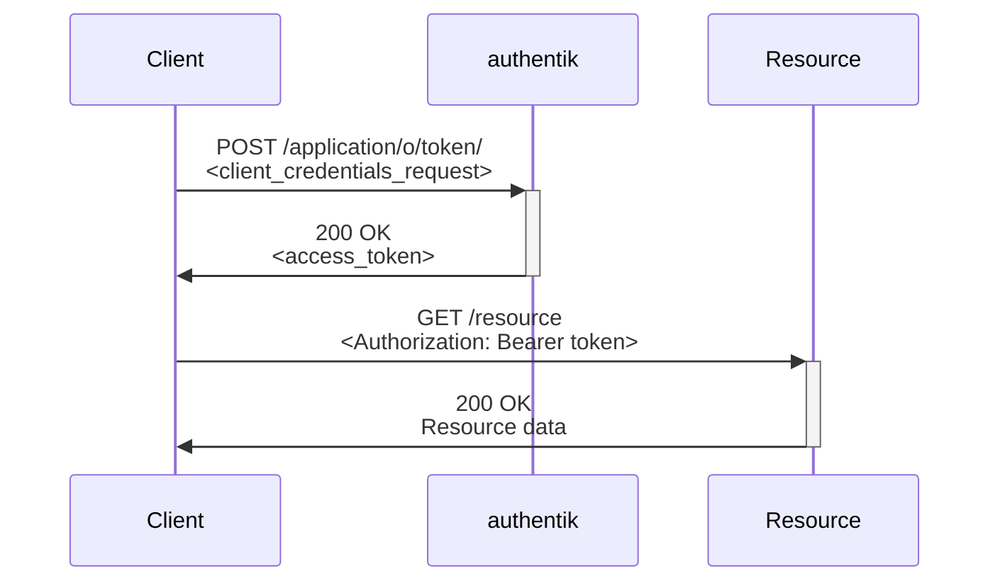

The OAuth 2.0 specification includes the client credentials grant, which allows machine-to-machine (M2M) authentication without user involvement. In authentik, machine clients do not authenticate using the typical `client_id` + `client_secret` combination. This is because OAuth providers can only have a single secret at any given time.

Instead, identification is based on a username, and authentication is based on app password tokens.


```mermaid
sequenceDiagram
    participant Client
    participant authentik
    participant Resource

    Client->>+authentik: POST /application/o/token/<br><client_credentials_request>
    authentik->>-Client: 200 OK<br/><access_token>
    Client->>+Resource: GET /resource<br/><Authorization: Bearer token>
    Resource->>-Client: 200 OK<br/>Resource data

```

## Static authentication

All user account types, including internal users, external users, and service accounts, can be used for authentication. These can be created manually beforehand or [automatically during authentication](#automatic-service-account-creation).

authentik treats a grant type of `password` the same as `client_credentials` to support applications that rely on a password grant. Scopes, if required, must be defined in the request and follow the same behavior as other OAuth requests.

To include custom claims from scope mappings in the issued JWT, select the scope mappings on the OAuth2 provider and request their scope names in the token request with the `scope` parameter, for example `scope=profile custom-scope`.

### Request with username and app password

**Example**:

```http
POST /application/o/token/ HTTP/1.1
Host: authentik.company
Content-Type: application/x-www-form-urlencoded

grant_type=client_credentials&
client_id=<client_id>&
username=<username>&
password=<app_password>&
scope=profile
```

This will return a JSON response with an `access_token`, which is a signed JWT token. This token can be sent along with requests to other hosts, which can then validate the JWT based on the signing key configured in authentik.

### Request with Base64-encoded username and app password

You can also encode the username and app password of the user to authenticate with, separated by a colon, into a base64 string and pass it as the `client_secret` value.

**Example**:

```http
POST /application/o/token/ HTTP/1.1
Host: authentik.company
Content-Type: application/x-www-form-urlencoded

grant_type=client_credentials&
client_id=<client_id>&
client_secret=<base64(username:token)>&
scope=profile
```

### Automatic service account creation

Alternatively, you can pass the configured `client_secret` value of an OAuth provider. In that case, authentik automatically generates a service account for which the JWT token will be issued.

**Example**:

```http
POST /application/o/token/ HTTP/1.1
Host: authentik.company
Content-Type: application/x-www-form-urlencoded

grant_type=client_credentials&
client_id=<client_id>&
client_secret=<client_secret>&
scope=profile
```

The automatically generated service account follows this naming scheme: `ak-<provider_name>-client_credentials`. Currently, the service account creation settings cannot be altered.

## JWT authentication

For both externally issued and authentik-issued JWTs, authentik creates a service account based on the provider name and the subject claim of the token it receives. You may end up with multiple service accounts depending on the tokens that are provided to authentik. These service accounts expire and are deleted based on the expiry claim, if one is set on the token.

### Externally issued JWTs

You can authenticate and obtain a token using an existing JWT. For readability, this page refers to the JWT issued by the external issuer or platform as the input JWT, and the resulting JWT from authentik as the output JWT.

To configure this, define a JWKS URL or raw JWKS data in OAuth Sources. If a JWKS URL is specified, authentik fetches the data and stores it in the source. Then select the source in the OAuth2 provider that will be authenticated against.

With this configuration, any JWT issued by the configured sources' certificates can be used to authenticate.

**Example**:

```http
POST /application/o/token/ HTTP/1.1
Host: authentik.company
Content-Type: application/x-www-form-urlencoded

grant_type=client_credentials&
client_assertion_type=urn:ietf:params:oauth:client-assertion-type:jwt-bearer&
client_assertion=<inputJWT>&
client_id=<client_id>
```

Alternatively, you can set the `client_secret` parameter to `<inputJWT>`, for applications that can set the password from a file but not other parameters.

Input JWTs are checked to verify that they are signed by any of the selected **Federated OIDC Sources**, and that their `exp` attribute is not set to the current time or a past time.

#### Kubernetes service account tokens

[Projected Kubernetes service account tokens](https://kubernetes.io/docs/tasks/configure-pod-container/configure-service-account/) work with this flow. The cluster or an auxiliary service must expose the service account issuer through OpenID Connect discovery or a JWKS endpoint. In practice, this means you can:

1. Create a generic **OAuth Source** in authentik.
2. Configure the source with either the issuer's `.well-known/openid-configuration` URL or the issuer's JWKS URL.
3. Add that source to the OAuth2 provider under **Federated OIDC Sources**.
4. Send the projected service account token as the `client_assertion` in the `client_credentials` request.

When the token validates, authentik creates or updates a generated service account and then issues a new access token from the selected OAuth2 provider. The generated account is derived from the provider name and the incoming JWT subject claim.

To propagate claims from the Kubernetes token into the token issued by authentik, create an **OAuth Source Property Mapping** to transfer the incoming JWT values to the generated service account, then use an **OAuth2 Scope Mapping** to include them as claims for the relying party.

Example OAuth source property mapping:

```python
return {
    "attributes": {
        "kubernetes_subject": info.get("sub"),
        "kubernetes_namespace": info.get("kubernetes.io", {}).get("namespace"),
    },
}
```

Example OAuth2 scope mapping:

```python
return {
    "kubernetes_namespace": request.user.attributes.get("kubernetes_namespace"),
}
```

To dynamically limit access based on the claims of the tokens, you can use [Expression policies](../../../customize/policies/types/expression/index.mdx), for example:

```python
return request.context["oauth_jwt"]["iss"] == "https://my.issuer"
```

Other information is also available in the policy expression context:

- `request.context["oauth_scopes"]` - list of scope names requested
- `request.context["oauth_grant_type"]` - the grant type
- `request.context["oauth_code_verifier"]` - a string or none

If you're authorizing with a JWT, then `request.context["oauth_jwt"]` is also available, which is the parsed JWT as a dictionary.

### authentik-issued JWTs

To allow federation between providers, modify the provider settings of the application whose token will be used for authentication to select the provider of the application to which you want to federate.

With this configuration, any JWT issued by the configured providers can be used to authenticate.

**Example**:

```http
POST /application/o/token/ HTTP/1.1
Host: authentik.company
Content-Type: application/x-www-form-urlencoded

grant_type=client_credentials&
client_assertion_type=urn:ietf:params:oauth:client-assertion-type:jwt-bearer&
client_assertion=<inputJWT>&
client_id=<client_id>
```

Alternatively, you can set the `client_secret` parameter to `<inputJWT>`, for applications which can set the password from a file but not other parameters.

Input JWTs must be valid access tokens issued by any of the configured **Federated OAuth2/OpenID Providers**. They must not have been revoked and must not have expired.

To dynamically limit access based on the claims of the tokens, you can use [Expression policies](../../../customize/policies/types/expression/index.mdx).

**Example**:

```python
return request.context["oauth_jwt"]["iss"] == "https://my.issuer"
```

Other information is also available in the policy expression context:

- `request.context["oauth_scopes"]` - list of scope names requested
- `request.context["oauth_grant_type"]` - the grant type
- `request.context["oauth_code_verifier"]` - a string or none

If you're authorizing with a JWT, then `request.context["oauth_jwt"]` is also available, which is the parsed JWT as a dictionary.

## Troubleshooting

### More detailed error information

If you receive an error response from authentik, it only includes a generic error, an error description, and the `request_id`.

However, you can obtain more detailed error information from the [authentik server container logs](../../../troubleshooting/logs/logs.mdx) by searching for the `request_id` from the response.

### OAuth introspection and revocation endpoints

To use the OAuth introspection endpoint to obtain more information on a token, you must first authenticate to it. By default, a provider can introspect or revoke tokens that were issued by that same provider.

To let a confidential provider introspect or revoke tokens from another OAuth2 provider, open the provider that issues the token and add the calling provider under **Federated OAuth2/OpenID Providers**. This applies to both `/application/o/introspect/` and `/application/o/revoke/`.

### Event logging

All of these authentication methods create a login event in the event logs rather than an authorization event. The event logs contain different information depending on the scenario:

- [Static authentication using credentials](#static-authentication): Authentication method `token`, with a dictionary containing the token identifier.
- [Static authentication and automatically generating the service account](#automatic-service-account-creation): Authentication method `oauth_client_secret`.
- [JWT authentication](#jwt-authentication): Authentication method `JWT`, with the parsed JWT and a reference to the source or provider.
