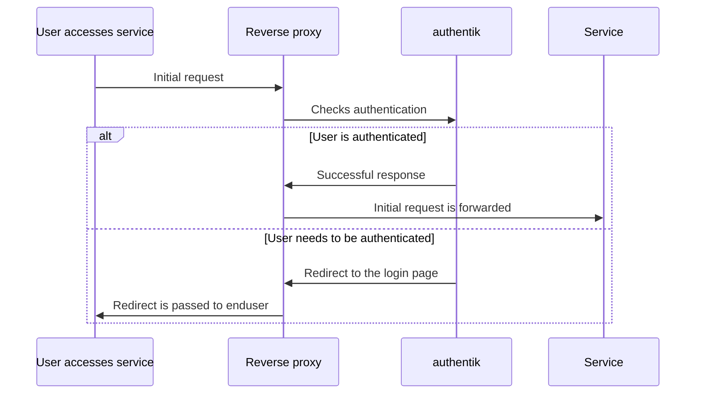

## Headers

The proxy outpost sets the following user-specific headers:

### `X-authentik-username`

Example value: `akadmin`

The username of the currently logged in user

### `X-authentik-groups`

Example value: `foo|bar|baz`

The groups the user is member of, separated by a pipe

### `X-authentik-entitlements`

Example value: `foo|bar|baz`

The entitlements on the application this user has access to, separated by a pipe

### `X-authentik-email`

Example value: `root@localhost`

The email address of the currently logged in user

### `X-authentik-name`

Example value: `authentik Default Admin`

Full name of the current user

### `X-authentik-uid`

Example value: `900347b8a29876b45ca6f75722635ecfedf0e931c6022e3a29a8aa13fb5516fb`

The hashed identifier of the currently logged in user.

Besides these user-specific headers, some application specific headers are also set:

### `X-authentik-meta-outpost`

Example value: `authentik Embedded Outpost`

The authentik outpost's name.

### `X-authentik-meta-provider`

Example value: `test`

The authentik provider's name.

### `X-authentik-meta-app`

Example value: `test`

The authentik application's slug.

### `X-authentik-meta-version`

Example value: `goauthentik.io/outpost/1.2.3`

The authentik outpost's version.

### `X-Forwarded-Host`

:::info
Only set in proxy mode
:::

The original Host header sent by the client. This is set as the `Host` header is set to the host of the configured backend.

### Additional headers

Additionally, you can set `additionalHeaders` attribute on groups or users to set additional headers:

```yaml
additionalHeaders:
    X-test-header: test-value
```

## HTTPS

The outpost listens on both 9000 for HTTP and 9443 for HTTPS.

:::info
If your upstream host is HTTPS, and you're not using forward auth, you need to access the outpost over HTTPS too.
:::

## Logging out

Login is done automatically when you visit the domain without a valid cookie.

When using single-application mode, navigate to `app.domain.tld/outpost.goauthentik.io/sign_out`.

When using domain-level mode, navigate to `auth.domain.tld/outpost.goauthentik.io/sign_out`, where auth.domain.tld is the external host configured for the provider.

To log out, navigate to `/outpost.goauthentik.io/sign_out`.

Starting with authentik 2023.2, when logging out of a provider, all the users sessions within the respective outpost are invalidated.

## Allowing unauthenticated requests

To allow un-authenticated requests to certain paths/URLs, you can use the _Unauthenticated URLs_ / _Unauthenticated Paths_ field.

Each new line is interpreted as a regular expression, and is compiled and checked using the standard Golang regex parser.

The behaviour of this field changes depending on which mode you're in.

### Proxy and Forward auth (single application)

In this mode, the regular expressions are matched against the Request's Path.

### Forward auth (domain level)

In this mode, the regular expressions are matched against the Request's full URL.

## Dynamic backend selection

You can configure the backend the proxy should access dynamically via _Scope mappings_. To do so, create a new _Scope mapping_, with a name and scope of your choice. As expression, use this:

```python
return {
    "ak_proxy": {
        "backend_override": f"http://foo.bar.baz/{request.user.username}"
    }
}
```

Afterwards, edit the _Proxy provider_ and add this new mapping. The expression is only evaluated when the user logs into the application.
