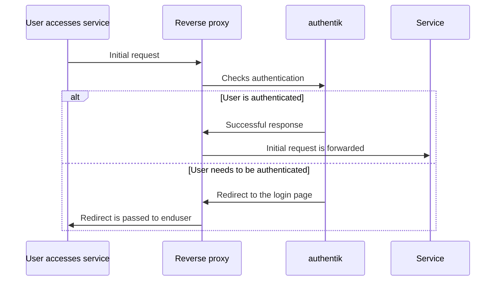

The proxy provider protects applications that do not support native authentication protocols such as OIDC, SAML, or LDAP.

Depending on the selected mode, one of the following happens:

1. The authentik outpost proxies requests to the upstream application.
2. Your existing reverse proxy handles the application traffic and asks the authentik outpost to check authentication and authorization.

Refer to the [create a proxy provider](./create-proxy-provider.md) documentation for setup instructions.


```mermaid
sequenceDiagram
    participant u as User accesses service
    participant rp as Reverse proxy
    participant ak as authentik
    participant s as Service

    u->>rp: Initial request
    rp->>ak: Checks authentication
    alt User is authenticated
        ak ->> rp: Successful response
        rp ->> s: Initial request is forwarded
    else User needs to be authenticated
        ak ->> rp: Redirect to the login page
        rp ->> u: Redirect is passed to enduser
    end
```

## Proxy modes

The proxy provider supports the following modes:

| Mode                              | Use when                                                                                                                 |
| --------------------------------- | ------------------------------------------------------------------------------------------------------------------------ |
| Proxy                             | The authentik outpost should proxy traffic to one upstream application.                                                  |
| Forward auth (single application) | Your existing reverse proxy should proxy traffic to one application and use authentik only for authentication checks.    |
| Forward auth (domain level)       | Your existing reverse proxy should use one proxy provider to protect multiple applications under the same parent domain. |

Domain-level forward auth cannot enforce different application-level authorization rules for each protected application. Use single-application mode when each application needs its own policies, bindings, or authorization behavior.

## Headers sent to upstream applications

The proxy outpost sets the following user-specific headers:

| Header                     | Example value                                                      | Description                                                        |
| -------------------------- | ------------------------------------------------------------------ | ------------------------------------------------------------------ |
| `X-authentik-username`     | `akadmin`                                                          | Username of the currently logged in user.                          |
| `X-authentik-groups`       | `foo\|bar\|baz`                                                    | Groups the user is a member of, separated by pipes.                |
| `X-authentik-entitlements` | `foo\|bar\|baz`                                                    | Entitlements the user has for the application, separated by pipes. |
| `X-authentik-email`        | `root@localhost`                                                   | Email address of the currently logged in user.                     |
| `X-authentik-name`         | `authentik Default Admin`                                          | Full name of the currently logged in user.                         |
| `X-authentik-uid`          | `900347b8a29876b45ca6f75722635ecfedf0e931c6022e3a29a8aa13fb5516fb` | Hashed identifier of the currently logged in user.                 |

The proxy outpost also sets the following application-specific headers:

| Header                      | Example value                  | Description                                               |
| --------------------------- | ------------------------------ | --------------------------------------------------------- |
| `X-authentik-meta-outpost`  | `authentik Embedded Outpost`   | Name of the authentik outpost.                            |
| `X-authentik-meta-provider` | `test`                         | Name of the authentik provider.                           |
| `X-authentik-meta-app`      | `test`                         | Slug of the authentik application.                        |
| `X-authentik-meta-version`  | `goauthentik.io/outpost/1.2.3` | Version of the authentik outpost.                         |
| `X-Forwarded-Host`          | `app.company`                  | Original host sent by the client. Only set in proxy mode. |

In proxy mode, `X-Forwarded-Host` preserves the original `Host` header sent by the client because the `Host` header is set to the configured upstream host.

### Additional headers

You can set the `additionalHeaders` attribute on groups or users to send additional static headers:

```yaml
additionalHeaders:
    X-test-header: test-value
```

For dynamic headers, see the [custom headers](./custom_headers.md) documentation.

## HTTPS

The outpost listens on port `9000` for HTTP and port `9443` for HTTPS.

:::info
If your upstream host is HTTPS, and you're not using forward auth, you need to access the outpost over HTTPS too.
:::

## Logging out

Login is initiated automatically when you visit the protected application without a valid cookie.

To log out, navigate to `/outpost.goauthentik.io/sign_out` on the host that serves the outpost:

- In proxy mode and forward auth single-application mode, use the protected application host, for example `https://app.company/outpost.goauthentik.io/sign_out`.
- In forward auth domain-level mode, use the authentication URL configured for the provider, for example `https://auth.company/outpost.goauthentik.io/sign_out`.

Logging out of a provider invalidates all sessions for that user within the respective outpost.

## Allowing unauthenticated requests

To allow unauthenticated requests to specific paths or URLs, use the **Unauthenticated Paths** or **Unauthenticated URLs** field on the proxy provider.

Each new line is interpreted as a regular expression and is compiled and checked using the standard Golang regex parser.

The behavior of this field changes depending on the selected mode.

### Proxy and Forward auth (single application)

In these modes, the regular expressions are matched against the request path.

### Forward auth (domain level)

In this mode, the regular expressions are matched against the full request URL, including the scheme and host.

## Dynamic backend selection

In proxy mode, you can configure the upstream backend dynamically with scope mappings.

Create a scope mapping with a name and scope of your choice, and set the expression to:

```python
return {
    "ak_proxy": {
        "backend_override": f"http://foo.bar.baz/{request.user.username}"
    }
}
```

Edit the proxy provider and add this mapping under **Additional scopes**. The expression is evaluated only when the user logs in to the application.

## Host header:ak-version[2025.6.1]

By default, the proxy provider uses the forwarded host header received from the client. Starting with authentik 2025.6.1, you can dynamically adjust the host header with a property mapping.

Create a scope mapping with a name and scope of your choice, and set the expression to:

```python
return {
    "ak_proxy": {
        "host_header": "my-internal-host-header"
    }
}
```

Edit the proxy provider and add this mapping under **Additional scopes**. The expression is evaluated only when the user logs in to the application.

### Dynamically setting host header

You can dynamically set the host header to match the **Internal host** value set on the proxy provider. To do this, create a scope mapping with a name and scope of your choice, and set the expression to:

```python
from urllib.parse import urlparse
parsed_url = urlparse(provider.proxyprovider.internal_host)
return {
    "ak_proxy": {
        "host_header": parsed_url.netloc
    }
}
```

Edit the proxy provider and add this mapping under **Additional scopes**. The expression is evaluated only when the user logs in to the application.

## Proxy authentication

When a user authenticates to the proxy, authentik uses OAuth2 behavior configured on the proxy provider. For header-based authentication options, see [Header authentication](./header_authentication.mdx) and [Machine-to-Machine](../oauth2/machine_to_machine.mdx).

## Troubleshooting

To obtain more detailed information about a failure, search the logs of the outpost or server container for the `client_id` of the proxy provider. The `client_id` is shown on the provider's **Authentication** tab.
