The RAC provider allows users to access remote Windows, macOS, and Linux machines via [RDP](https://en.wikipedia.org/wiki/Remote_Desktop_Protocol)/[SSH](https://en.wikipedia.org/wiki/Secure_Shell)/[VNC](https://en.wikipedia.org/wiki/Virtual_Network_Computing). Just like other providers in authentik, the RAC provider is associated with an application that appears on a user's **My applications** page.

For instructions on creating a RAC provider, refer to the [Create a Remote Access Control (RAC) provider](./create-rac-provider.md) documentation. Alternatively, watch our ["Remote Access Control (RAC) in authentik" video on YouTube](https://www.youtube.com/watch?v=9wahIBRV6Ts).

## RAC components

A RAC provider uses several components:

```mermaid
architecture-beta
    service application(mdi:application-outline)[Application]
    service provider(mdi:application-cog-outline)[Provider]
    service endpoint(mdi:network-pos)[Endpoint Settings]
    service server(mdi:server)[authentik Server]
    service outpost(mdi:server-plus)[RAC Outpost]

    service machine(mdi:desktop-classic)[Remote Machine]

    application:R --> L:provider
    provider:B -- T:endpoint
    provider:R --> L:server
    server:R <--> L:outpost
    outpost:B <--> T:machine
```

When a user starts the RAC application, it communicates with the authentik server, which then connects to the RAC outpost and sends instructions (based on the endpoint data you defined) on how to connect to the remote machine.

After connecting to the remote machine, the outpost sends a message back to the authentik server (via WebSockets), and the web browser opens the WebSocket connection to the remote machine.

## Endpoints

Unlike other providers, where an application-provider pair is created for each resource you wish to access, RAC works differently. RAC uses a single application connected to one RAC provider. The RAC provider then has an _Endpoint_ object for each remote machine (computer/server) you want to connect to.

The _Endpoint_ object specifies:

- Hostname, IP address, and port of the remote machine
- Protocol to use: SSH, RDP, or VNC
- RDP connection settings
- [RAC Property mappings](#rac-property-mappings) to apply
- [Connection settings](#connection-settings) to apply

Additionally, it is possible to bind policies to _Endpoint_ objects to restrict user access. To connect to a remote machine, users must have access to both the application that the RAC provider is using and the corresponding endpoint.

## Connection management

A new connection is created every time an RAC application/endpoint is selected in the [User Interface](../../../customize/interfaces/user). After the user's authentik session expires, the connection is terminated. Additionally, you can configure connection expiry in the RAC provider, which applies even if the user is still authenticated. The connection can also be terminated manually from the **Connections** tab of the RAC provider.

## RAC Property Mappings

You can create RAC property mappings via **Customization** > **Property Mappings**.

RAC property mappings allow you to configure the following settings:

- **Username**: the username for the remote machine
- **Password**: the password for the remote machine
- **Ignore Server certificate**: set whether the validity of the returned RDP server certificate will be ignored
- **Enable wallpaper**: enable/disable the desktop wallpaper of the RDP server
- **Enable font-smoothing**: enable/disable font-smoothing (anti-aliasing) on the RDP server
- **Enable full window dragging**: enable/disable whether the full content of a window is visible while moving it on the RDP server
- **Advanced settings**: set [connection settings](#connection-settings) via a Python expression

## Connection settings

The RAC provider utilizes [Apache Guacamole](https://guacamole.apache.org/) for establishing SSH, RDP and VNC connections. RAC supports the use of Apache Guacamole connection configurations.

Connection settings can include `username`, `password`, `domain`, `private-key`, `security`, `enable-audio`, and more.

For a full list of possible connection settings, see the [Apache Guacamole connection configuration documentation](https://guacamole.apache.org/doc/gug/configuring-guacamole.html#configuring-connections).

RAC connection settings can be set via several methods and are all merged together when connecting:

1. Default settings
2. RAC Provider settings
3. RAC Endpoint settings
4. RAC Provider property mapping settings
5. RAC Endpoint property mapping settings
6. The `connection_settings` object in the flow plan

For examples of how to configure connection settings, see the [RAC SSH public key authentication](./rac-public-key.md) and [RAC Credentials Prompt](./rac_credentials_prompt.md) documentation.

## Capabilities

The following features are currently supported:

- Bi-directional clipboard
- Audio redirection (from remote machine to browser)
- Resizing
