The RAC provider allows users to access remote Windows, macOS, and Linux machines via [RDP](https://en.wikipedia.org/wiki/Remote_Desktop_Protocol)/[SSH](https://en.wikipedia.org/wiki/Secure_Shell)/[VNC](https://en.wikipedia.org/wiki/Virtual_Network_Computing). Just like other providers in authentik, the RAC provider is associated with an application that appears on a user's **Application Dashboard** page.

For instructions on creating a RAC provider, refer to the [Create a Remote Access Control (RAC) provider](./create-rac-provider.mdx) documentation. Alternatively, watch our ["Remote Access Control (RAC) in authentik" video on YouTube](https://www.youtube.com/watch?v=9wahIBRV6Ts).

## RAC components

A RAC provider uses several components:

```mermaid
architecture-beta
    service application(mdi:application-outline)[Application]
    service provider(mdi:application-cog-outline)[Provider]
    service device(mdi:network-pos)[Device]
    service server(mdi:server)[authentik Server]
    service outpost(mdi:server-plus)[RAC Outpost]

    service machine(mdi:desktop-classic)[Remote Machine]

    application:R --> L:provider
    provider:B -- T:device
    provider:R --> L:server
    server:R <--> L:outpost
    outpost:B <--> T:machine
```



When a user starts the RAC application, it communicates with the authentik server, which then connects to the RAC outpost and sends instructions (based on the device that is being connected to) on how to connect to the remote machine.

After connecting to the remote machine, the outpost sends a message back to the authentik server (via WebSockets), and the web browser opens the WebSocket connection to the remote machine.

## Devices

Unlike other providers, where an application-provider pair is created for each resource you wish to access, RAC works differently. RAC uses a single application connected to one RAC provider, and that provider connects to the [devices](../../../endpoint-devices/index.mdx) in your authentik instance.

A device is the same object that connectors such as the authentik agent enroll and report facts for, so a machine only has to exist in authentik once. RAC takes the connection details from, in order:

1. The RAC settings in the device's attributes, set when adding a device manually or to override what the device reports.
2. The facts the device reported: its hostname, or the first non-local interface address, and its operating system.
3. The provider, which sets the protocol (when not set to **Automatic**) and the concurrent connection limit.

To connect to a device, users must have access to the application that the RAC provider is using, and pass the policies bound to the device. Because policies are bound to the device itself, a device's reported facts can gate remote access; see [Restricting access with device compliance](#restricting-access-with-device-compliance). A provider can additionally be limited to a single device access group.

:::info
A device's attributes are readable by anyone who can view the device, so do not store credentials in its connection settings. Use a [RAC property mapping](#rac-property-mappings) or the [credentials prompt](./rac_credentials_prompt.mdx) instead.
:::

### Restricting access with device compliance

Devices that are enrolled through a connector report facts about themselves, such as their operating system version or whether their disks are encrypted. Binding an [expression policy](../../../customize/policies/expression.mdx) to a device, or to a device access group, lets you require those facts before a connection is authorized:

```python
facts = request.obj.cached_facts.data
return facts.get("os", {}).get("family") == "windows"
```

The device that is being connected to is also available to the policies and stages of the provider's authorization flow as `request.context["rac_device"]`.

## Connection management

Launching a RAC application/device from the [User interface](../../../customize/interfaces/user) runs the provider's authorization flow and creates a connection authorization tied to the user's current authentik session. This authorization allows the browser to connect to that device. You can view and delete stored connection authorizations from the **Connections** tab of the RAC provider.

### Delete authorization on disconnect

The RAC provider's **Delete authorization on disconnect** setting is disabled by default.

- When disabled, the connection authorization remains available after a disconnect. The browser can reuse it to reconnect to the same device without repeating the authorization flow, provided that the authorization and the authentik session are still valid. This allows reconnection after a temporary network failure. Launching the application/device again starts a new authorization flow rather than reusing the previous authorization.
- When enabled, the authorization cannot be reused. After a disconnect, the user must launch the application/device again and complete the provider's authorization flow. This also applies when a temporary network failure interrupts the connection, so enabling the setting can cause repeated authorization prompts on unstable networks. The prompts depend on the stages configured in the authorization flow; reauthorization does not necessarily require logging in to authentik again.

Although the UI describes deletion as happening on disconnect, authentik deletes the stored authorization during connection setup, after requesting a connection from the outpost. The current connection continues, but subsequent reconnect attempts cannot use that authorization. A connection attempt that fails after this deletion also requires a new authorization.

### Connection and session expiry

**Connection expiry** limits the authorization's lifetime, starting when authentik creates it. The default is `hours=8`. Reconnecting with the same authorization does not reset this limit. When it expires, authentik disconnects the RAC connection and requires a new authorization, even if the user is still logged in to authentik.

The connection also ends when the user's authentik session expires or the user logs out. **Delete authorization on disconnect** controls authorization reuse; it does not extend or replace either expiry limit. Connection expiry still applies to the current connection when the setting is enabled.

A connection authorization is separate from the login session on the remote operating system. Deleting the authorization prevents reuse through authentik; it does not itself log the user out of the remote operating system or terminate applications running there. Whether a remote session survives a disconnected RAC connection depends on the protocol and the remote machine's session policies.

## RAC Property Mappings

You can create RAC property mappings via **Customization** > **Property Mappings**.

RAC property mappings allow you to configure the following settings:

- **Username**: the username for the remote machine
- **Password**: the password for the remote machine
- **Ignore server certificate**: set whether the validity of the returned RDP server certificate will be ignored
- **Enable wallpaper**: enable/disable the desktop wallpaper of the RDP server
- **Enable font-smoothing**: enable/disable font-smoothing (anti-aliasing) on the RDP server
- **Enable full window dragging**: enable/disable whether the full content of a window is visible while moving it on the RDP server
- **Advanced settings**: set [connection settings](#connection-settings) via a Python expression

## Connection settings

The RAC provider utilizes [Apache Guacamole](https://guacamole.apache.org/) for establishing SSH, RDP and VNC connections. RAC supports the use of Apache Guacamole connection configurations.

Connection settings can include `username`, `password`, `domain`, `private-key`, `security`, `enable-audio`, and more.

For a full list of possible connection settings, see the [Apache Guacamole connection configuration documentation](https://guacamole.apache.org/doc/gug/configuring-guacamole.html#configuring-connections).

RAC connection settings can be set via several methods and are all merged together when connecting:

1. Default settings
2. RAC Provider settings
3. The device's address and port
4. The device's RAC connection settings
5. RAC Provider property mapping settings
6. RAC property mapping settings referenced by the device
7. The `connection_settings` object in the flow plan

For examples of how to configure connection settings, see the [RAC SSH public key authentication](./rac-public-key.mdx) and [RAC Credentials Prompt](./rac_credentials_prompt.mdx) documentation.

## Capabilities

The following features are currently supported:

- Bi-directional clipboard
- Audio redirection (from remote machine to browser)
- Resizing
