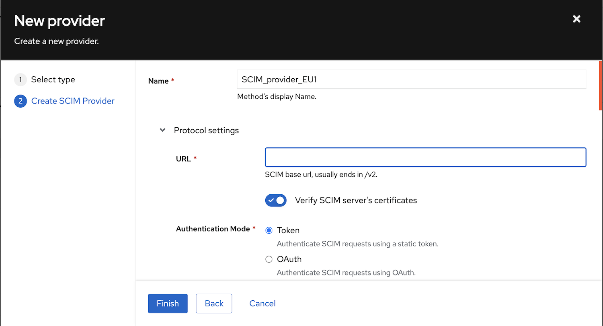

SCIM (System for Cross-domain Identity Management) is a set of APIs to provision users and groups. The SCIM provider in authentik supports SCIM 2.0 and can be used to provision and sync users from authentik into other applications.

A SCIM provider requires a SCIM base URL for the endpoint and an authentication token. SCIM works via HTTP requests, so authentik must be able to reach the specified endpoint. This endpoint usually ends in `/v2`, which corresponds to the SCIM version supported.

SCIM providers in authentik always serve as [backchannel providers](../../applications/manage_apps.mdx#backchannel-providers), which are used in addition to the main provider that supplies SSO authentication. A backchannel provider is used for an application that requires backend authentication, directory synchronization, or other additional authentication needs.

## Set up a SCIM provider

Many applications use SCIM together with another SSO protocol such as OAuth/OIDC or SAML. For example, you can create an application and provider pair for Slack by using SAML for authentication and SCIM for provisioning. For this setup, use the following workflow:

1. [Create](../../applications/manage_apps.mdx#create-an-application-and-provider-pair) the application and provider pair.
2. [Create](../../applications/manage_apps.mdx#backchannel-providers) the SCIM backchannel provider.
3. Edit the application, and in the **Backchannel Providers** field add the SCIM provider that you created.

## Authentication modes

In authentik, there are two ways to authenticate SCIM requests:

- **Static token** provided by the application. This is the default authentication mode.
- **OAuth token** that authentik retrieves from a specified source and uses for authentication.

When you create a new SCIM provider, select the **Authentication Mode** that the application supports.

For either mode, enter the SCIM base **URL** for the endpoint.

### Static token

When the authentication mode is set to **Static token**, authentik sends the token provided by the application with outgoing SCIM requests to authenticate each request.

### OAuth token :ak-enterprise

When you configure a SCIM provider to use OAuth for authentication, authentik generates short-lived tokens through an OAuth flow and sends them to the SCIM endpoint. This offers improved security and control compared with a static token.

You can also add additional token request parameters such as `grant_type`, `subject_token`, or `client_assertion`.

**Example**:

- `grant_type: client_credentials`
- `grant_type: password`

:::info OAuth source required
To use OAuth authentication for your application, create and connect an [OAuth source](../../../users-sources/sources/protocols/oauth/).
:::

## Sync behavior

SCIM data is synchronized in two ways:

- When a user or group is created, modified, or deleted, that change is sent to all SCIM providers.
- Once an hour, all SCIM providers are fully synchronized.

The synchronization process runs in the authentik worker. To improve scalability, authentik starts a task for each batch of 100 users or groups, so the workload can be distributed across multiple workers.

### Attribute mapping

Attribute mapping from authentik to SCIM users is done through property mappings, as with other providers. The default mappings for users and groups work for many setups, but you can define custom mappings to add fields.

All selected mappings are applied in the order of their name, and are deeply merged onto the final user data. The final data is then validated against the SCIM schema, and if the data is not valid, the sync is stopped.

#### Skipping objects during synchronization

To exclude specific users or groups from SCIM synchronization, you can create a property mapping that raises the `SkipObject` exception. When this exception is raised during the evaluation of a property mapping, the object is skipped and the sync continues with the next object.

For more information, refer to [Skip objects during synchronization](../property-mappings/#skip-objects-during-synchronization).

## Filter the sync scope

You can limit which users and groups a SCIM provider synchronizes. User filtering and group filtering are configured separately.

### User filtering

Use **Exclude service accounts** in the SCIM provider settings when you do not want service accounts to be synchronized.

Users can also be filtered through application access policies. If the SCIM provider is attached to a backchannel application, only users who can view that application are synchronized.

### Group filters

Group filters define the synchronization scope for groups.

If no group filters are selected, the SCIM provider synchronizes all groups.

If group filters are selected, only the selected groups are synchronized.

Group filters apply only to groups. They do not limit which users are synchronized.

Changing the selected group filters does _not_ remove groups or memberships that were synchronized previously.

## Compatibility modes

Compatibility modes adjust authentik behavior for vendor-specific SCIM implementations.

Available compatibility modes are:

- **Default**: Standard SCIM 2.0 implementation
- **AWS**: Disables PATCH operations for AWS Identity Center compatibility
- **Slack**: Enables filtering support for Slack's SCIM implementation
- **Salesforce**: Uses the non-standard `/ServiceProviderConfigs` endpoint
- **Webex**: Uses the vendor-specific behavior required for Webex SCIM

To configure a compatibility mode, select the appropriate option in the **SCIM Compatibility Mode** field when creating or editing a SCIM provider.

## Remote service capabilities

SCIM defines several optional settings that allow clients to discover a service provider's supported features. In authentik, the [`ServiceProviderConfig`](https://datatracker.ietf.org/doc/html/rfc7644#section-4) endpoint provides support for the following options (if the option is supported by the service provider).

:::note
The `ServiceProviderConfig` is cached for 1 hour after it is fetched. The cache is automatically cleared when the SCIM provider is updated (such as when changing the compatibility mode).
:::

- Filtering

    When the remote system supports [filtering](https://datatracker.ietf.org/doc/html/rfc7644#section-3.4.2.2), authentik uses that operation to match remote users and groups to existing authentik users and groups.

- Bulk

    The [`bulk`](https://datatracker.ietf.org/doc/html/rfc7644#section-3.7) configuration enables clients to send large collections of resource operations in a single request. If the remote system sets this attribute, authentik will respect the `maxOperations` value to determine the maximum number of individual operations a server can process within a single bulk request.

- Patch updates

    If the service provider supports [PATCH updates](https://datatracker.ietf.org/doc/html/rfc7644#section-3.5.2), authentik will use patch requests to add/remove members of groups. For all other updates, such as user updates and other group updates, PUT requests are used.

### Using in conjunction with other providers

Many applications support SCIM together with another SSO protocol such as OAuth/OIDC or SAML. With default settings, the unique user IDs in SCIM and other protocols are identical, which makes it easier for applications to link provisioned users with users who log in through SSO.

Applications can either match users on a unique ID sent by authentik called `externalId`, by their email or username.

#### OAuth/OIDC

The default provider configuration for the _Subject mode_ option of _Based on the User's hashed ID_ matches the `externalId` that's generated by default. If any other _Subject mode_ is selected, the `externalId` attribute can be customized via SCIM mappings.

#### SAML

The SAML NameID policy _urn:oasis:names:tc:SAML:2.0:nameid-format:persistent_ uses the same unique user identifier as the default `externalId` value used by the SCIM provider. If a SAML application does not send a NameID request, this value is also used as fallback.
