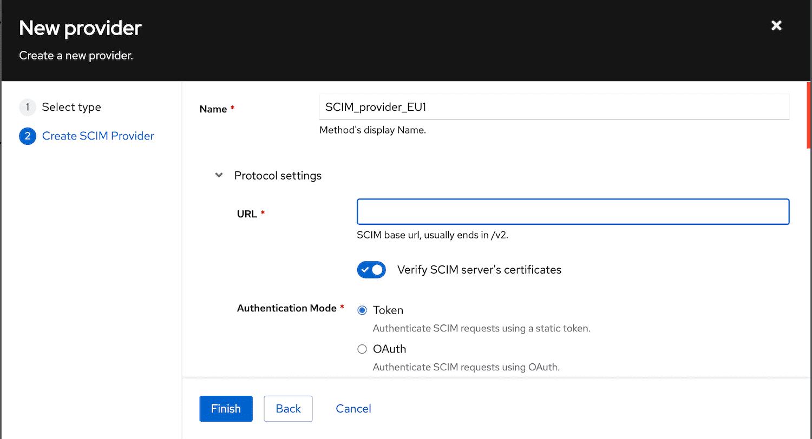

SCIM (System for Cross-domain Identity Management) is a set of APIs to provision users and groups. The SCIM provider in authentik supports SCIM 2.0 and can be used to provision and sync users from authentik into other applications.

A SCIM provider requires a SCIM base URL for the endpoint and an authentication token. SCIM works via HTTP requests, so authentik must be able to reach the specified endpoint. This endpoint usually ends in `/v2`, which corresponds to the SCIM version supported.

SCIM providers in authentik always serve as [backchannel providers](../../applications/manage_apps.mdx#backchannel-providers), which are used in addition to the main provider that supplies SSO authentication. A backchannel provider is used for an application that requires backend authentication, directory synchronization, or other additional authentication needs.

For example, you can create an application and provider pair for Slack, creating Slack as the application and SAML as the provider. Say you then want to use SCIM for further authentication using a token. For this scenario use the following workflow:

1. [Create](../../applications/manage_apps.mdx#create-an-application-and-provider-pair) the application and provider pair.
2. [Create](../../applications/manage_apps.mdx#backchannel-providers) the SCIM backchannel provider.
3. Edit the application and in the **Backchannel Providers** field add the backchannel provider that you just created.

## Authentication mode options

In authentik, there are two options for how to configure authentication for a SCIM provider:

- **Static token** provided by the application (default)
- **OAuth token** authentik will retrieve an OAuth token from a specified source and use that token for authentication

When you create a new SCIM provider, select which **Authentication Mode** the application supports.

Whichever mode you select you'll need to enter a SCIM base **URL**, for the endpoint.

### Default authentication method for a SCIM provider

With authentik's default mode, the token that you enter (provided by the application) is sent with all outgoing SCIM requests to authenticate each request.

### OAuth authentication for a SCIM provider :ak-enterprise :ak-version[2025.10]

Configuring your SCIM provider to use OAuth for authentication means that short-lived tokens are dynamically generated through an OAuth flow and sent to the SCIM endpoint. This offers improved security and control versus a static token.

You can also add additional token request parameters to the OAuth token, such as `grant_type`, `subject_token`, or `client_assertion`.

Some examples are:

- `grant_type: client_credentials`

- `grant_type: password`

:::info OAuth source required
To use OAuth authentication for your application, you will need to create and connect to an [OAuth source](../../../users-sources/sources/protocols/oauth/).
:::

### Syncing

Data is synchronized in multiple ways:

- When a user/group is created/modified/deleted, that action is sent to all SCIM providers
- Periodically (once an hour), all SCIM providers are fully synchronized

The actual synchronization process is run in the authentik worker. To allow this process to better to scale, a task is started for each 100 users and groups, so when multiple workers are available the workload will be distributed.

### Attribute mapping

Attribute mapping from authentik to SCIM users is done via property mappings as with other providers. The default mappings for users and groups make some assumptions that should work for most setups, but it is also possible to define custom mappings to add fields.

All selected mappings are applied in the order of their name, and are deeply merged onto the final user data. The final data is then validated against the SCIM schema, and if the data is not valid, the sync is stopped.

### Filtering users

By default service accounts are excluded from being synchronized. This can be configured in the SCIM provider. Additionally, an optional group can be configured to only synchronize the users that are members of the selected group. Changing this group selection does _not_ remove members outside of the group that might have been created previously.

### Supported options

SCIM defines several optional settings that allow clients to discover a service provider's supported features. In authentik, the [`ServiceProviderConfig`](https://datatracker.ietf.org/doc/html/rfc7644#section-4) endpoint provides support for the following options (if the option is supported by the service provider).

- Filtering

    When the remote system supports [filtering](https://datatracker.ietf.org/doc/html/rfc7644#section-3.4.2.2), authentik uses this operation to filter users and groups in the remote system to match them to existing authentik users and groups.

- Bulk

    The [`bulk`](https://datatracker.ietf.org/doc/html/rfc7644#section-3.7) configuration enables clients to send large collections of resource operations in a single request. If the remote system sets this attribute, authentik will respect the `maxOperations` value to determine the maximum number of individual operations a server can process within a single bulk request.

- Patch updates

    If the service provider supports [PATCH updates](https://datatracker.ietf.org/doc/html/rfc7644#section-3.5.2), authentik will use patch requests to add/remove members of groups. For all other updates, such as user updates and other group updates, PUT requests are used.

### Using in conjunction with other providers

A lot of applications support SCIM in conjunction with another SSO protocol like OAuth/OIDC or SAML. With default settings, the unique user IDs in SCIM and other protocols are identical, which should easily allow applications to link users the are provisioned with users that are logging in.

Applications can either match users on a unique ID sent by authentik called `externalId`, by their email or username.

#### OAuth/OIDC

The default provider configuration for the _Subject mode_ option of _Based on the User's hashed ID_ matches the `externalId` that's generated by default. If any other _Subject mode_ is selected, the `externalId` attribute can be customized via SCIM mappings.

#### SAML

The SAML NameID policy _urn:oasis:names:tc:SAML:2.0:nameid-format:persistent_ uses the same unique user identifier as the default `externalId` value used by the SCIM provider. If a SAML application does not send a NameID request, this value is also used as fallback.
