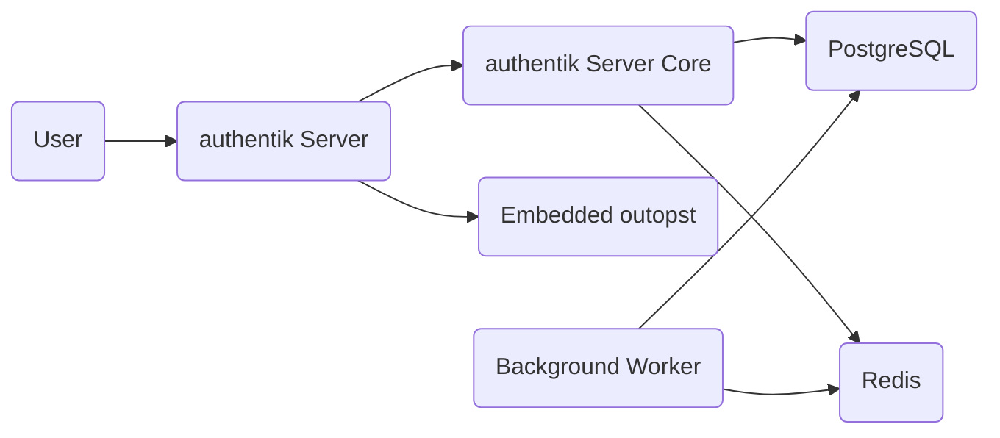

authentik consists of a handful of compoennts, most of which are required for a functioning setup.

### Server

The server container consists of two sub-components, the actual server itself and the embedded outpost. Incoming requests to the server container(s) are routed by a lightweight router to either the _Core_ server or the embedded outpost. This router also handles requests for any static assets such as JavaScript and CSS files.

##### Core

The core sub-component handles most of authentik's logic, such as API requests, flow executions, any kind of SSO requests, etc.

##### Embedded outpost

Similar to [other Outposts](../outposts/index.mdx), this outposts allows using [Proxy providers](../providers/proxy/index.md) without deploying a separate outpost

##### Persistence

-   `/media` is used to store icons and such, but not required, and if not mounted, authentik will allow you to set a URL to icons in place of a file upload

### Worker

This container executes background tasks, such as sending emails, the event notification system, and everything you can see on the _System Tasks_ page in the frontend.

##### Persistence

-   `/certs` is used for authentik to import external certs, which in most cases shouldn't be used for SAML, but rather if you use authentik without a reverse proxy, this is used for the lets encrypt integration
-   `/templates` is used for custom email templates, and as with the other ones fully optional

### PostgreSQL

authentik uses PostgreSQL to store all of its configuration and other data, aside from uploaded files.

##### Persistence

-   `/var/lib/postgresql/data` is used to store the PostgreSQL database

### Redis

authentik uses Redis as a message-queue and a cache. Data in Redis is not required to be persistent, however if this is not the case, restarting Redis will cause the loss of all sessions.

##### Persistence

-   `/data` is used to store the Redis data
