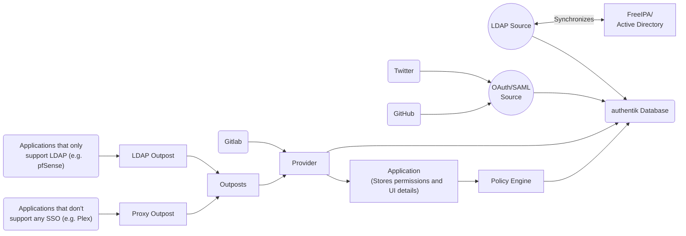

### Application

An application links together Policies with a Provider, allowing you to control access. It also holds Information like UI Name, Icon and more.

### Source

Sources are locations from which users can be added to authentik. For example, an LDAP Connection to import Users from Active Directory, or an OAuth2 Connection to allow Social Logins.

### Provider

A Provider is a way for other applications to authenticate against authentik. Common Providers are OpenID Connect (OIDC) and SAML.

### Policy

At a base level a policy is a yes/no gate. It will either evaluate to True or False depending on the Policy Kind and settings. For example, a "Group Membership Policy" evaluates to True if the user is member of the specified Group and False if not. This can be used to conditionally apply Stages, grant/deny access to various objects, and for other custom logic.

See [Policies](../policies/index.md)

### Flows & Stages

Flows are an ordered sequence of stages. These flows can be used to define how a user authenticates, enrolls, etc.

A stage represents a single verification or logic step. They are used to authenticate users, enroll users, and more. These stages can optionally be applied to a flow via policies.

See [Flows](../flow/index.md)

### Property Mappings

Property Mappings allow you to make information available for external applications. For example, if you want to login to AWS with authentik, you'd use Property Mappings to set the user's roles in AWS based on their group memberships in authentik.

See [Property Mappings](../property-mappings/index.md)

### Outpost

An outpost is a separate component of authentik, which can be deployed anywhere, regardless of the authentik deployment. The outpost offers services that aren't implemented directly into the authentik core, e.g. Reverse Proxying.

See [Outposts](../outposts/index.mdx)

### System tasks

These are longer-running tasks which authentik runs in the background. This is used to sync LDAP sources, backup the database, and other various tasks.
