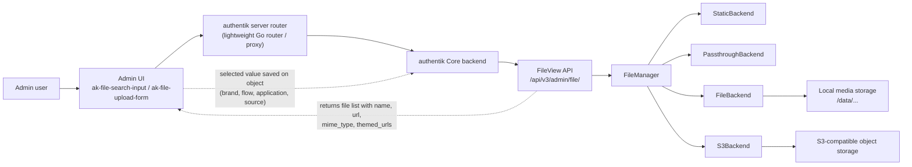
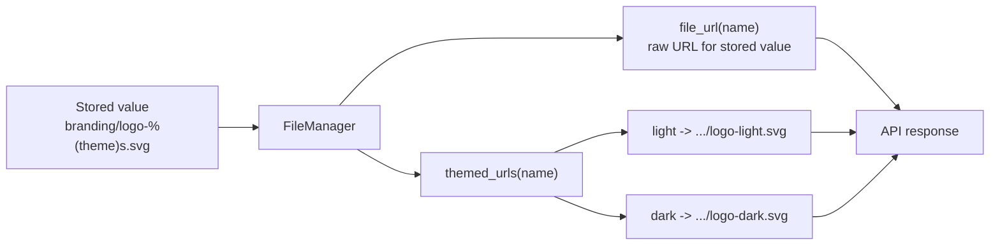

Image files are used in authentik to add icons to applications and sources, and to define the ["branded" look](../sys-mgmt/brands/index.md#branding-settings) of the authentik interface with your company's logo, favicon, and flow background images.

authentik provides a centralized file management system for storing and organizing these files. Files can be uploaded and managed from **Customization** > **Files** in the Admin interface. By default, files are stored on disk in the `/data` directory, but [S3 storage](../sys-mgmt/ops/storage-s3.md) can also be configured.

## Upload and manage files

To upload and use image files, follow these steps:

1. Log in to authentik as an administrator and open the authentik Admin interface.
2. Navigate to **Customization** > **Files**.

    Here you can upload a new file, delete a file, and search for a file that you already uploaded.

:::info Accepted values in picker fields
Fields such as brand logos, favicons, flow backgrounds, application icons, and source icons all use the same file picker. Those fields can accept uploaded files, built-in static assets, external URLs, Font Awesome icons, and theme-aware paths using `%(theme)s`.

See [File picker values](./file-picker.md) for the full list of supported values and path rules.
:::

## Technical deep dive

You can skip this section if you only need to upload or reference files.

The shared file picker is a UI on top of the files API and the storage backends. The frontend stores the selected value as a string such as a relative media path, a static asset path, an external URL, or a `fa://...` icon reference.

- The frontend calls the files API to list selectable entries
- The files API asks the `FileManager` to list files and resolve each file into a `url`
- The `FileManager` picks the first backend that supports the value
- For uploaded files, the management backend is either local file storage or S3
- For built-in assets, the static backend returns `/static/...` paths
- For external URLs and `fa://...` values, the passthrough backend returns the value unchanged
- For uploads, the backend validates the file size and path rules before writing to local storage or S3

When a value contains `%(theme)s`, authentik can return both a single `url` and a `themed_urls` map:

- The files API can return `themed_urls` for picker entries
- The current-brand/config response and the flow, application, and source APIs expose themed URL fields for assets that support them
- Those fields include `branding_logo_themed_urls`, `branding_favicon_themed_urls`, `background_themed_urls`, `meta_icon_themed_urls`, and `icon_themed_urls`
- The frontend uses those pre-resolved themed URLs to pick the correct asset for light or dark mode
- This is especially important for S3-backed media, where each themed variant may need its own presigned URL
