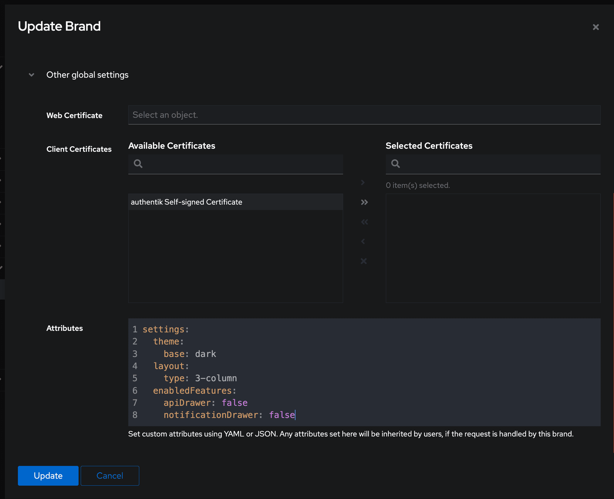

The Admin interface can be customized using attributes configured in [Brands](../../../sys-mgmt/brands.md)

To add, remove, or modify attributes for a brand, log in to the Admin interface and navigate to **System > Brands > Other global settings > Attributes**.

Most attributes defined in a brand apply to _both_ the User and Admin interfaces. However, any settings that are specific to only the Admin interface are explicitly noted as such below.

The following screenshot shows the syntax for setting several attributes for a brand: dark mode, a 3-column display of applications on **My applications** page of the User interface, and hiding the API and Notifications drawers from the Admin interface tool bar.

## Custom settings

The following settings for attributes are grouped by:

- `enabledFeatures` settings
- General settings (used on both the Admin interface and the User interface)
- Admin interface only

import Enabledfeatureslist from "../\_enabledfeatureslist.mdx";

<Enabledfeatureslist />

import Generalattributes from "../\_generalattributes.mdx";

<Generalattributes />

### Settings for the Admin interface only

The following settings can only be used to customize the Admin interface, not the User interface.

#### `settings.pagination.perPage`

How many items should be retrieved per page. Defaults to 20.

#### `settings.defaults.userPath`

Default user path which is used when opening the user list. Defaults to `users`.

import Global from "../_global/global.mdx";

<Global />
