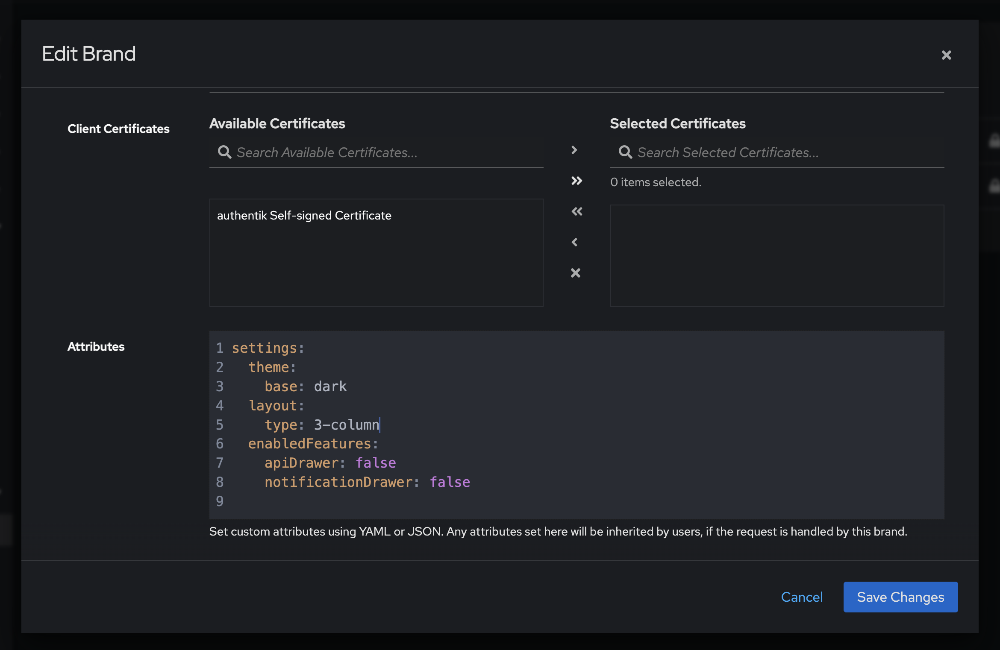

To add, remove, or modify attributes for a brand, log in to the Admin interface and navigate to **System > Brands > Other global settings > Attributes**.

The following screenshot shows the syntax for setting several attributes for a brand: dark mode, a 3-column display of applications on the **Application Dashboard** page of the User interface, and hiding the API and Notifications drawers from the Admin interface toolbar.

