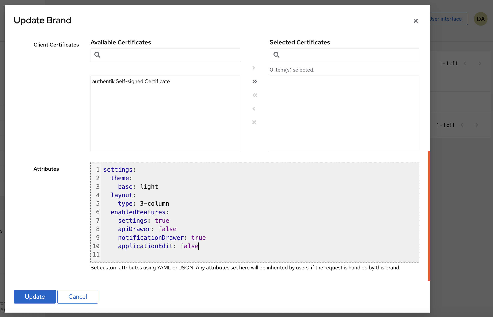

The authentik User interface and Admin interface can both be customized through attributes, defined in [Brands](../../../sys-mgmt/brands.md) under **Other global settings > Attributes**.

Most settings that are defined in the Brand's attributes are manifested in _both_ the User interface and the Admin interface, except for those marked below as either only for the Admin interface or only for the User interface.

## Custom settings

The following settings are grouped by:

- `enabledFeatures` settings
- general configurations

### Enabling/disabling features

The following features can be enabled/disabled using attributes defined on the Brand. By default, all of them are enabled; to disable a feature, set the value to `false`, as shown in the screenshot below.

#### `settings.enabledFeatures.apiDrawer`

    Display the API Request drawer in the upper tool bar.

#### `settings.enabledFeatures.notificationDrawer`

Display the Notification drawer in the upper tool bar.

#### `settings.enabledFeatures.settings`

    Display the Settings link in the upper tool bar.

#### `settings.enabledFeatures.applicationEdit` (User interface only)

    Application edit in library (only shown when user is superuser)

#### `settings.enabledFeatures.search`

    Display the Search bar in the upper tool bar.

### General configurations

#### `settings.navbar.userDisplay`

Configure what is shown in the top right corner. Defaults to `username`. Choices: `username`, `name`, `email`

#### `settings.theme.base`

Configure the base color scheme, or dark/light mode. Defaults to `automatic`, which switches between dark and light mode based on the users' browsers' preference. Choices: `automatic`, `dark`, `light`.

**Example**:

```
settings:
  theme:
    base: dark
```

#### `settings.theme.background`

Optional CSS that is applied to the background of the User interface, for example to set a custom background color, gradient, or image.

```yaml
settings:
    theme:
        background: >
            background: url('https://picsum.photos/1920/1080');
            filter: blur(8px);
            background-position: center;
            background-repeat: no-repeat;
            background-size: cover;
```

#### `settings.layout.type` (User interface only)

Which layout to use for the _My applications_ view. Defaults to `row`. Choices: `row`, `2-column`, `3-column`

#### `settings.pagination.perPage` (Admin interface only)

How many items should be retrieved per page. Defaults to 20.

#### `settings.defaults.userPath` (Admin interface only)

Default user path which is opened when opening the user list. Defaults to `users`.

#### `settings.locale`

The locale which can be configured in the user settings by default. This can be used to preset locales for groups of users, but still let them choose their own preferred locale.

**Example**:

The following screenshot shows the syntax for setting several attributes for a brand: light mode, a 3-column display of applications on My Applications page, hiding the API drawer from the tool bar, and disallowing users to edit the applications on My Applications page.



import Global from "../_global/global.mdx";

<Global />
