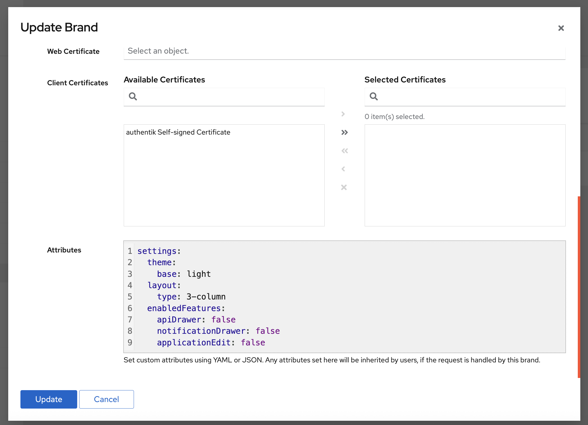

The User interface can be customized using attributes configured in [Brands](../../../sys-mgmt/brands/index.md).

To add, remove, or modify attributes for a brand, log in as an administrator and navigate to **System > Brands > Other global settings > Attributes**.

Most attributes defined in a brand apply to _both_ the User and Admin interfaces. However, any settings that are specific to only one interface are explicitly noted as such below.

The following screenshot shows the syntax for setting several attributes for a brand: light mode, a 3-column display of applications on **My applications** page, hiding the API drawer and the Notification drawer from the tool bar, and disallowing users to edit the applications on **My applications** page.

## Custom settings

The following settings for attributes are grouped by:

- `enabledFeatures` settings
- General attributes (used on both the Admin interface and the User interface)
- User interface only

import Enabledfeatureslist from "../\_enabledfeatureslist.mdx";

<Enabledfeatureslist />

#### `settings.enabledFeatures.applicationEdit` (User interface only)

    Display the Edit option for each application on the **My applications** page (only shown when user is superuser).

import Generalattributes from "../\_generalattributes.mdx";

<Generalattributes />

### Settings for the User interface only

#### `settings.layout.type`

Which layout to use for the **My applications** page. Defaults to `row`. Choices: `row`, `2-column`, `3-column`

import Global from "../_global/global.mdx";

<Global />
