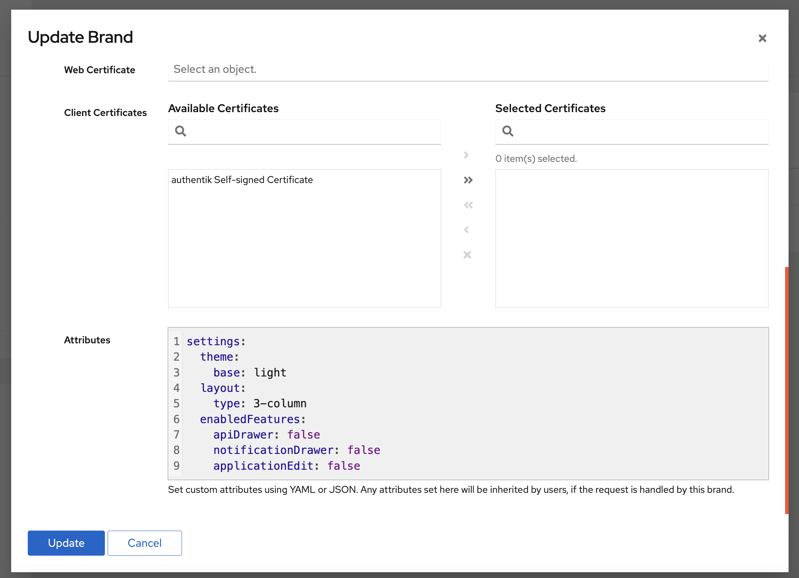

import EnabledFeaturesList from "../\_enabled-features-list.mdx";
import GlobalAttributes from "../\_global-attributes.mdx";
import UserAttributes from "./_attributes.mdx";

The User interface can be customized using attributes configured in [Brands](../../../sys-mgmt/brands/index.md).

To add, remove, or modify attributes for a brand, log in as an administrator and navigate to **System > Brands > Other global settings > Attributes**.

Most attributes defined in a brand apply to _both_ the User and Admin interfaces. However, any settings that are specific to only one interface are explicitly noted as such below.

The following screenshot shows the syntax for setting several attributes for a brand: light mode, a 3-column display of applications on the **Application Dashboard** page, hiding the API drawer and the Notification drawer from the toolbar, and disallowing users to edit applications on the **Application Dashboard** page.

## Custom settings

The following settings for attributes are grouped by:

- `enabledFeatures` settings
- General attributes (used on both the Admin interface and the User interface)
- User interface only

<EnabledFeaturesList />

<UserAttributes />

<GlobalAttributes />
