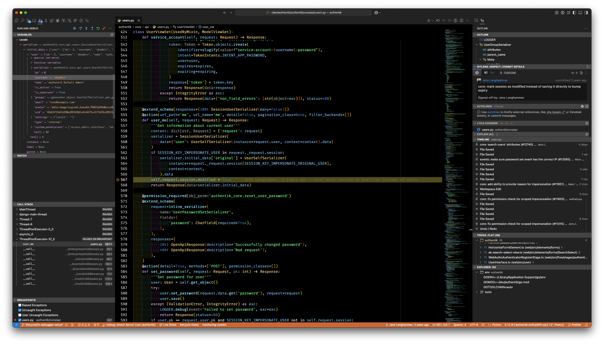

This page describes how to debug different parts of an authentik instance, running either in production or in a development setup.

## authentik Server & Worker - Python

The majority of the authentik codebase is in Python, running in gunicorn for the server and celery for the worker. These instructions show how this code can be debugged/inspected.

Note that authentik uses [debugpy](https://github.com/microsoft/debugpy), which relies on the "Debug Adapter Protocol". These instructions demonstrate debugging using [Visual Studio Code](https://code.visualstudio.com/), however they should be adaptable to other editors which support DAP.

To enable the debugging server, set the environment variable `AUTHENTIK_DEBUG` to `true`. This will launch the debugging server (by default on port _9901_).

With this setup in place, you can set Breakpoints in VS Code. To connect to the debugging server, run the command `> Debug: Start Debugging" in VS Code.



:::info
Note that due to the Python debugger for VS Code, when a python file in authentik is saved and the Django process restarts, you must manually reconnect the Debug session. Automatic re-connection is not supported for the Python debugger (see [here](https://github.com/microsoft/vscode-python/issues/19998) and [here](https://github.com/microsoft/vscode-python/issues/1182))
:::

#### Debugging in Containers

When debugging an authentik instance running in containers, there are some additional steps that need to be taken in addition to the steps above.

A local clone of the authentik repository is required to be able to set breakpoints in the code. The locally checked out repository must be on the same version/commit as the authentik version running in the containers. To checkout version 2024.12.3 for example, you can run `git checkout version/2024.12.3`.

The debug port needs to be accessible on the local machine. By default, this is port 9901. Additionally, the container being debugged must be started as root as additional dependencies need to be installed on startup.

When running in docker compose, a file `docker-compose.override.yml` can be created next to the authentik docker-compose.yml file to expose the port and change the user.

```yaml
services:
    server:
        user: root
        ports:
            - 9901:9901
```

After re-creating the containers with `AUTHENTIK_DEBUG` set to `true` and the port mapped, the steps are identical to the steps above.

If the authentik instance is running on a remote server, the `.vscode/launch.json` file needs to be adjusted to point to the IP of the remote server. Alternatively, it is also possible to forward the debug port via an SSH tunnel, using `-L 9901:127.0.0.1:9901`.

## authentik Server / Outposts - Golang

Outposts as well as some auxiliary code of the authentik server are written in Go. These components can be debugged using standard Golang tooling, such as [Delve](https://github.com/go-delve/delve).
