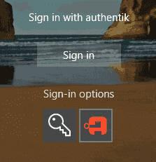

## Windows Credential Provider

Windows Credential Provider (WCP) is a component of the authentik Agent that allows logging in to Windows devices using authentik credentials.

Currently, only local login is supported; RDP login is not yet available and is under development.

:::warning

- WCP is currently only tested on Windows 11 and Windows Server 2022.
- When WCP is enabled, the password of the Windows user account that's used to log in is set to a random string.
- WCP can cause issues with user encrypted directories.
- Support with Active Directory has not been confirmed yet.
- Offline login is currently not supported.
  :::

## Prerequisites

- The authentik Agent (including the WCP component) deployed on the Windows device. See [Deploy the authentik Agent on Windows](../../agent-deployment/windows.md) for more details.
- A **[device access group](../device-access-groups.mdx)** configured with the appropriate user or group bindings. Without this group, all login attempts are denied. See [Configure device access](#configure-device-access).

## How it works

- The system agent requests an authentication and authorization URL from authentik, using its token.
- This URL is opened in a browser that also injects the device token information, allowing authentik to know that the login request is executed on the same machine.
- The end user logs in normally using the standard authentik interface and flows.
- After authentication finishes, the browser is redirected to a well-defined location and uses the token it receives to finish authentication and authorization through the system agent.

## How to log in to a Windows device

1. On the Windows login screen, click the authentik icon:

2. A browser window opens and prompts you for your authentik credentials.
3. After you authenticate, you are logged in to the Windows device.

## Configure device access

Local device login requires the authenticating user to have access to the device. [Device access groups](../device-access-groups.mdx) always control access. On Enterprise, direct device bindings for users, groups, or policies also affect access. Without an appropriately configured device access group or direct binding, **all login attempts are denied**.

1. In the Admin interface, navigate to **Endpoint Devices** > **Device access groups** and click **New Device Access Group**.
2. Provide a **Group name** (e.g. `windows-devices`) and click **Create Device Access Group**.
3. Expand the newly created device access group and click **Bind existing Policy / Group / User**.
4. Select **Group** and choose a group that contains the users who should be allowed to log in to the device. Alternatively, bind a specific **User** or a **Policy**.
5. Click **Create**.
6. Navigate to **Endpoint Devices** > **Devices** and edit the device for which you want to enable login.
7. Set the **Access group** to the device access group you created.
8. Click **Update**.

:::info
You can also assign a device access group during enrollment by selecting a **Device group** when creating the enrollment token.
:::
