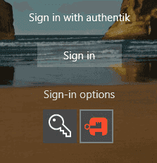

## Windows Credential Provider

Windows Credential Provider (WCP) is a component of the authentik Agent that allows logging in to Windows devices using authentik credentials.

It currently only supports local login; RDP login is not supported.

:::warning

- WCP is currently only tested on Windows 11 and Windows Server 2022.
- When WCP is enabled, the password of the Windows user account that's used to login is set to a random string.
- WCP can cause issues with user encrypted directories.
- Support with Active Directory has not been confirmed yet.
- Offline login is currently not supported.
  :::

## Prerequisites

You need to have deployed the authentik Agent including the WCP component on the Windows device, see [Deploy the authentik Agent on Windows](../../authentik-agent/agent-deployment/windows.md) for more details.

## How it works

- The system agent requests an authentication and authorization URL from authentik, using its token.
- This URL is opened in a browser which also injects the device token information, allowing authentik to know that the login request is executed on the same machine.
- The end user logs in normally using the standard authentik interface and flows.
- Once finished, the browser is redirected to a well-defined location and uses the token it receives to finish authentication and authorization through the system agent.

## How to log in to a Windows device

1. On the Windows login screen, click the authentik icon:

2. A browser window will open and prompt you for your authentik credentials.
3. Once authenticated, you will be logged in to the Windows device.
