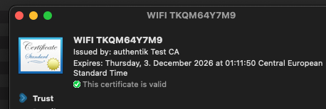
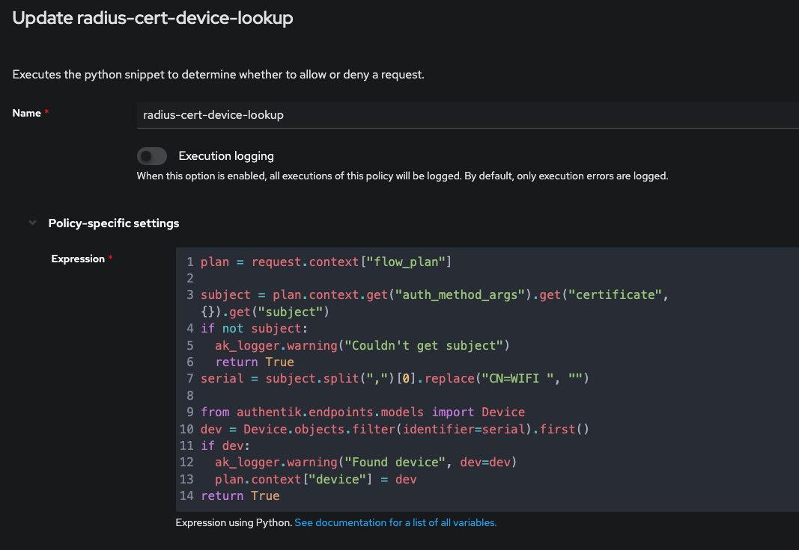
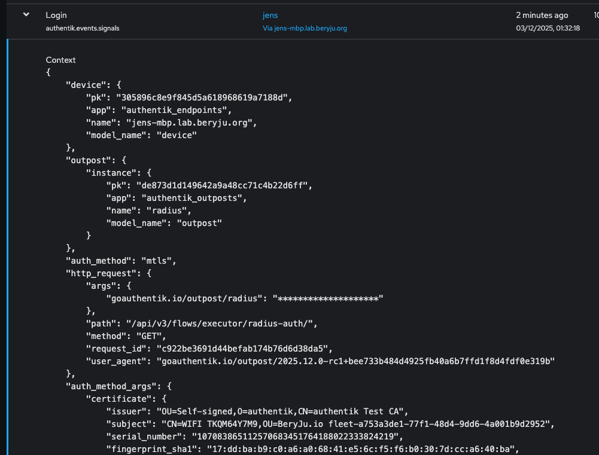

(TODO Change all images)

If you have MDM-managed certificates for Wi-Fi and they include the serial number, for example:

You can use a policy like this:

Which then associates Wi-FI login events with the device:

