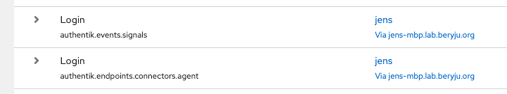

Endpoint Devices registered with authentik via a connector, such as the [authentik Agent](./connectors.md#authentik-agent) connector, regularly [check-in](#device-check-in) with authentik and report their [device facts](#device-facts).

These facts are shown on the [Devices](../manage-devices.mdx) page and are also accessible to policies and can be used to make policy decisions. See [Device Compliance Policy](./device-compliance-policy.md) for more details.

## Device check-in

When a device registered with authentik reports its [device facts](#device-facts), this is called a device check-in. These check-ins occur on a regular configurable schedule and can also be set to occur whenever a device is associated with an [Endpoint stage](../../add-secure-apps/flows-stages/stages/endpoint/index.md).

## Device facts

Device facts are informational snippets about a device, such as its operating system, serial number, installed applications, running processes, and more. These facts are supplied to authentik flows via the [authentik browser extension](browser-extension.mdx) to be used in making policy decisions. For example, you can create a policy that only allows endpoint devices that are running a recent OS version to access an application.

JL: the facts are supplied either by ak-sysd or from other connectors, and the browser extension is only used to associate the device the user is using with the device in the authentik database

### Advanced device facts :ak-enterprise

This feature is still in development and will be announced soon.

## Example facts

For an example of the facts provided for a Linux device, see [here](./facts-linux.json).

## Endpoint devices in event logs

Authentication events involving endpoint devices are included in the [event logs](../../sys-mgmt/events/logging-events.md). For example:

### Search for an endpoint device in the event logs :ak-enterprise

To search for event logs matching a specific endpoint device:

1. Log in to authentik as an administrator and open the authentik Admin interface.
2. Navigate to **Events** > **Logs**.
3. In the search bar, enter: `context.device.name = "<device_name>"`

For more information on searching the events logs, see [Logging events](../../sys-mgmt/events/logging-events.md).
