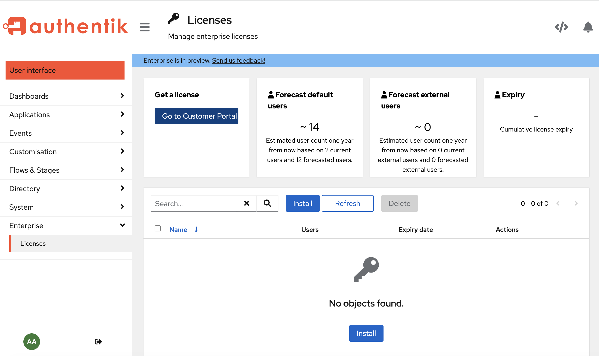

## Organization management

Your organization defines the members, their roles, the licenses associated with the organization, and account management for billing, payment methods, and invoice history.

### Create an Organization

1. To create a new organization, log in to the [Customer portal](./get-started#access-enterprise).

2. On the **My organizations** page, click **Create an organization**.

3. Specify the organization's name and notification email address, and then click **Create**.

    Your new organization page displays.

:::info
If you need to delete an organization open a ticket in the Support center.
:::

### Add/remove members of an organization

In the Customer portal you can remove members and invite new members to the organization. When you invite new members, you can specify the role for the new member.

-   **Member**: can view licenses, including the license key.
-   **Owner**: can do everything the Member role can do, plus: add and remove members, order and renew licenses, and edit the organization.

1. To manage membership in an organization, log in to the [Customer portal](./get-started#access-enterprise).

2. On the **My organizations** page, click the name of the organization you want to edit membership in.

    Your organization page displays.

    - To remove a member, scroll down to the **Membership** area and then click **Remove** beside the name of the member.

    - To invite a new member, scroll down to the **Pending invitations** area, and enter the email address for the person, select the role, and then click **Invite**.

    A message appears that the invitation has been sent. When the recipient accepts the invitation by clicking a link in the email, they will be added to the organization.

## License management

### Buy a license

:::info
[Learn more](#about-users) about **internal** and **external** users, and how we forecast the number of users.
:::

1. To get a license key, log in to your authentik account with your admin credentials, and then click **Admin interface** in the upper right.

2. On the **Admin interface**, navigate to **Enterprise → Licenses** in the left menu, and then click **Go to Customer portal** under the **Get a license** section.

3. In the Authentik login screen, sign up and then log in to the Customer Portal.

    In the Customer Portal, if you have not already created an Organization (nor been invited to join one), you are first prompted to create an organization.

4. On the **My organizations** page, click **Create an organization**.

5. Specify the organization's name and notification email address, and then click **Create**.

    Your new organization page displays.

6. Click **Purchase license**, and then on the **Purchase a license** page, review the pricing plans and (optionally) change the name of the license. The name is simply a nickname, a convenient way to label the license.

7. Click **Continue** to display the checkout page. Select the number of users, provide your payment information, and then click **Subscribe**.

    When payment verification is complete, you are redirected to the **My organizations** page, where you should see a message saying "Successful purchase. Your license will appear here once we've validated your payment. If it doesn't, please contact us."

    When ready, the license displays on the organization's page.

:::info
If you access the checkout page directly from the Customer portal, and not through the admin interface, you are prompted to provide the Install ID for your authentik installation. This ID can be found in the Admin interface on the **Licenses** page; click **Install** to view the **Install ID** number.
:::

8. To retrieve your license key, click on **Details** beside the license name and copy the key to your clipboard.

9. Go back to the Admin interface, navigate to **Enterprise -> Licenses** page, click on **Install**, paste the key, and then click **Install**.

#### License verification

To verify that the license was successfully installed, confirm that the expriry date on the **Enterprise --> Licenses** page displays a date one year later.

### How to view your license key

You can view the list of licenses that are applied to your organization on either the Admin interface, on the **Enterprise -> Licenses** page, or in the Customer portal, under your organization's page.

### About the license expiry date

The **Enterprise -> Licenses** page shows your current licenses' **Cumulative license expiry**. Expiry date calculation works by verifying the individual expiry date for all valid licenses and then picking the lowest expiry date. After the date of the earliest expiring license, all calculations will be updated without that license, by selecting the next earliest date.

### License violation notifications

The following events occur when a license expeires and is not renewed within two weeks.

-   After 2 weeks of the expiry date administrators see a warning banner on the Admin interface

-   After another 2 weeks, users get a warning banner

-   After another 2 weeks, the authentik Enterprise instance becomes “read-only”

### About users and licenses

License usage is calculated based on total user counts and log-in data data that authentik regularly captures. This data is checked against all valid licenses, and the sum total of all users.

-   The **_default user_** count is calculated based on actual users assigned to the organization.

-   The **_external user_** count is calculated based on how many external users were active (i.e. logged in) since the start of the current month.

:::info
An **internal** user is typically a team member, such as company employees, who gets access to the full Enterprise feature set. An **external** user might be an external consultant or a B2C customer who logged onto your website to shop. These users don't get access to enterprise features.
:::

## Manage Billing

Billing is based on each individual organization.

1. To manage your billing, go to the Customer portal and click "My organizations" in the top menu bar.

2. Select the organization for which you want to manage bulling.

    The organization detail page displays.

3. Click **Manage Billing** in the top left of the page.

    On the billing page you can:

    - update your account information (address, name, phone number, and tax ID)
    - add a payment method
    - view your invoice and payment history
