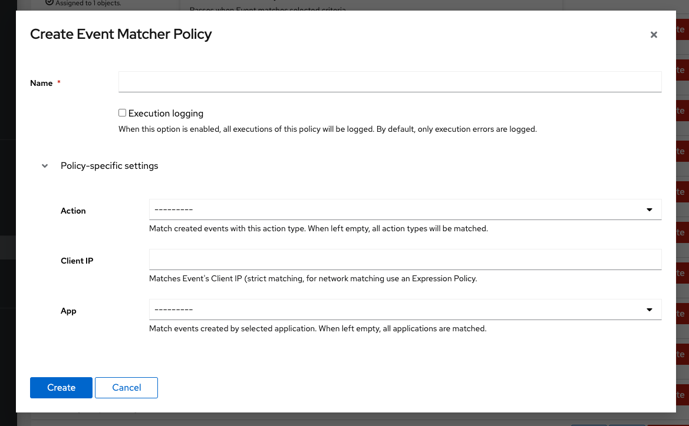

:::note
To prevent infinite loops (events created by policies which are attached to a Notification rule), **any events created by a policy which is attached to any Notification Rules do not trigger notifications.**
:::

## Filtering Events

Starting with authentik 0.15, you can create notification rules, which can alert you based on the creation of certain events.

Filtering is done by using the Policy Engine. You can do simple filtering using the "Event Matcher Policy" type.



An event has to match all configured fields, otherwise the rule will not trigger.

To match events with an "Expression Policy", you can write code like so:

```python
if "event" not in request.context:
    return False

return ip_address(request.context["event"].client_ip) in ip_network('192.0.2.0/24')
```

## Selecting who gets notified

After you've created the policies to match the events you want, create a "Notification Rule".

You have to select which group the generated notification should be sent to. If left empty, the rule will be disabled.

:::info
Before authentik 2023.5, when no group is selected, policies bound to the rule are not executed. Starting with authentik 2023.5, policies are executed even when no group is selected.
:::

You also have to select which transports should be used to send the notification.
A transport with the name "default-email-transport" is created by default. This transport will use the [global email configuration](../installation/docker-compose#email-configuration-optional-but-recommended).

Starting with authentik 2022.6, a new default transport will be created. This is because notifications are no longer created by default, they are now a transport method instead. This allows for better customization of the notification before it is created.
