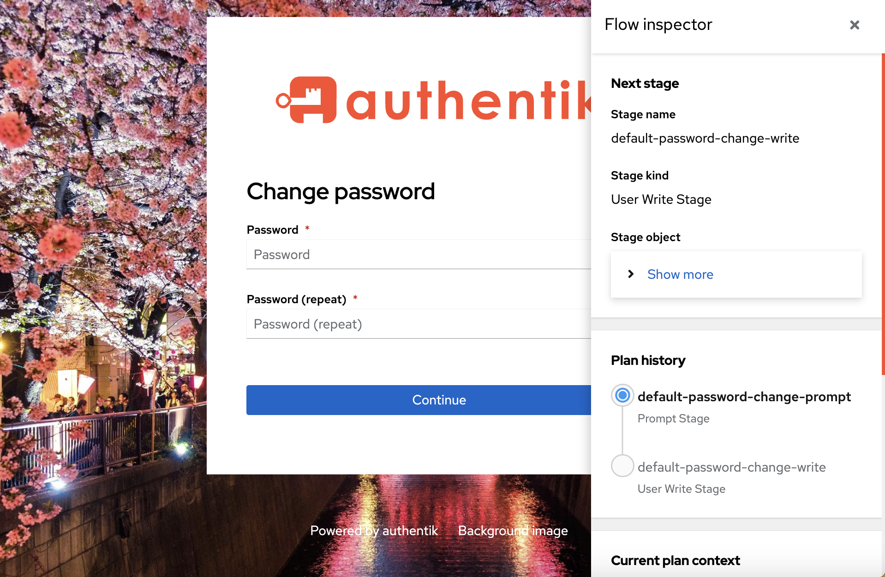
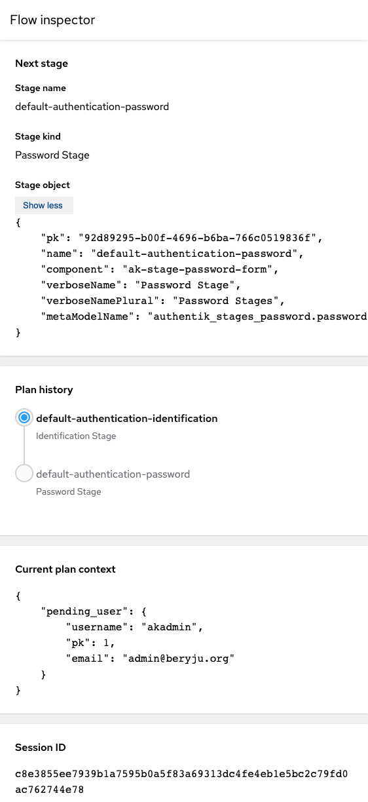

The flow inspector, introduced in 2021.10, allows administrators to visually determine how custom flows work, inspect the current [flow context](../flow/context/index.md) and debug issues.

:::info
Be aware that when running a flow with the inspector enabled, the flow is still executed normally. This means that for example, a [User write](../flow/stages/user_write.md) stage will _actually_ write user data.
:::

### Access the Flow Inspector

By default, the inspector can only be enabled when the currently authenticated user is a superuser, OR if a user has been granted the permission **Can inspect a Flow's execution** (or a user assigned to role witht he permissons).

When developing authentik with the debug-mode enabled, the inspector is enabled by default and can be accessed by both unauthenticated users and standard users. However the debug-mode should only be used for the development of authentik.

The following infos are shown in the inspector

## Next stage

This is the currently planned next stage. If you have stage bindings configured to _Evaluate when flow is planned_, then you will see the result here. If you however have them configured to re-evaluate (_Evaluate when stage is run_), then this will not show up here, since the results will vary based on your input.

Shown is the name and kind of the stage, as well as the unique ID.

## Plan history

Here you can see an overview of which stages have run, which is currently active, and which is planned to come next. Same caveats as above apply.

## Current plan context

This shows you the current context. This will contain fields depending on the same, after an identification stage for example you would see "pending_user" be set.

This data is not cleaned, so if your flow involves inputting a password, it will be shown here too.

## Session ID

The unique ID for the currently used session. This can be used to debug issues with flows restarting/losing state.
