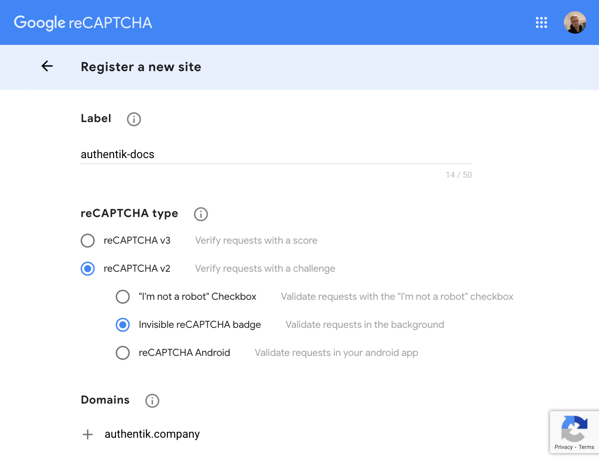

This stage adds a form of verification using [Google's ReCaptcha](https://www.google.com/recaptcha/intro/v3.html) or compatible services. Currently supported implementations:

-   ReCaptcha
-   hCaptcha
-   Turnstile

### Google ReCaptcha

This stage has two required fields: Public key and private key. These can both be acquired at https://www.google.com/recaptcha/admin.

### hCaptcha

See https://docs.hcaptcha.com/switch

### Turnstile

See https://developers.cloudflare.com/turnstile/get-started/migrating-from-recaptcha
