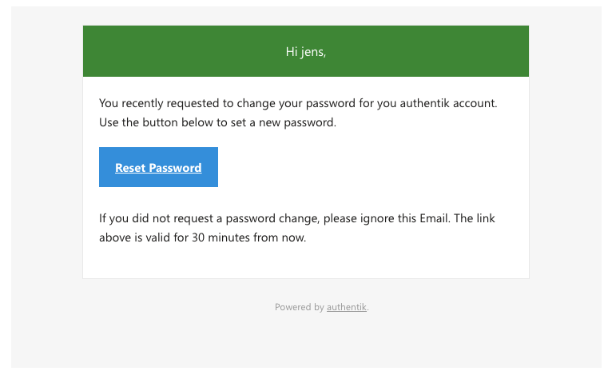
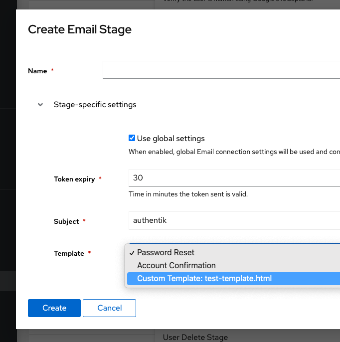

This stage can be used for email verification. authentik's background worker will send an email using the specified connection details. When an email can't be delivered, delivery is automatically retried periodically.



## Behaviour

By default, the email is sent to the currently pending user. To override this, you can set `email` in the plan's context to another email address, which will override the user's email address (the user won't be changed).

For example, create this expression policy and bind it to the email stage:

```python
request.context["email"] = "foo@bar.baz"
# Or get it from a prompt
# request.context["email"] = request.context["prompt_data"]["email"]
# Or another user attribute
# request.context["email"] = request.context["pending_user"].attributes.get("otherEmail")
return True
```

## Custom Templates

You can also use custom email templates, to use your own design or layout.

Place any custom templates in the `custom-templates` Folder, which is in the same folder as your docker-compose file. Afterwards, you'll be able to select the template when creating/editing an Email stage.

:::info
This is currently only supported for docker-compose installs, and supported starting version 0.15.
:::

:::info
If you've add the line and created a file, and can't see if, check the logs using `docker-compose logs -f worker`.
:::



### Example template

Templates are rendered using Django's templating engine. The following variables can be used:

-   `url`: The full URL for the user to click on
-   `user`: The pending user object.
-   `expires`: The timestamp when the token expires.

```html
{# This is how you can write comments which aren't rendered. #} {# Extend this
template from the base email template, which includes base layout and CSS. #}  {# Load the internationalization module to
translate strings, and humanize to show date-time #}   {# The email/base.html template uses a single "content" block #} 
<tr>
    <td class="alert alert-success">
         Hi {{ username }}, 
    </td>
</tr>
<tr>
    <td class="content-wrap">
        <table width="100%" cellpadding="0" cellspacing="0">
            <tr>
                <td class="content-block">
                     You recently requested to change your
                    password for you authentik account. Use the button below to
                    set a new password. 
                </td>
            </tr>
            <tr>
                <td class="content-block">
                    <table
                        role="presentation"
                        border="0"
                        cellpadding="0"
                        cellspacing="0"
                        class="btn btn-primary"
                    >
                        <tbody>
                            <tr>
                                <td align="center">
                                    <table
                                        role="presentation"
                                        border="0"
                                        cellpadding="0"
                                        cellspacing="0"
                                    >
                                        <tbody>
                                            <tr>
                                                <td>
                                                    <a
                                                        id="confirm"
                                                        href="{{ url }}"
                                                        rel="noopener noreferrer"
                                                        target="_blank"
                                                        ></a
                                                    >
                                                </td>
                                            </tr>
                                        </tbody>
                                    </table>
                                </td>
                            </tr>
                        </tbody>
                    </table>
                </td>
            </tr>
            <tr>
                <td class="content-block">
                     If you did
                    not request a password change, please ignore this Email. The
                    link above is valid for {{ expires }}. 
                </td>
            </tr>
        </table>
    </td>
</tr>

```
