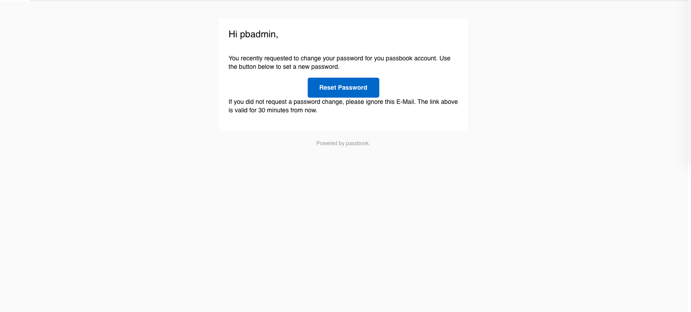
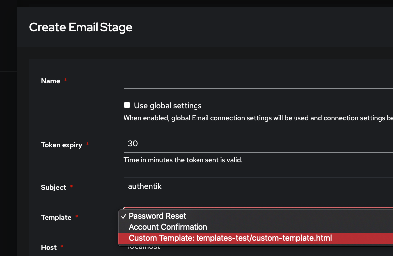

This stage can be used for email verification. authentik's background worker will send an email using the specified connection details. When an email can't be delivered, delivery is automatically retried periodically.



## Custom Templates

You can also use custom email templates, to use your own design or layout. To do this, simply add the following line to the docker-compose file:

```yanl
    [...]
    volumes:
      - ./backups:/backups
      - /var/run/docker.sock:/var/run/docker.sock
      # Add this line
      - ./templates:/templates
    env_file:
    [...]
```

And run `docker-compose up -d`.

Afterwards, any HTML file you place in the `templates` folder, and you'll be able to select them in the Email stage edit Form:

:::info
If you've add the line and created a file, and can't see if, check the logs using `docker-compose logs -f worker`.
:::


