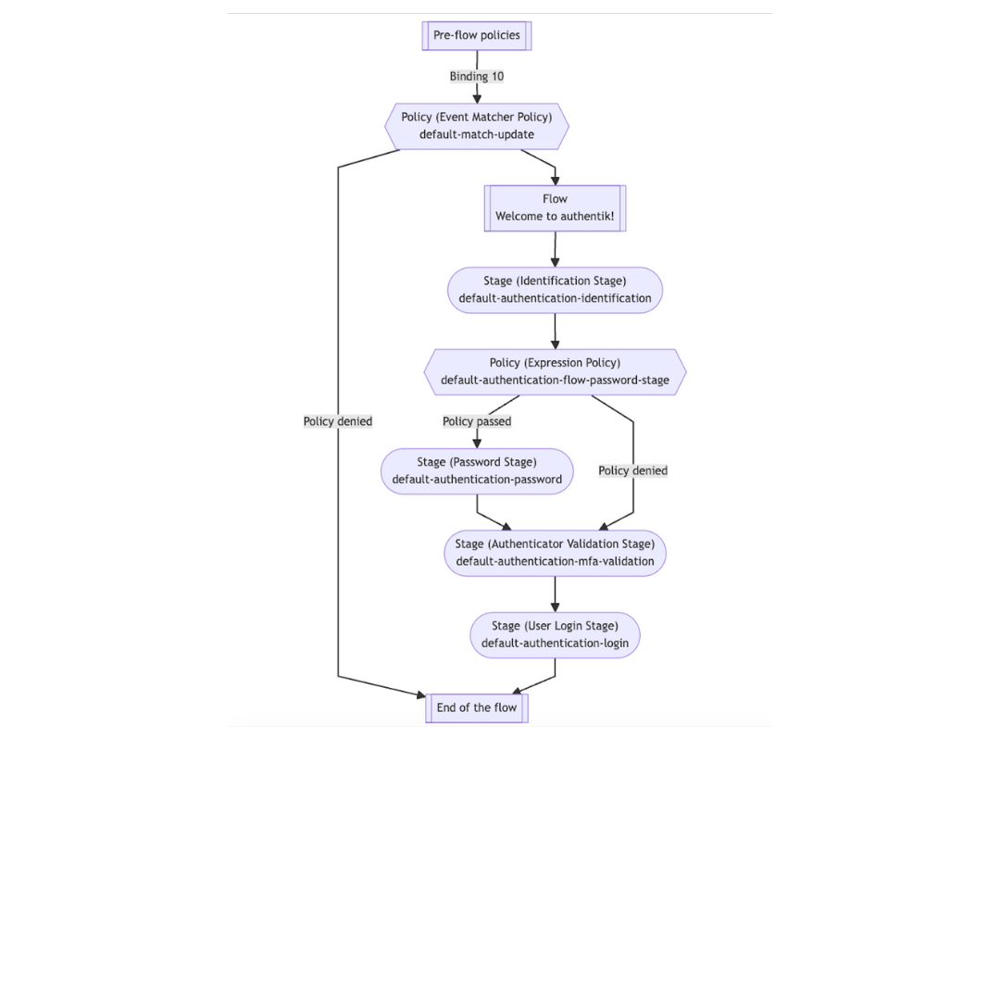

Stages are one of the fundamental building blocks in authentik, along with [flows](../../flow/index.md). and [policies](../../policies/index.md).

A stage represents a single verification or logic step, within a flow. You can bind one or more stages to a flow to create a customized, flexible log in and authentication process.

In the following diagram of the `default-authentication-flow`, you see multiple stages, or steps, in the authentication process for a user. Policies are bound to some stages, to provide a dynamic application of a specific stage if the policy criteria is met.

