import "./styles.css";

After you have installed and started authentik, you are now ready to add your first application and provider, add some users, and get started with using authentik as your Identity provider.

```mermaid
---
config:
    theme: 'base'
    themeVariables:
        primaryColor: '#FD4B2D'
        primaryTextColor: '#000'
        primaryBorderColor: '#FFF'
        archEdgeColor: '#000'
        archEdgeArrowColor: '#000'
        archEdgeWidth: '#FD4B2D'
        archGroupBorderColor: '#fff'
---
architecture-beta

    group first

    service install(mdi:application-cog-outline)[Install authentik] in first
    service acl(mdi:account-key-outline)[Access authentik] in first
    service apps(mdi:plus-box-multiple-outline)[Add an app and provider] in first
    service users(mdi:account-multiple-plus)[Create a new user] in first
    service further(mdi:cog-clockwise)[Further customization] in first

    install:R --> L:acl
    acl:R --> L:apps
    apps:R --> L:users
    users:R --> L:further

```



## Where are we now, and what's next?

The following tutorial assumes that you have already:

1. Installed authentik on either [Docker Compose](../../install-config/install/docker-compose.mdx#install-and-start-authentik), [Kubernetes](../../install-config/install/kubernetes.md#install-authentik-helm-chart), or [AWS CloudFormation](../../install-config/install/aws.md) and then started the server and worker.

2. Opened authentik in your browser to the `initial-setup` flow and added credentials for a default Admin account. ([Docker](../../install-config/install/docker-compose.mdx#access-authentik), [Kubernetes](../../install-config/install/kubernetes.md#access-authentik)), or [AWS CloudFormation](../../install-config/install/aws.md#access-authentik-from-aws-cloudformation).

:::info Initial setup in browser
You will get a `Not Found` error if the initial setup URL doesn't include the forward slash `/` at the very end of the URL. Also verify that the authentik server, worker, and PostgreSQL database are running and healthy. Review additional tips in our [troubleshooting docs](../../troubleshooting/login.md#cant-access-initial-setup-flow-during-installation-steps).
:::

Other optional pre-installation configurations that you might have already completed include:

- [Configured your global email address](../email/#global-email-settings).
- [Configured your PostgreSQL settings](../configuration/configuration.mdx#postgresql-settings) (read-replica, connections, etc.).
- Configured a [reverse proxy](../reverse-proxy.md).
- Configured your [media storage settings](../../install-config/configuration/configuration.mdx#media-storage-settings) or optionally [AWS S3 file storage](../../sys-mgmt/ops/storage-s3.md).
- Added additional [custom configurations environment variables](../configuration/#set-your-environment-variables).
- [Verified](../configuration/#verify-your-configuration-settings) your configuration settings.

## Install your first application and provider

Now that you have your authentik instance installed and configured with the required settings, you can add your first [application](../../../core/glossary/?application) and [provider](../../../core/glossary/?provider). After that, we'll walk through how to add your first user.

:::tip Security Best Practice

In a production environment, best practice is to first [create a group](../../users-sources/groups/manage_groups.mdx#create-a-group), then [create the user(s)](../../users-sources/user/user_basic_operations.md#create-a-user), and then add the application. Then you can configure the application to have a [binding](../../add-secure-apps/bindings-overview/work_with_bindings.md#) to a specific group or user. The binding controls the access to the application (whether or not it is displayed on a user's My Applications page).

:::

authentik supports any application; refer to our [Integrations documentation](https://integrations.goauthentik.io/index.mdx) to view integrations guides for over 150 of the most common ones.

**In this guide we'll be setting up Grafana as an example application.**

<details>
    <summary>Why Grafana?</summary>

We'll use Grafana as an example application in this guide as it is very common and straight forward to setup.

For more configuration options and full details about integrating with Grafana, refer to our [full integration guide](https://integrations.goauthentik.io/monitoring/grafana/). The following steps require that you have [Grafana instance running in Docker](https://grafana.com/docs/grafana/latest/setup-grafana/configure-docker/), and that you can access the authentik Admin interface.

</details>

### 1. Log in to authentik as an administrator and open the authentik Admin interface.

    **A.** In the Admin interface, navigate to **Applications** > **Applications** and click **Create with Provider** to create an application and provider pair.

:::tip About application and provider pairs
Every application that you add to authentik requires a provider, which is used to configure the specific protocol between the application and authentik, for example OIDC, SAML, LDAP, or others.
:::

**B.** Provide the details for the application (Grafana) and provider (OAuth2/OIDC).

- **Configure the Application**:
    - **Name**: provide a descriptive name (such as Grafana).
        - **Group**: select an optional group for the type of application. For example, you can choose to classify applications that your Sales team uses, or your Infrastructure team.
    - **Policy engine mode**: select **Any** for this tutorial; the mode determnes how strictly policies are adhered to.
        - <font color="green">
              <b>TIP</b>: in authentik,
              [policies](../../customize/policies/working_with_policies.md) are used in authentik to
              fine-tune access to applications, flows, stages and many other authentik components.
              It is not required to use a policy at all, though. The _policy engine mode_ setting of
              **Any** means that as long as a single policy passes (or if there are no policies
              bound to the application), then access to the application is granted. The mode **ALL**
              means that every one of any policies bound to the application must pass in order for a
              user to have access to the application.{" "}
          </font>
    - **UI Settings**: optional UI settings that are displayed about the application, including the launch URL, and three settings to display extra information about the application on the \*\*My Applications\*\* page: an optional icon, the publisher of the application, and a brief description.

- **Choose a Provider type**: select **OAuth2/OpenID Connect** as the provider type.

- **Configure the Provider**:
    - **Name**: Provide a name (or accept the auto-provided name).
    - **Authorization flow**: Select the default `implicit` authorization flow to use for this provider.
        - <font color="green">
              <b>TIP</b>
          </font>
          : The authorization [flow](../../add-secure-apps/flows-stages/flow/index.md) is where the
          various steps, or [_stages_](../../add-secure-apps/flows-stages/stages/index.md) of
          authorization are defined and executed. The defined set of stages construct the workflows
          of authentication, authorization, etc.
    - **Protocol settings** provide the following required configurations: - Note the **Client ID**, **Client Secret**, and **Slug** values because they will be required later when you configure Grafana to use authentik. - Set a `Strict` redirect URI to `https://grafana.company/login/generic_oauth`.
        - <font color="green">
              <b>TIP</b>
          </font>
          : The Redirect URI is where the application will go as soon as authentik's authorization
          flow is successfully completed.
    - **Logout URI**: set to `https://grafana.company/logout`.
    - **Logout Method**: set to `Front-channel`.
        - <font color="green">
              <b>TIP</b>
          </font>
          : With OAuth2, front-channel logout is considered the default because most application
          (including Grafana) do not support back-channel logout.
    - **Signing key**: select any available signing key.
        - <font color="green">
              <b>TIP</b>
          </font>
          : authentik generates a key that you can use, called the `authentik Self-signed
          Certificate`, if you do not have a specific signing key for an application.
- **Configure Bindings** _(optional)_: for this tutorial, skip this step because you do not yet have a user. Later, after you create your first user, you can create a binding to manage the display and access to applications on a user's **My applications** page.
    - <font color="green">
          <b>TIP</b>
      </font>
      : Short summary about how bindings works.

    For any fields not mentioned above, you can leave the default value.

**C.** Click **Submit** to save the new application and provider.

### 2. Configure Grafana to use authentik as its IdP

For some applications, you log into the application and configure settings there; with Grafana you simply edit your Grafana Docker Compose file. Here you add basic configuration settings as well as the **Client ID**, **Client Secret**, and the **Slug** values that you obtained when you configured the application and provider in authentik in Step 1. above.

**A.** In the Grafana Docker Compose file, set the following environment variables:

:::tip Docker-specific values
Note that these values are for a [Grafana instance running in Docker](https://grafana.com/docs/grafana/latest/setup-grafana/configure-docker/); for standalone or Helm Chart instances refer to our [Grafana integration guide](https://integrations.goauthentik.io/monitoring/grafana/)).
:::

# TODO: Explain authentik.company placeholder

MOVE THIS UP MAYBE TO BE BY THE REDIRECT URI?? We want to explain that this is a placeholder that we use, but they would replace the domain that authentik is running on... just like grafana.company is the domain for grafama

```
environment:
    GF_AUTH_GENERIC_OAUTH_ENABLED: "true"
    GF_AUTH_GENERIC_OAUTH_NAME: "authentik"
    GF_AUTH_GENERIC_OAUTH_CLIENT_ID: "<Client ID from above>"
    GF_AUTH_GENERIC_OAUTH_CLIENT_SECRET: "<Client Secret from above>"
    GF_AUTH_GENERIC_OAUTH_SCOPES: "openid profile email"
    GF_AUTH_GENERIC_OAUTH_AUTH_URL: "https://authentik.company/application/o/authorize/"
    GF_AUTH_GENERIC_OAUTH_TOKEN_URL: "https://authentik.company/application/o/token/"
    GF_AUTH_GENERIC_OAUTH_API_URL: "https://authentik.company/application/o/userinfo/"
    GF_AUTH_SIGNOUT_REDIRECT_URL: "https://authentik.company/application/o/<application_slug>/end-session/"
    # Optionally enable auto-login (bypasses Grafana login screen)
    GF_AUTH_OAUTH_AUTO_LOGIN: "true"
    # Optionally map user groups to Grafana roles
    GF_AUTH_GENERIC_OAUTH_ROLE_ATTRIBUTE_PATH: "contains(groups[*], 'Grafana Admins') && 'Admin' || contains(groups[*], 'Grafana Editors') && 'Editor' || 'Viewer'"
    # Required if Grafana is running behind a reverse proxy
    GF_SERVER_ROOT_URL: "https://grafana.company"
```

**B.** Save your Grafana Docker Compose file, and then launch the stack and access Grafana via your browser at the configured URL.

**C.** To confirm that authentik is properly configured with the new application, log out of Grafana and then log back in using the **Sign in with authentik** button. You should be redirected to authentik to provide credentials.

## Add your first user

Now that you can access the authentik Admin interface, and you have added an application and provider, let's add a new user.

### 1. Log in to authentik as an administrator and open the authentik Admin interface.

    **A.** Navigate to **Directory > Users**, and click **New User**.

    **B.** Fill in the **_required_** fields:

    - **Username**: This value must be unique across all users.
    # TODO: what is the path used for, link to ??? about this. State that paths are used to organize your users... for example HR vs Sales, etc. They do not imoact access,, etc., purely organizational. Note to me: the top-level user dir shows all user including those in sub-dirs
    - **Path**: The path where the user will be created. By default the new user is created in the `users` directory, but you can change that later by editing the user.

    For information about the **_optional_** fields below, refer to our [documentation on managing users](../../users-sources/user/user_basic_operations.md#create-a-user).

    - **Name**: The display name of the user.
    - **Email**: The email address of the user. This is required for many integrations.
    - **Is active**: Define the newly created user account as active.
    - **Attributes**: You can leave this empty for this tutorial. This field can be used to store custom attributes for the user, in YAML or JSON format. These attributes can then be used within property mappings and policies.

    **C.** Click **Create**.

### 2. Verify that the new user was created

- Look for the new user in the list on the **Directory** > **Users** page.

## What's next?

Now that you have added your first application, and a new user, here are some typical next steps:

- Assign your new user to appropriate [groups](../../users-sources/user/user_basic_operations.md#add-a-user-to-a-group) and [roles](../../users-sources/user/user_basic_operations.md#add-a-user-to-a-role).
- Configure federated or external [sources](../../users-sources/sources/index.md) (an existing source of user credentials and other user data).
- Set up MFA
- Define [property mappings](../../add-secure-apps/providers/property-mappings/index.md).
- Create a [custom flow](../../add-secure-apps/flows-stages/flow/index.md#).
- Install an [Enterprise license](../../enterprise/manage-enterprise.mdx#buy-a-license)
- [Create a policy](../../customize/policies/index.md) to control access, force MFA use, etc..

## Things to know and troubleshooting tips

Review the following information to learn more about the basics of setting up authentik and for troubleshooting tips.

### Modifying the Docker Compose file

Especially when you are just starting out with authentik, we recommend that you use the default `docker-compose.yml` file that comes with the download, instead of trying to write the file from scratch. After you have successfully installed, configured, and accessed authentik, you can edit the file to do more advanced configurations, as documented in the [Configuration section](../../install-config/configuration/configuration.mdx).

### Reverse proxy

Typically authentik is set up with a reverse proxy in front of it. If you already have a reverse proxy that you are using to handle your incoming network traffic, you can simply use that same reverse proxy for authentik, by adding a few configuration values. For more details see the [Reverse proxy guide](../reverse-proxy.md).

### The `latest` tag is deprecated

We highly recommend that you do NOT use the `:latest` tag with container images because it can lead to unintentional updates and potentially broken setups. Instead, use a specific version tag for authentik instances' container images, such as `:2025.12`.

### Using bindings to allow or restrict access to applications

Note that if you do not define any bindings, then all users have access to the application. For more information about user access, refer to our documentation about [authorization](../../add-secure-apps/applications/manage_apps.mdx#policy-driven-authorization) and [hiding an application](../../add-secure-apps/applications/manage_apps.mdx#hide-applications).
