After you have installed and started authentik, you are now ready to add your first application and provider, add some users, and get started with using authentik as your SSO and IdP.

```mermaid
%%{init: {'theme': 'base', 'themeVariables': { 'primaryColor': '#FD4B2D', 'primaryTextColor': '#000', 'primaryBorderColor': '#FD4B2D'}}}%%

architecture-beta
    group first

    service install(mdi:application-cog-outline)[Install authentik] in first
    service acl(mdi:account-key-outline)[Access authentik] in first
    service apps(mdi:plus-box-multiple-outline)[Add an appp and provider] in first
    service users(mdi:account-multiple-plus)[Create a new user] in first
    service further(mdi:cog-clockwise)[Further customization] in first

    install:R --> L:acl
    acl:R --> L:apps
    apps:R --> L:users
    users:R --> L:further

```



## Where are we now, and what's next?

The following tutorial assumes that you have already:

1. Installed authentik on either [Docker Compose](../install-config/install/docker-compose.mdx#install-and-start-authentik), [Kubernetes](../install-config/install/kubernetes.md#install-authentik-helm-chart), or [AWS CloudFormation](../install-config/install/aws.md) and then started the server and worker.

2. Opened authentik in your browser and added credentials for a default Admin account. ([Docker](../install-config/install/docker-compose.mdx#access-authentik) or [Kubernetes](../install-config/install/kubernetes.md#access-authentik)).

:::info Initial setup in browser
If your attempt to open authentik in the browser using the URL with the `initial-setup` flow does not work, verify that you have a trailing slash on the end of the URL. Also verify that the authentik server, worker, an PostgreSQL database are started and healthy.
:::

Other optional pre-installation configurations that you might have already completed include:

- [Configured your global email address](../email/#global-email-settings).
- [Installed a production-ready PostgreSQL database](./install/kubernetes.md#postgresql-production-setup).
- [Configured your PostgreSQL settings](./configuration/configuration.mdx#postgresql-settings) (read-replica, connections, etc.).
- Configured your [media storage settings](../install-config/configuration/configuration.mdx#media-storage-settings) or optionally [AWS S3 file storage](../sys-mgmt/ops/storage-s3.md).
- Added additional [custom configurations environment variables](../configuration/#set-your-environment-variables).
- [Verified](../configuration/#verify-your-configuration-settings) your configuration settings.

## Install your first application and provider

Now that you have your authentik instance installed and configured with the required settings, you can add your first [application](../core/glossary/terms/application.mdx) and [provider](../core/glossary/terms/provider.mdx). After that, we'll walk through how to add you r first user.

:::tip Security Best Practice

In a production environment, best practice is to first [create a group](../users-sources/groups/manage_groups.mdx#create-a-group), then [create the user(s)](../users-sources/user/user_basic_operations.md#create-a-user), and then add the application; you can configure the application to have a binding to the group or user. The binding controls the access to the application (whether or not it is displayed on a user's My Apps page).

:::

authentik supports hundreds of applications; refer to our [Integrations documentation](https://integrations.goauthentik.io/index.mdx) to view integrations guides for many common ones.

<details>
    <summary>We'll use the Grafana application as a first application.</summary>

For more configuration options and full details about integrating with Grafana, refer to our [full integration guide](https://integrations.goauthentik.io/monitoring/grafana/). The following steps require that you have [Grafana instance running in Docker](https://grafana.com/docs/grafana/latest/setup-grafana/configure-docker/), and that you can access the authentik Admin interface.

</details>

### 1. Log in to authentik as an administrator and open the authentik Admin interface.

    **A.** In the Admin interface, navigate to **Applications** > **Applications** and click **Create with Provider** to create an application and provider pair.

:::tip About app and provider pairs
Every application that you add to authentik has a provider; the provider is the protocol by which the application communicates and shares data between software applications on network devices.
:::

**B.** Provide the details for the application (Grafana) and provider (OAuth2/OIDC).

- **Application**: provide a descriptive name (such as Grafana), an optional group for the type of application, the policy engine mode (select ANY to simplify this exercise), and optional UI settings that are displayed about the application.
- **Choose a Provider type**: select **OAuth2/OpenID Connect** as the provider type.
- **Configure the Provider**: provide a name (or accept the auto-provided name) and the authorization flow to use for this provider. Under **Protocol settings** provide the following required configurations.
    - Note the **Client ID**, **Client Secret**, and **slug** values because they will be required later when you configure Grafana to use authentik.
    - Set a `Strict` redirect URI to `https://grafana.company/login/generic_oauth`. <font color="green"><b>TIP</b>: The Redirect URI is where the application will go as soon as authentik's authorixation flow is successfully completed. </font>
    - Set the Logout URI to `https://grafana.company/logout`.
    - Set the Logout Method to `Front-channel`. <font color="green"><b>TIP</b>: With OAuth2, front-channel logout is considered the default because most application (including Grafana) do not support back-channel logout. </font>
    - Select any available signing key.
- **Configure Bindings** _(optional)_: you can create a [binding](../../add-secure-apps/flows-stages/bindings/) to manage the display and access to applications on a user's **My applications** page.

    For any fields not mentioned above, you can leave the default value.

**C.** Click **Submit** to save the new application and provider.

### 2. Configure Grafana to use authentik as its IdP

For some applications, you log into the application and configuring settings there; with Grafana you simply edit your authentik `.env` file. Here you add basic configuration settings as well as the Client ID, the secret, and the slug values that you obtained when you configured authentik in Step 1., above.

**A.** In your authentik `.env` file, set the following environment variables:

:::tip Docker-specific values
Note that these values are for a [Grafana instance running in Docker](https://grafana.com/docs/grafana/latest/setup-grafana/configure-docker/); for standalone or Helm Chart instances refer to our [Grafana integration guide](https://integrations.goauthentik.io/monitoring/grafana/)).
:::

```
environment:
    GF_AUTH_GENERIC_OAUTH_ENABLED: "true"
    GF_AUTH_GENERIC_OAUTH_NAME: "authentik"
    GF_AUTH_GENERIC_OAUTH_CLIENT_ID: "<Client ID from above>"
    GF_AUTH_GENERIC_OAUTH_CLIENT_SECRET: "<Client Secret from above>"
    GF_AUTH_GENERIC_OAUTH_SCOPES: "openid profile email"
    GF_AUTH_GENERIC_OAUTH_AUTH_URL: "https://authentik.company/application/o/authorize/"
    GF_AUTH_GENERIC_OAUTH_TOKEN_URL: "https://authentik.company/application/o/token/"
    GF_AUTH_GENERIC_OAUTH_API_URL: "https://authentik.company/application/o/userinfo/"
    GF_AUTH_SIGNOUT_REDIRECT_URL: "https://authentik.company/application/o/<application_slug>/end-session/"
    # Optionally enable auto-login (bypasses Grafana login screen)
    GF_AUTH_OAUTH_AUTO_LOGIN: "true"
    # Optionally map user groups to Grafana roles
    GF_AUTH_GENERIC_OAUTH_ROLE_ATTRIBUTE_PATH: "contains(groups[*], 'Grafana Admins') && 'Admin' || contains(groups[*], 'Grafana Editors') && 'Editor' || 'Viewer'"
    # Required if Grafana is running behind a reverse proxy
    GF_SERVER_ROOT_URL: "https://grafana.company"
```

**B.** Save your authentik `.env` file and go to your Grafana application.

**C.** To confirm that authentik is properly configured with the new application, log out of the Grafana application and then log back in using your authetntik credentials. If you don't use the default admin account that's fine, just be sure that the account is for a member of an appropriate authentik group.

## Add your first user

Now that you can access the authentik Admin interface, and you have added an application and provider, let's add a new user.

### 1. Log in to authentik as an administrator and open the authentik Admin interface.

    **A.** Navigate to **Directory > Users**, and click **New User**.

    **B.** Fill in the **_required_** fields:

    - **Username**: This value must be unique across your user folders.
    - **Path**: The path where the user will be created. By default the new user is created in the `/root/users` directory path, but you can change that later by editing the user.

    For information about the **_optional_** fields below, refer to our [documentation on managing users](../users-sources/user/user_basic_operations.md#create-a-user).

    - **Name**: The display name of the user.
    - **Email**: The email address of the user.
    - **Is active**: Define the newly created user account as active.
    - **Attributes**: You can leave this empty for this tutorial. Custom attributes definition for the user, in YAML or JSON format. These attributes can be used to enforce additional prompts on authentication stages or define conditions to enforce specific policies if the current implementation does not fit your use case.

    **C.** Click **Create**.

### 2. Verify that the new user was created

- Look for the new user in the list on the **Directory > Users** page.

## What's next?

Now that you have added your first application, and a new user, here are some typical next steps:

- Assign your new user to appropriate [groups](../users-sources/user/user_basic_operations.md#add-a-user-to-a-group) and [roles](../users-sources/user/user_basic_operations.md#add-a-user-to-a-role).
- Configure federated or external [sources](../users-sources/sources/index.md) (an existing source of user credentials and other user data).
- Set up MFA
- Define [property mappings](../add-secure-apps/providers/property-mappings/index.md).
- Create a [custom flow](../add-secure-apps/flows-stages/flow/index.md#).
- Configure a [reverse proxy](./reverse-proxy.md).
- Install an [Enterprise license](../enterprise/manage-enterprise.mdx#buy-a-license)
- [Create a policy](../customize/policies/index.md) to control access or force MFA use.

## Things to know and troubleshooting tips

Review the following information to learn more about the basics of setting up authentik and for troubleshooting tips.

### Production environments

For production environments we recommend that you install and run authentik in [Kubernetes](../install-config/install/kubernetes.md).

### Modifying the Docker Compose file

Especially when you are just starting out with authentik, we recommend that you use the default `docker-compose.yml` file that comes with the download, instead of trying to write the file from scratch. After you have successfully installed, configured, and accessed authentik, you can edit the file to do more advanced configurations, as documented in the [Configuration section](../install-config/configuration/configuration.mdx).

### Reverse proxy

Typically authentik is set up with a reverse proxy in front of it. If you already have a reverse proxy that you are using to handle your incoming network traffic, you can simply use that same reverse proxy for authentik, by adding a few configuration values. There is no need to set up a separate reverse proxy. For more details see the [Reverse proxy guide](./reverse-proxy.md).

### The `latest` tag is deprecated

We highly recommend that you do NOT use the `:latest` tag with container images because it can lead to unintentional updates and potentially broken setups. Instead, use a specific version tag for authentik instances' container images, such as `:2025.12`.

### Using bindings to allow or restrict access to applications

Note that if you do not define any bindings, then all users have access to the application. For more information about user access, refer to our documentation about [authorization](../add-secure-apps/applications/manage_apps.mdx#policy-driven-authorization) and [hiding an application](../add-secure-apps/applications/manage_apps.mdx#hide-applications).
