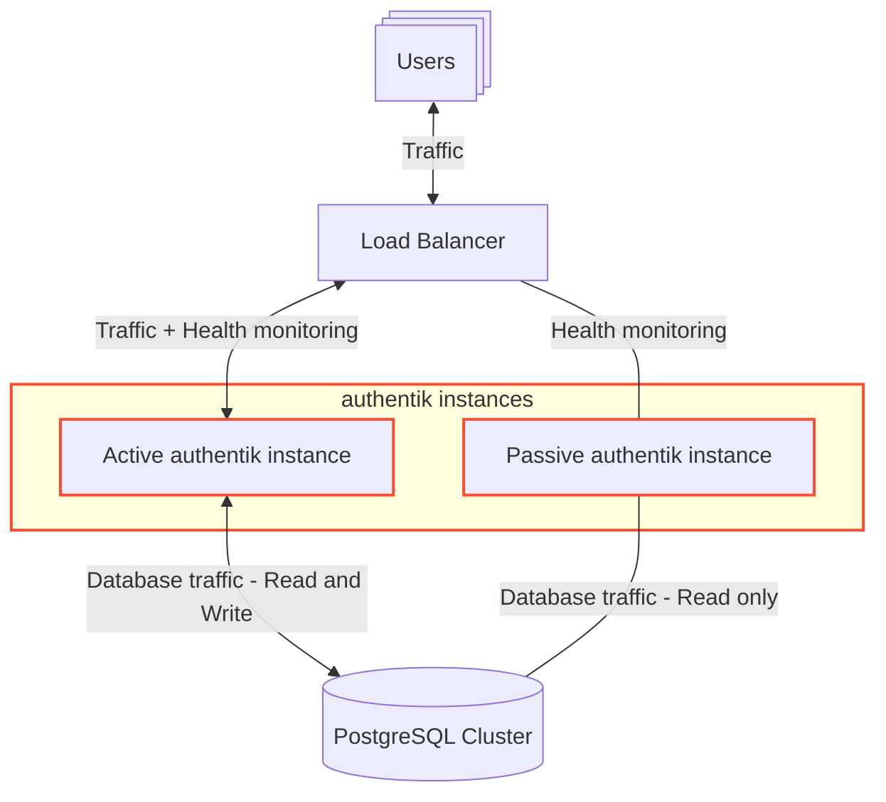

High availability refers to designing systems to minimize downtime even in the event of failures or disruptions.

authentik supports high availability in several ways:

- Multiple instances of the server and worker can be run in parallel, allowing for redundancy.
- The authentik database is PostgreSQL, which has extensive support for different [highly available setups](https://www.postgresql.org/docs/current/high-availability.html).
- Both authentik and PostgreSQL support active-passive deployments.

## Parallel server and worker instances

authentik server and worker instances are stateless, meaning that session states and configurations are stored in the database. This statelessness makes it easy to horizontally scale authentik deployments by adding more server and worker instances, ensuring resilience and fault tolerance.

If a server or worker instance goes offline, another instance can continue to serve traffic. If these instances are distributed among multiple hosts, it can provide even higher levels of resilience and fault tolerance.

## PostgreSQL high availability

PostgreSQL supports high availability through _replication_ and _clustering_.

Refer to the [PostgreSQL High Availability, Load Balancing, and Replication documentation](https://www.postgresql.org/docs/current/high-availability.html) for more details.

authentik also has built-in support for [PostgreSQL Read Replicas](../configuration/#read-replicas) and using [PostgreSQL Connection Poolers](../configuration/#using-a-postgresql-connection-pooler) like PgBouncer or PgPool.

## Active-passive authentik deployment

In an active-passive deployment, one authentik instance actively serves all requests while the other is on standby, prepared to assume control in the event of a failure.

The components of an active-passive authentik deployment include:

- **Active Instance**: Handles all user authentication requests, API calls, and background tasks during normal operation. It is fully operational and serves live traffic.
- **Passive Instance**: Runs as a hot/warm standby. Does not handle incoming traffic or processing. Does not actively write to the database.
- **Shared Database**: Both instances connect to the same PostgreSQL database which ensures data consistency. Because authentik is stateless, there are no data conflicts.
- **Load Balancer**: A load balancer monitors the active instance's health. Upon detecting failure, it promotes the passive instance to active by redirecting all traffic to it. This failover can be triggered automatically or manually, depending on your failover strategy. When the original active authentik instance is restored, it can either remain passive or be promoted back to active (failback).

For more information on monitoring the health of an authentik instance, refer to the [Monitoring documentation](../sys-mgmt/ops/monitoring.md).

This setup provides several advantages:

- **Resilient hosting options**: The ability to host each authentik deployment in separate environments. Different hardware, datacenters, or providers can be utilized for each deployment to increase resiliency and fault tolerance.
- **Continuity of service**: During maintenance windows, continuity of service can be assured by switching between active and passive instances.
- **Automatic failover**: A load balancer allows for automatic failover based on health monitoring, rather than waiting for administrators to detect an issue and manually failover.
- **Possibility of blue-green deployment**: The use of a load balancer also allows for blue-green methodology, assuming that appropriate changes are made to the database.
