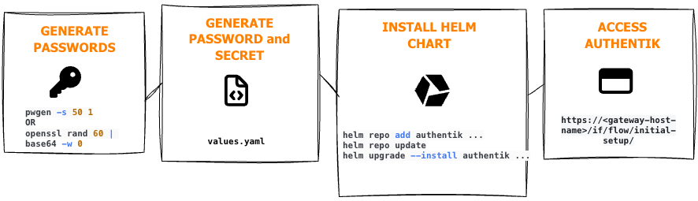

You can install authentik to run on Kubernetes using a Helm Chart.

:::info
You can also [view a video walk-through](https://www.youtube.com/watch?v=O1qUbrk4Yc8) of the installation process on Kubernetes (with bonus details about email configuration and other important options).
:::

## Requirements

- Kubernetes
- Helm

## Workflow



## Video

View our video about installing authentik on Kubernetes.

<iframe width="560" height="315" src="https://www.youtube.com/embed/O1qUbrk4Yc8?si=hs-ZhbVk4Y-TW_Vw&amp;start=562" title="YouTube video player" frameborder="0" allow="accelerometer; autoplay; clipboard-write; encrypted-media; gyroscope; picture-in-picture; web-share" allowfullscreen></iframe>

## Generate passwords

Start by generating passwords for the database and cache. You can use either of the following commands:

```shell
pwgen -s 50 1
openssl rand 60 | base64 -w 0
```

## Set values

Create a `values.yaml` file with a minimum of these settings:

```yaml
authentik:
    secret_key: "PleaseGenerateASecureKey"
    # This sends anonymous usage-data, stack traces on errors and
    # performance data to sentry.io, and is fully opt-in
    error_reporting:
        enabled: true
    postgresql:
        password: "ThisIsNotASecurePassword"

server:
    gateway:
        # Specify kubernetes gateway controller class name
        GatewayClassName: nginx | traefik | kong
        enabled: true
        hosts:
            - authentik.domain.tld

postgresql:
    enabled: true
    auth:
        password: "ThisIsNotASecurePassword"
```

See all configurable values on [ArtifactHub](https://artifacthub.io/packages/helm/goauthentik/authentik).

## PostgreSQL production setup

The PostgreSQL database that is created by default during installation is only intended for demonstration and testing purposes. For production instances, you should use another installation method using one of the following operators:

- [CloudNativePG](https://github.com/cloudnative-pg/cloudnative-pg)
- [Zalando Postgres Operator](https://github.com/zalando/postgres-operator)

## Email configuration (optional but recommended)

It is also recommended to configure global email settings. These are used by authentik to notify administrators about alerts, configuration issues and new releases. They can also be used by [Email stages](../../add-secure-apps/flows-stages/stages/email/index.mdx) to send verification/recovery emails.

For more information, refer to our [Email configuration](../email.mdx) documentation.

## Install authentik Helm Chart

Now, execute the following commands to install authentik:

```shell
helm repo add authentik https://charts.goauthentik.io
helm repo update
helm upgrade --install authentik authentik/authentik -f values.yaml
```

During the installation process, the database migrations will be applied automatically on startup.

## Access authentik

After the installation is complete, access authentik at `https://<gateway-host-name>/if/flow/initial-setup/`. Here, you can set a password for the default `akadmin` user.

:::info
You will get a `Not Found` error if initial setup URL doesn't include the trailing forward slash `/`. Make sure you use the complete URL (`http://<ingress-host-name>/if/flow/initial-setup/`) including the trailing forward slash.
:::

## First steps in authentik

import Blurb_first_steps from "../\_blurb_first_steps.md";

<Blurb_first_steps />
