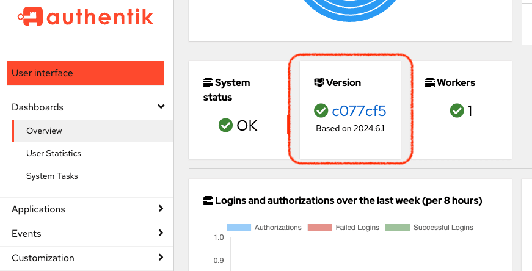

Upgrading to the latest version of authentik, whether a new major release or a patch, involves running a few commands to pull down the latest images and then restarting the servers and databases.

## Important considerations

:::danger
authentik does not support downgrading. Make sure to back up your database in case you need to revert an upgrade.
:::

**Preview the release notes**: Be sure to carefully read the [Release Notes](../../releases/) for the specific version to which you plan to upgrade. The release might have special requirements or actions or contain breaking changes.

**Database backup**: Before upgrading, make a backup of your PostgreSQL database. You can create a backup by dumping your existing database. For detailed instructions, refer to the relevant guide for your deployment method ([Docker Compose](../troubleshooting/postgres/upgrade_docker.md) or [Kubernetes](../troubleshooting/postgres/upgrade_kubernetes.md)).

**Upgrade sequence**: Upgrades must follow the sequence of major releases; **do not skip** directly from an older major version to the most recent version.

Always upgrade to the latest minor version (`.x`) within each `major.minor` version before upgrading to the next major version. For example, if you're currently running `2025.2.1`, upgrade in the following order:

1. Upgrade to the latest `2025.2.x`.
2. Then to the latest `2025.4.x`.
3. Finally to the latest `2025.6.x`.

**Outposts**: The version of the authentik server and all authentik outposts must match. Ensure that all [outposts are upgraded](../add-secure-apps/outposts/upgrading.md) at the same time as the core authentik instance.

## Upgrade authentik

import TabItem from "@theme/TabItem";
import Tabs from "@theme/Tabs";

<Tabs groupId="platform">
  <TabItem value="docker-compose" label="Docker Compose" default>
    In your terminal, navigate to your installation directory and follow these steps:

    #### 1. Retrieve latest `docker-compose.yml` file

    Download the `docker-compose.yml` file using either `wget -O docker-compose.yml https://goauthentik.io/docker-compose.yml` or `curl -O https://goauthentik.io/docker-compose.yml` or a similar process.

    **2. Run upgrade commands**

    ```shell
    docker compose pull
    docker compose up -d
    ```

  </TabItem>
  <TabItem value="kubernetes" label="Kubernetes">
    In your terminal, navigate to your installation directory and run the following commands:

    ```
    helm repo update
    helm upgrade --install authentik authentik/authentik -f values.yaml
    ```

  </TabItem>
  <TabItem value="aws-cloudformation-ecs" label="AWS Cloudformation ECS">
    Navigate to your authentik AWS Cloudformation stack. Click on the **Changesets** tab and **Create changeset**.

    Select **Use existing template** and follow the prompts to upgrade.

    To upgrade to a specific version, select **Replace existing template** and use the following URL: `https://authentik-cloudformation-templates.s3.amazonaws.com/authentik.ecs.VERSION.yaml` replacing `VERSION` with the version you want to upgrade to. You can use `latest` to upgrade to the latest version.

  </TabItem>
</Tabs>

## Upgrade any outposts

Be sure to also [upgrade any outposts](../add-secure-apps/outposts/upgrading.md) when you upgrade your authentik instance.

## Verify your upgrade

You can view the current version of your authentik instance by logging in to the Admin interface, and then navigating to **Dashboards -> Overview**.



## Troubleshooting your upgrade

If you run the upgrade commands but your version on the Dashboard doesn’t change, follow this steps:

1. Look at the server logs and search for an entry of `migration inconsistency`.
2. If you see this entry, revert to your database backup.
3. Now, upgrade to each subsequent higher version. That is, upgrade in sequence, do not skip directly to the most recent version.
