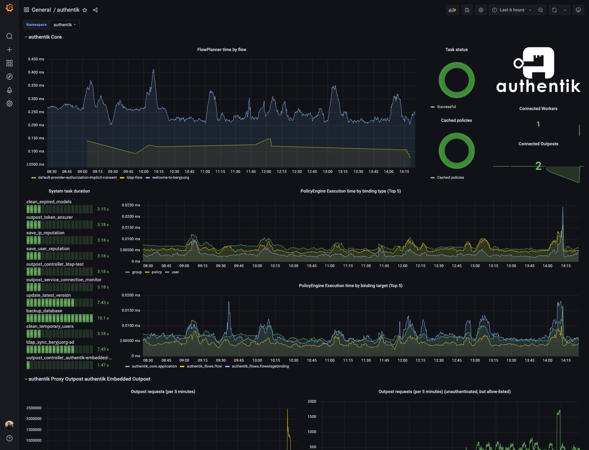

authentik can be easily monitored multiple ways.

## Server monitoring

Configure your monitoring software to send requests to `/-/health/live/`, which will return a HTTP 204 response as long as authentik is running. You can also send HTTP requests to `/-/health/ready/`, which will return HTTP 204 if both PostgreSQL and Redis connections can be/have been established correctly.

## Worker monitoring

The worker container can be monitored by running `ak healthcheck` in the worker container. This will ping the worker and ensure it can communicate with redis as required.

## Outpost monitoring

Both kinds of outpost (proxy and LDAP) listen on a separate port (9300), and can be monitored by sending HTTP requests to `/outpost.goauthentik.io/ping`.

---

Both docker-compose and Kubernetes deployments use these methods by default to determine when authentik is ready after starting, and to only route traffic to healthy instances, and unhealthy instances are restarted

## Metrics

Both the core authentik server and any outposts expose Prometheus metrics on a separate port (9300), which can be scraped to gather further insight into authentik's state. The metrics require no authentication, as they are hosted on a separate, non-exposed port by default.

You can find an example dashboard here: [grafana.com](https://grafana.com/grafana/dashboards/14837-authentik/)

