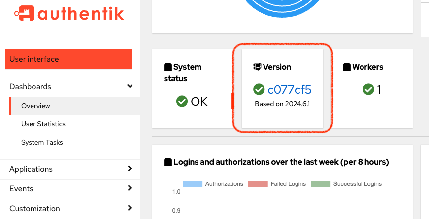

Upgrading to the latest version of authentik, whether a new major release or a patch, involves running a few commands to pull down the latest packages and then restart the servers and databases.

:::warning
The version of the authentik instance and any outposts must be the same. We recommended that you always upgrade any outposts at the same time you upgrade your authentik instance.
:::

import Tabs from "@theme/Tabs";
import TabItem from "@theme/TabItem";

<Tabs
defaultValue="docker-compose"
values={[
{label: 'Docker Compose', value: 'docker-compose'},
{label: 'Kubernetes', value: 'kubernetes'},
]}
groupId="platform">
<TabItem value="docker-compose">
In your terminal, navigate to your installation directory and run the following commands:

```shell
docker compose pull
docker compose up -d
```

  </TabItem>

  <TabItem value="kubernetes">
In your terminal, navigate to your installation directory and run the following commands:

```
helm repo update
helm upgrade authentik authentik/authentik -f values.yaml
```

  </TabItem>
</Tabs>

## Verify your upgrade

You can view the current version of your authentik instance by logging in to the Admin interface, and then navigating to **Dashboards -> Overview**.



## Tips and troubleshooting your upgrade

<Tabs
defaultValue="docker-compose"
values={[
{label: 'Docker Compose', value: 'docker-compose'},
{label: 'Kubernetes', value: 'kubernetes'},
]}
groupId="platform">
<TabItem value="docker-compose">
If you run the upgrade commands but your version on the Dashboard doesn’t change,you might need to make sure the old `authinstall database`` is removed before upgrading.

Run `docker compose down -v`.

  </TabItem>

  <TabItem value="kubernetes">
If you run the upgrade commands but your version on the Dashboard doesn’t change, follow these steps:

1.  Run `helm repo add authentik https://charts.goauthentik.io`
2.  Then run `kubectl rollout restart deployment` to force the system to pick up the latest version.
3.  Finally, run the upgrade commands again:

        `helm repo update

    helm upgrade --install authentik authentik/authentik -f values.yaml`

  </TabItem>
</Tabs>

TODOs:

-   Add link to Release Notes (and from Release Notes to here)

-` Do we need to mention this? "For arm64 platforms, append`-arm64` to the tag name (no spaces)."

-   What other tips and info do they need?
