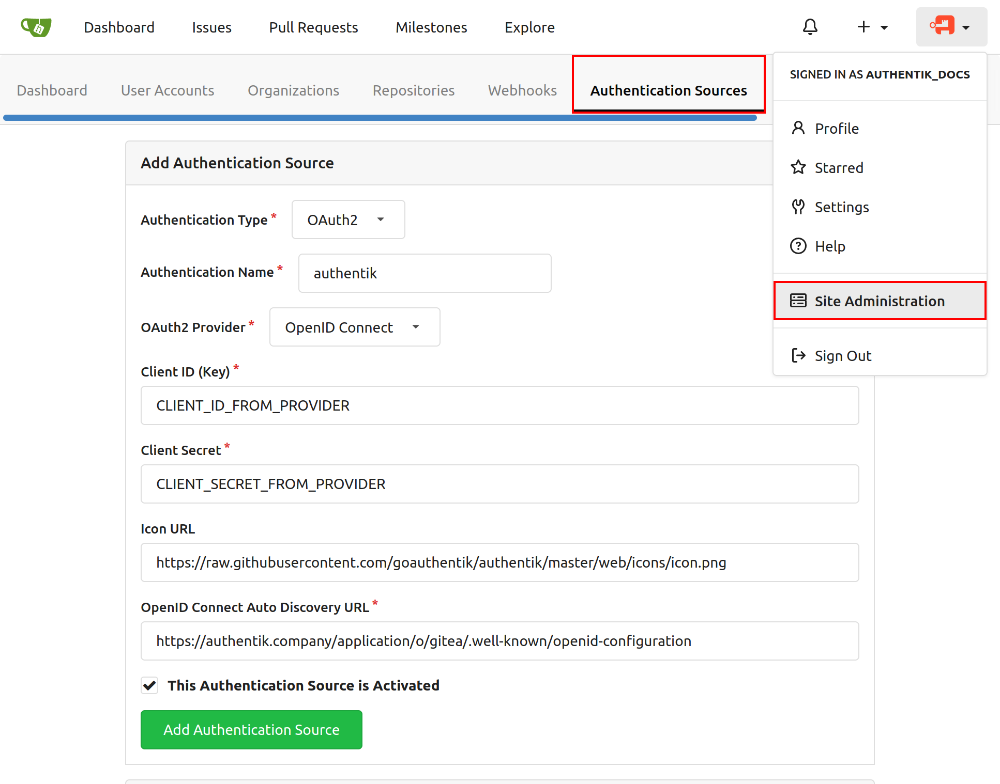

## What is Gitea

From https://gitea.io/

:::note
Gitea is a community managed lightweight code hosting solution written in Go. It is published under the MIT license.
:::

:::note
This is based on authentik 2021.10.3 and Gitea 1.15.6 installed using https://docs.gitea.io/en-us/install-from-binary/. Instructions may differ between versions.
:::

## Preparation

The following placeholders will be used:

- `authentik.company` is the FQDN of authentik.
- `gitea.company` is the FQDN of Gitea.

### Step 1

In authentik, create an _OAuth2/OpenID Provider_ (under _Resources/Providers_) with these settings:

:::note
Only settings that have been modified from default have been listed.
:::

**Protocol Settings**
- Name: Gitea
- RSA Key: authentik Self-signed certificate

:::note
Take note of the `Client ID` and `Client Secret`, you'll need to give them to Gitea in _Step 3_.
:::

### Step 2

In authentik, create an application (under _Resources/Applications_) which uses this provider. Optionally apply access restrictions to the application using policy bindings.

:::note
Only settings that have been modified from default have been listed.
:::

- Name: Gitea
- Slug: gitea-slug
- Provider: Gitea

### Step 3

Navigate to the _Authentication Sources_ page at https://gitea.company/admin/auths and click `Add Authentication Source`

Change the following fields

- Authentication Name: authentik
- OAuth2 Provider: OpenID Connect
- Client ID (Key): Step 2
- Client Secret: Step 2
- Icon URL: https://raw.githubusercontent.com/goauthentik/authentik/master/web/icons/icon.png
- OpenID Connect Auto Discovery URL: https://authentik.company/application/o/gitea-slug/.well-known/openid-configuration

`Add Authentication Source` and you should be done. Your Gitea login page should now have a `Sign in With` followed by the authentik logo which you can click on to sign-in to Gitea with Authentik creds.
