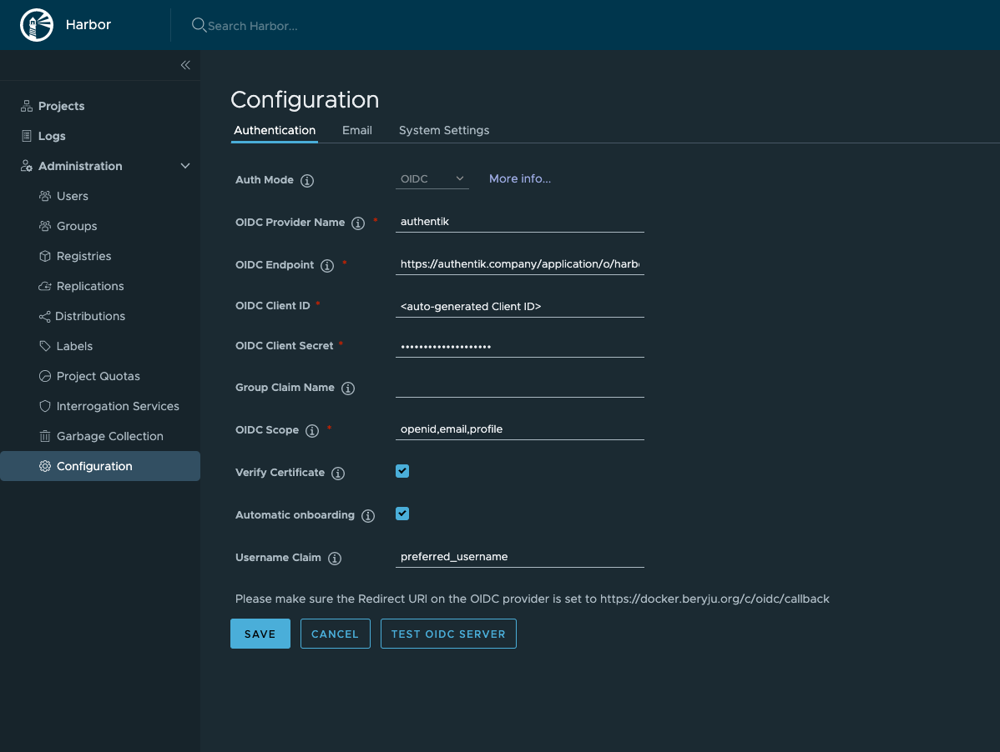

## What is Harbor

From https://goharbor.io

:::note
Harbor is an open source container image registry that secures images with role-based access control, scans images for vulnerabilities, and signs images as trusted. A CNCF Incubating project, Harbor delivers compliance, performance, and interoperability to help you consistently and securely manage images across cloud native compute platforms like Kubernetes and Docker.
:::

## Preparation

The following placeholders will be used:

-   `harbor.company` is the FQDN of the Harbor install.
-   `authentik.company` is the FQDN of the authentik install.

Create an application in authentik. Create an OpenID provider with the following parameters:

-   Client Type: `Confidential`
-   Response types: `code (Authorization Code Flow)`
-   JWT Algorithm: `RS256`
-   Redirect URIs: `https://harbor.company/c/oidc/callback`
-   Scopes: `openid`

## Harbor

