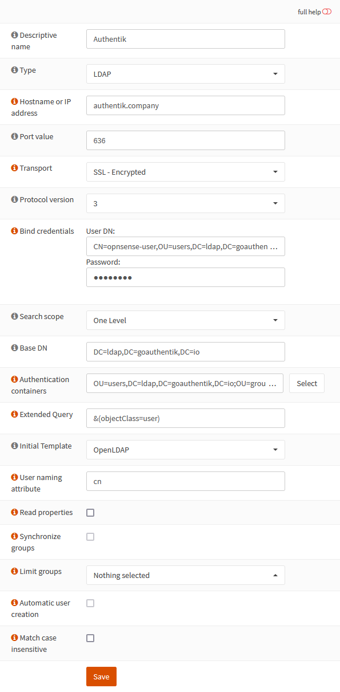

## What is OPNsense

From https://opnsense.org/

:::note
OPNsense is a free and Open-Source FreeBSD-based firewall and routing software. It is licensed under an Open Source Initiative approved license.
:::

:::note
This is based on authentik 2021.10.3 and OPNsense 21.7.4-amd64 installed using https://docs.opnsense.org/manual/install.html. Instructions may differ between versions.
:::

## Preparation

The following placeholders will be used:

- `authentik.company` is the FQDN of authentik.
- `opnsense-user` is the name of the authentik user we'll create.
- `DC=ldap,DC=goauthentik,DC=io` is the Base DN of the LDAP Provider (default)

### Step 1

In authentik, under _Identity & Cryptography/Users_, create a user for OPNsense to use as the LDAP Binder.

Change the password of that user by clicking `Impersonate` on the Users page and going to `Change password` after clicking on the settings cog.

### Step 2

In authentik, under _Resources/Providers_, create an _LDAP Provider_ with these settings:

:::note
Only settings that have been modified from default have been listed.
:::

**Protocol Settings**
- Name: LDAP
- Certificate: authentik Self-signed certificate

### Step 3

Add your authentik LDAP server to OPNsense by going to your OPNsense Web UI and clicking the `+` under _System/Access/Servers_.

Change the following fields

- Descriptive name: authentik
- Hostname or IP address: authentik.company
- Transport: SSL - Encrypted
- Bind credentials
  - User DN: CN=CN=opnsense-user,OU=users,DC=ldap,DC=goauthentik,DC=io
  - Password: whatever-you-set
  - Base DN: DC=ldap,DC=goauthentik,DC=io
- Authentication containers: OU=users,DC=ldap,DC=goauthentik,DC=io;OU=groups,DC=ldap,DC=goauthentik,DC=io
- Extended Query: &(objectClass=user)

### Step 3

In authentik, create an application which uses this provider. Optionally apply access restrictions to the application using policy bindings.

- Name: LDAP
- Slug: ldap
- Provider: LDAP

## Notes

:::note
Secure LDAP more by creating a group for your `DN Bind` users and restricting the `Search group` of the LDAP Provider to them.
:::
