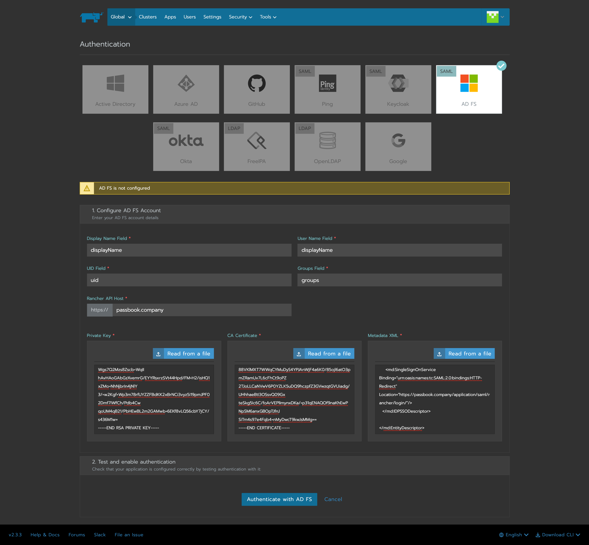

## What is Rancher

From https://rancher.com/products/rancher

:::note
An enterprise platform for managing Kubernetes Everywhere
Rancher is a platform built to address the needs of the DevOps teams deploying applications with Kubernetes, and the IT staff responsible for delivering an enterprise-critical service.
:::

## Preparation

The following placeholders will be used:

-   `rancher.company` is the FQDN of the Rancher install.
-   `authentik.company` is the FQDN of the authentik install.

Create an application in authentik and note the slug, as this will be used later. Create a SAML provider with the following parameters:

-   ACS URL: `https://rancher.company/v1-saml/adfs/saml/acs`
-   Audience: `https://rancher.company/v1-saml/adfs/saml/metadata`
-   Issuer: `authentik`

You can of course use a custom signing certificate, and adjust durations.

## Rancher

