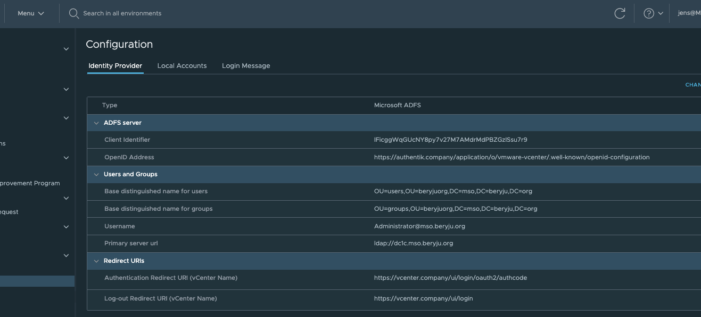

## What is vCenter

From https://en.wikipedia.org/wiki/VCenter

:::note
vCenter Server is the centralized management utility for VMware, and is used to manage virtual machines, multiple ESXi hosts, and all dependent components from a single centralized location. VMware vMotion and svMotion require the use of vCenter and ESXi hosts.
:::

:::warning
This requires passbook 0.10.3 or newer.
:::

:::warning
This requires VMware vCenter 7.0.0 or newer.
:::

:::note
It seems that the vCenter still needs to be joined to the Active Directory Domain, otherwise group membership does not work correctly. We're working on a fix for this, for the meantime your vCenter should be part of your Domain.
:::

## Preparation

The following placeholders will be used:

-   `vcenter.company` is the FQDN of the vCenter server.
-   `passbook.company` is the FQDN of the passbook install.

Since vCenter only allows OpenID-Connect in combination with Active Directory, it is recommended to have passbook sync with the same Active Directory.

### Step 1

Under _Property Mappings_, create a _Scope Mapping_. Give it a name like "OIDC-Scope-VMware-vCenter". Set the scope name to `openid` and the expression to the following

```python
return {
  "domain": "<your active directory domain>",
}
```

### Step 2

:::note
If your Active Directory Schema is the same as your Email address schema, skip to Step 3.
:::

Under _Sources_, click _Edit_ and ensure that "Autogenerated Active Directory Mapping: userPrincipalName -> attributes.upn" has been added to your source.

### Step 3

Under _Providers_, create an OAuth2/OpenID Provider with these settings:

-   Client Type: Confidential
-   Response Type: code (ADFS Compatibility Mode, sends id_token as access_token)
-   JWT Algorithm: RS256
-   Redirect URI: `https://vcenter.company/ui/login/oauth2/authcode`
-   Post Logout Redirect URIs: `https://vcenter.company/ui/login`
-   Sub Mode: If your Email address Schema matches your UPN, select "Based on the User's Email...", otherwise select "Based on the User's UPN...".
-   Scopes: Select the Scope Mapping you've created in Step 1


### Step 4

Create an application which uses this provider. Optionally apply access restrictions to the application.

Set the Launch URL to `https://vcenter.company/ui/login/oauth2`. This will skip vCenter's User Prompt and directly log you in.

## vCenter Setup

Login as local Administrator account (most likely ends with vsphere.local). Using the Menu in the Navigation bar, navigate to _Administration -> Single Sing-on -> Configuration_.

Click on _Change Identity Provider_ in the top-right corner.

In the wizard, select "Microsoft ADFS" and click Next.

Fill in the Client Identifier and Shared Secret from the Provider in passbook. For the OpenID Address, click on _View Setup URLs_ in passbook, and copy the OpenID Configuration URL.

On the next page, fill in your Active Directory Connection Details. These should be similar to what you have set in passbook.



If your vCenter was already setup with LDAP beforehand, your Role assignments will continue to work.
