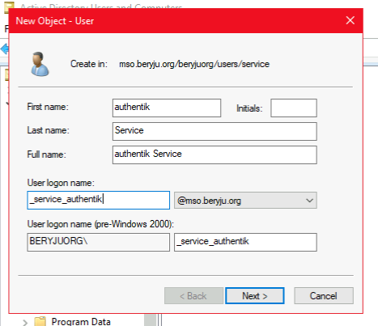
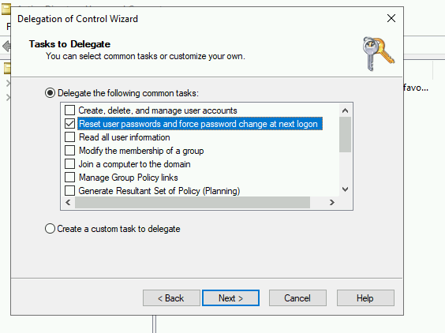

## Preparation

The following placeholders will be used:

-   `ad.company` is the Name of the Active Directory domain.
-   `authentik.company` is the FQDN of the authentik install.

## Active Directory Setup

1. Open Active Directory Users and Computers

2. Create a user in Active Directory, matching your naming scheme

    

3. Give the User a password, generated using for example `pwgen 64 1`.

4. Open the Delegation of Control Wizard by right-clicking the domain.

5. Select the authentik service user you've just created.

6. Ensure the "Reset user password and force password change at next logon" Option is checked.

    

## authentik Setup

In authentik, create a new LDAP Source in Administration -> Sources.

Use these settings:

-   Server URI: `ldap://ad.company`

    For authentik to be able to write passwords back to Active Directory, make sure to use `ldaps://`

-   Bind CN: `<name of your service user>@ad.company`
-   Bind Password: The password you've given the user above
-   Base DN: The base DN which you want authentik to sync
-   Property Mappings: Shift-Select all

The other settings might need to be adjusted based on the setup of your domain.

-   Addition User/Group DN: Additional DN which is _prepended_ to your Base DN for user synchronization.
-   Addition Group DN: Additional DN which is _prepended_ to your Base DN for group synchronization.
-   User object filter: Which objects should be considered users.
-   Group object filter: Which objects should be considered groups.
-   Group membership field: Which user field saves the group membership
-   Object uniqueness field: A user field which contains a unique Identifier
-   Sync parent group: If enabled, all synchronized groups will be given this group as a parent.

After you save the source, a synchronization will start in the background. When its done, you cen see the summary on the System Tasks page.

To finalise the Active Directory setup, you need to enable the backend "authentik LDAP" in the Password Stage.

