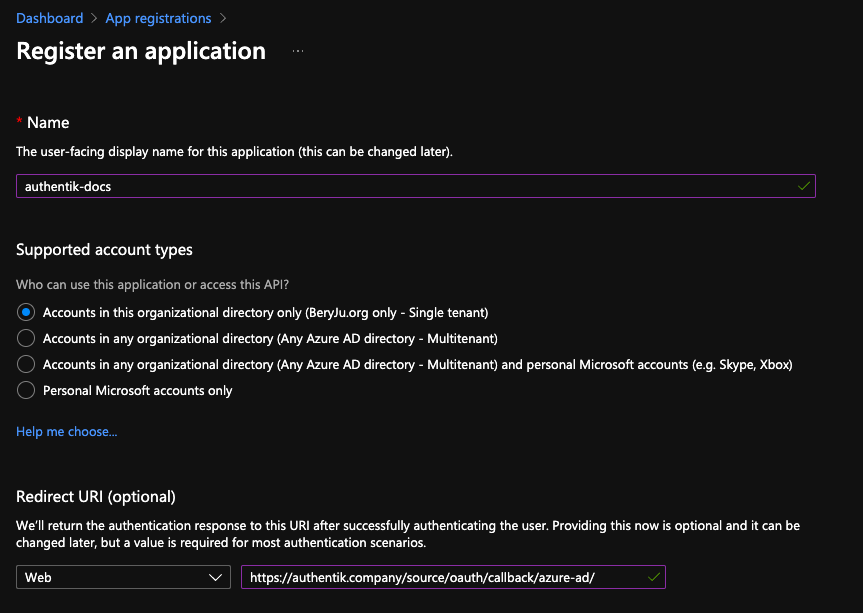
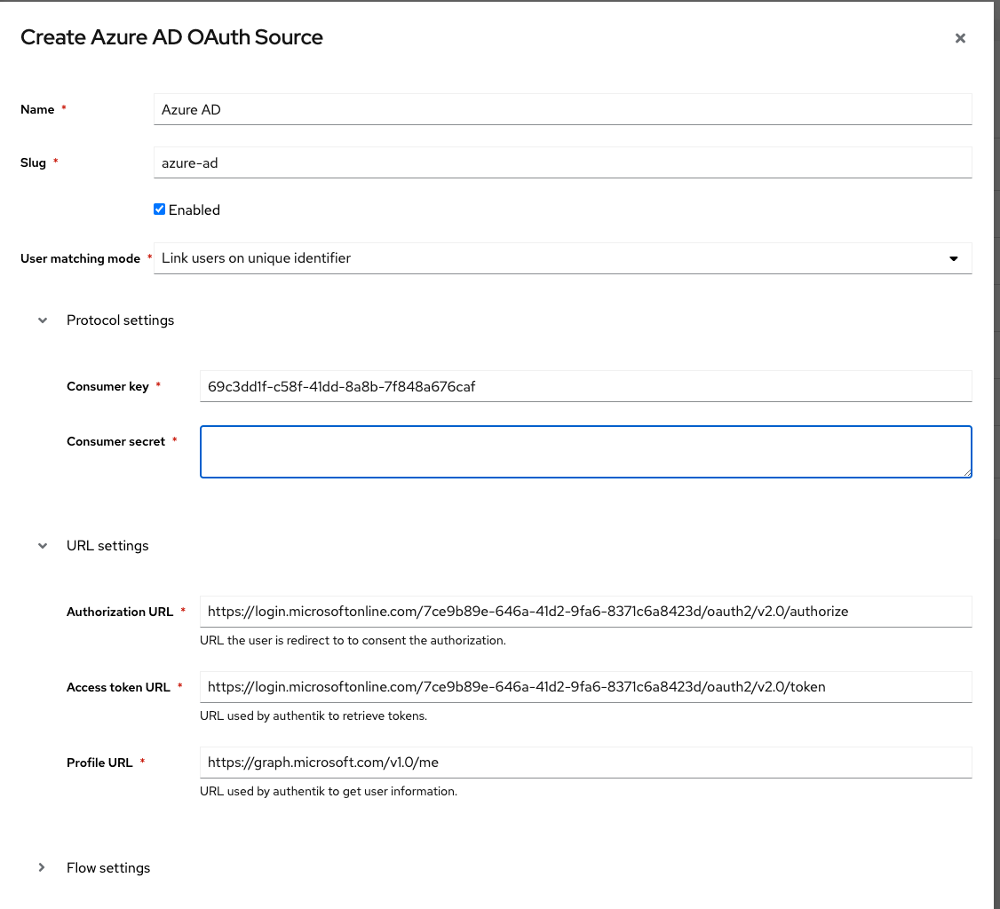

## Preparation

The following placeholders will be used:

- `authentik.company` is the FQDN of the authentik install.

## Azure setup

1. Navigate to [portal.azure.com](https://portal.azure.com), and open the *App registration* service
2. Register a new application

    Under *Supported account types*, select whichever account type applies to your use-case.

    
3. Take note of the *Application (client) ID* value.

    If you selected *Single tenant* in the *Supported account types* prompt, also note the *Directory (tenant) ID* value.
4. Navigate to *Certificates & secrets* in the sidebar, and to the *Client secrets* tab.
5. Add a new secret, with an identifier of your choice, and select any expiration. Currently the secret in authentik has to be rotated manually or via API, so it is recommended to choose at least 12 months.
6. Note the secret's value in the *Value* column.

## authentik Setup

In authentik, create a new *Azure AD OAuth Source* in Resources -> Sources.

Use the following settings:

- Name: `Azure AD`
- Slug: `azure-ad` (this must match the URL being used above)
- Consumer key: `*Application (client) ID* value from above`
- Consumer secret: `*Value* of the secret from above`

If you kept the default *Supported account types* selection of *Single tenant*, then you must change the URLs below as well:

- Authorization URL: `https://login.microsoftonline.com/*Directory (tenant) ID* from above/oauth2/v2.0/authorize`
- Access token URL: `https://login.microsoftonline.com/*Directory (tenant) ID* from above/oauth2/v2.0/token`

Save, and you now have Azure AD as a source.

:::note
For more details on how-to have the new source display on the Login Page see [here](../index).
:::
