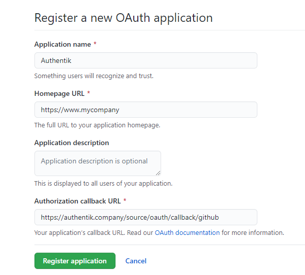
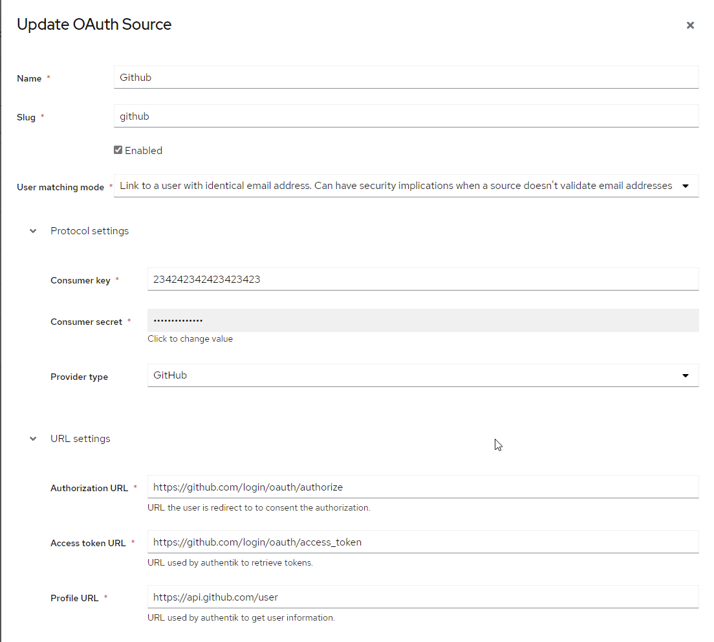

Allows users to authenticate using their Github credentials

## Preparation

The following placeholders will be used:

- `authentik.company` is the FQDN of the authentik install.
- `www.my.company` Homepage URL for your site

## Github

1. Create an OAuth app under Developer Settings https://github.com/settings/developers by clicking on the **Register a new application**

2. **Application Name:** Choose a name users will recognize ie: Authentik
3. **Homepage URL**:: www.my.company
4. **Authorization callback URL**: https://authentik.company/source/oauth/callback/github
5. Click **Register Application**

Example screenshot

6. Copy the **Client ID** and _save it for later_
7. Click **Generate a new client secret** and _save it for later_  You will not be able to see the secret again, so be sure to copy it now.  

## Authentik

8. Under _Resources -> Sources_ Click **Create Github OAuth Source**

9. **Name**: Choose a name (For the example I use Github)
10. **Slug**: github (If you choose a different slug the URLs will need to be updated to reflect the change)
11.  **Consumer Key:** Client ID from step 6
12. **Consumer Secret:** Client Secret from step 7
13. **Provider Type:** Github

Expand URL settings:

:::note
As of June 20 2021 these URLS are correct. Here is the Github reference URL https://docs.github.com/en/developers/apps/building-oauth-apps/authorizing-oauth-apps
:::

14. **Authorization URL:** `https://github.com/login/oauth/authorize`
15. **Access token URL:** `https://github.com/login/oauth/access_token`
16. **Profile URL:** `https://api.github.com/user`

Here is an exmple of a complete Authentik Github OAuth Source

Save, and you now have Github as a source.

:::note
For more details on how-to have the new source display on the Login Page see the Sources page
:::
