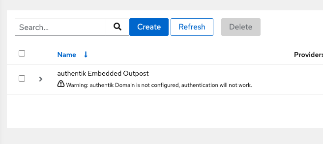

Starting with 2021.8.1, authentik comes with an embedded outpost. This has been added to simplify deployment for users using the Proxy provider.

The embedded outpost runs in the main `server` container, and is managed by authentik itself. The embedded outpost authenticates itself via the secret key.

You can access the embedded outpost on the same ports as authentik itself, 9000 and 9443.

The embedded outpost cannot be disabled, if it doesn't make sense to use it in your deployment you can simply ignore it.

### Configuration

Since the outpost uses OAuth2, there is some configuration required.

On a fresh authentik install, your Outpost list will look like this:

Click the edit button on the right of the column, and set the value of `authentik_host` to the URL you want to login with.
Make sure to set it to full URL, only configuring a hostname or FQDN will not work.

### Routing

Routing is handled like this:

1. Paths starting with `/static`, `/media` and `/help` return packaged CSS/JS files, and user-uploaded media files.
2. Paths starting with `/outpost.goauthentik.io` are sent to the embedded outpost.
3. Any hosts configured in the providers assigned to the embedded outpost are sent to the outpost.
4. Everything remaining is sent to the authentik backend server.

### Differences

There are a few more differences between managed outposts and the embedded outpost, mainly due to the fact that authentik can't fully manage the containers.

1. (Docker-only) No automatic traefik labels are added to the server container.

    When you deploy a managed outpost on docker, the container has several labels to automatically configure traefik. This is not done for the embedded outpost.

2. (Kubernetes-only) An additional service is created.

    Since authentik does not know what the normal authentik Service is called, another one is created with a common set of labels that is always set.
