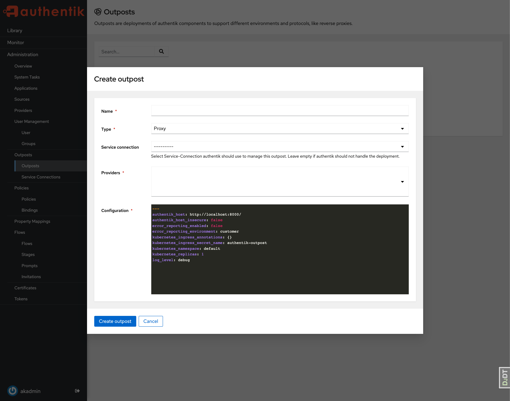

An outpost is a single deployment of an authentik component, which can be deployed in a completely separate environment:

-   [LDAP Provider](../providers/ldap/index.md)
-   [Proxy Provider](../providers/proxy/index.md)
-   [RADIUS Provider](../providers/radius/index.md)

Upon creation, a service account and a token is generated. The service account only has permissions to read the outpost and provider configuration. This token is used by the Outpost to connect to authentik.

authentik can manage the deployment, updating and general lifecycle of an Outpost. To communicate with the underlying platforms on which the outpost is deployed, authentik has several built-in integrations.

-   If you've deployed authentik on docker-compose, authentik automatically creates an integration for the local docker socket (See [Docker](./integrations/docker.md)).
-   If you've deployed authentik on Kubernetes, with `kubernetesIntegration` set to true (default), authentik automatically creates an integrations for the local Kubernetes Cluster (See [Kubernetes](./integrations/kubernetes.md)).

To deploy an outpost with these integrations, simply select them during the creation of an Outpost. A background task is started, which creates the container/deployment. You can see that Status on the System Tasks page.

To deploy an outpost manually, see:

-   [Kubernetes](./manual-deploy-kubernetes.md)
-   [docker-compose](./manual-deploy-docker-compose.md)

## Configuration

Outposts fetch their configuration from authentik. Below are all the options you can set, and how they influence the outpost.

import Configuration from "./_config.md";

<Configuration />

## Metrics

Each authentik outpost has a Prometheus metrics endpoint accessible under port `:9300/metrics`. This endpoint is not mapped via docker, as the endpoint doesn't have any authentication.

For the embedded outpost, the metrics of the outpost and the metrics of the core authentik server are both returned under the same endpoint.
