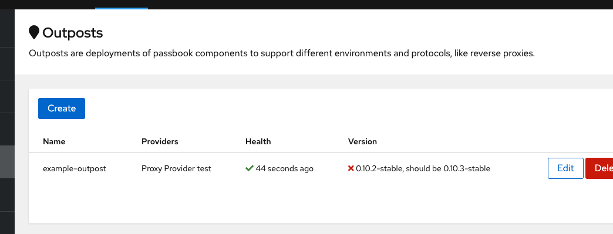

In the Outpost Overview list, you'll see if any deployed outposts are out of date.

To upgrade the Outpost to the latest version, simply adjust the docker tag of the outpost to the new version.

Since the configuration is managed by authentik, that's all you have to do.
