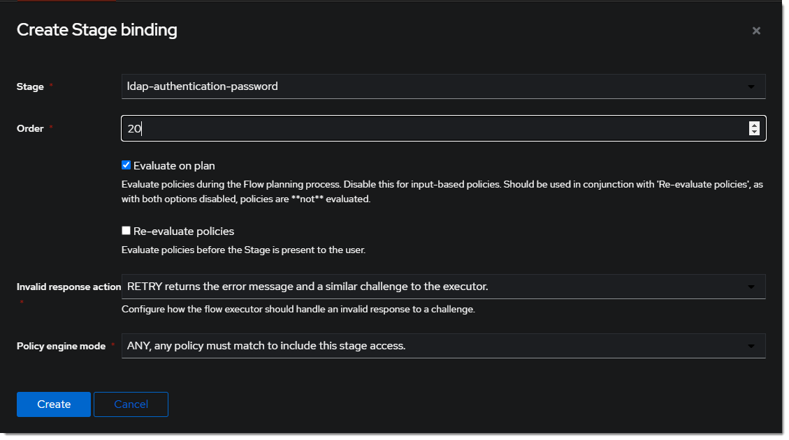

### Create User/Group

1. Create a new user account to test ldap bind. `Directory > Users > Create` In this example `ldapservice`.
   Note the DN is `cn=ldapservice,ou=users,dc=ldap,dc=goauthentik,dc=io`
2. Create a new group for ldap searches. In this example `ldapsearch`. Add the `ldapservice` user to this new group.

:::info
Note: The `default-authentication-flow` can have mult-factor authenticator(s) configured. This will not work with ldap for authentication. To account for this, create a new authenication flow, with 3 stages, dedicated to ldap.
:::

### Create Custom Stages

1. Create a new identification stage. `Flows & Stage > Stages > Create`
   
2. Name it something meaningful like `ldap-identification-stage`. Select User fields Username and Email (and UPN if it is relevant to your setup).
   
3. Create a new password stage. `Flows & Stage > Stages > Create`
   
4. Name it something meaningful like `ldap-authentication-password`. Leave the defaults for Backends.
   
5. Create a new user login stage. `Flows & Stage > Stages > Create`
   
6. Name it something meaningful like `ldap-authentication-login`.
   

### Create Custom Flow

1. Create a new authentication flow. `Flows & Stage > Flows > Create`. Name it something meaningful like `ldap-authentication-flow`
   
2. Click the newly created flow and choose `Stage Bindings`.
   
3. Click `Bind Stage` choose `ldap-identification-stage` and set the order to `10`.
   
4. Click `Bind Stage` choose `ldap-authentication-password` and set the order to `20`.
   
5. Click `Bind Stage` choose `ldap-authentication-login` and set the order to `30`.
   
6. Edit the `ldap-identification-stage`.
   
7. Change the Password stage to `ldap-authentication-password`.
   

### Create LDAP Provider

1. Create the LDAP Provider. `Applications > Providers > Create`
   
2. Name is something meaningful like `LDAP`, bind the custom flow created previously and specifiy the search group created earlier.
   

### Create LDAP Application

1. Create the LDAP Application. `Applications > Applications > Create`. Name it something meaningful like `LDAP`. Choose the provider created in the previous step.
   

### Create LDAP Outpost

1. Create (or update) the LDAP Outpost `Applications > Outposts > Create`. Type is `LDAP` and choose the `LDAP` application created in the previous step.
   :::info
   Note: There can only be one local LDAP provider, but many LDAP outposts.
   :::
   

### ldapsearch Test

Test connectivity by using ldapsearch `sudo apt-get install ldap-utils -y`(install command for Debian-based systems)

```
ldapsearch \
  -x \
  -h <ldap ip address> \
  -p 389 \ # Production should use SSL 636
  -D 'cn=ldapservice,ou=users,DC=ldap,DC=goauthentik,DC=io' \
  -w '<ldapuserpassword>' \
  -b 'DC=ldap,DC=goauthentik,DC=io' \
  '(objectClass=user)'
```

:::info
Note: This query will NOT log an event in the `Events > Logs` area if it is successful. To validate connectivity, run the query, but use an incorrect password. This will log a failed login attempt.
:::
