### Create User/Group

1. Create a new user account to bind with under _Directory_ -> _Users_ -> _Create_, in this example called `ldapservice`.

    Note the DN of this user will be `cn=ldapservice,ou=users,dc=ldap,dc=goauthentik,dc=io`

2. Create a new group for LDAP searches. In this example `ldapsearch`. Add the `ldapservice` user to this new group.

:::info
Note: The `default-authentication-flow` validates MFA by default, and currently everything but SMS-based devices are supported by LDAP. If you plan to use only dedicated service accounts to bind to LDAP, or don't use SMS-based authenticators, then you can use the default flow and skip the extra steps below and continue at [Create LDAP Provider](#create-ldap-provider)
:::

### LDAP Flow

#### Create Custom Stages

1. Create a new identification stage. _Flows & Stage_ -> _Stages_ -> _Create_
   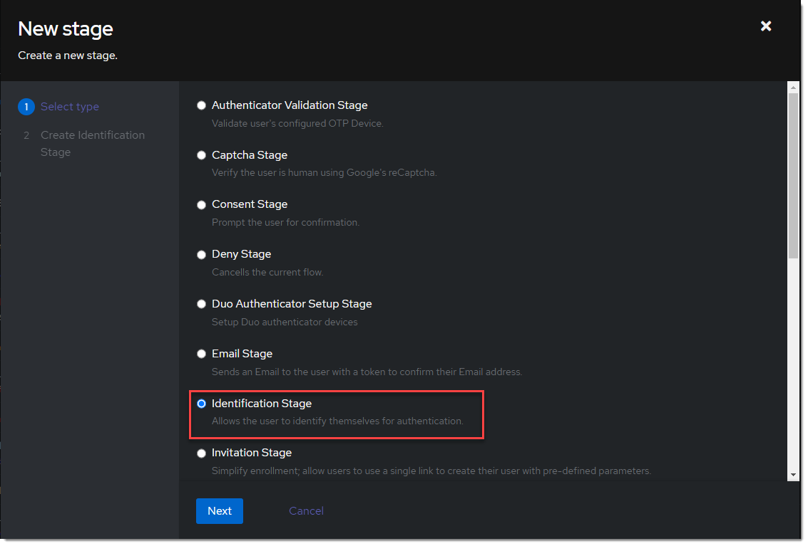
2. Name it something meaningful like `ldap-identification-stage`. Select User fields Username and Email (and UPN if it is relevant to your setup).
   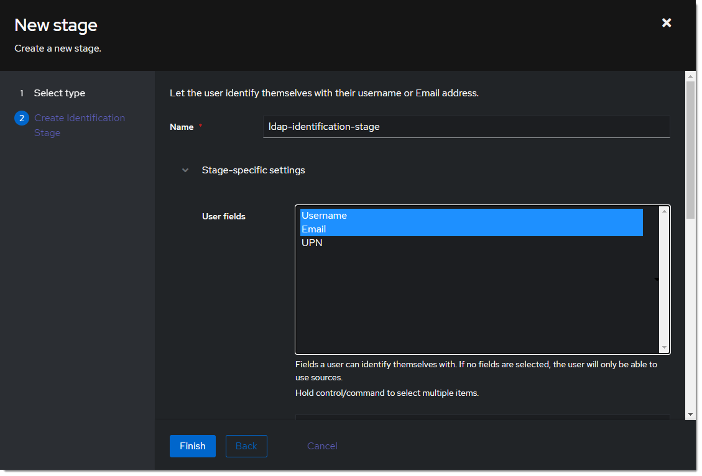
3. Create a new password stage. _Flows & Stage_ -> _Stages_ -> _Create_
   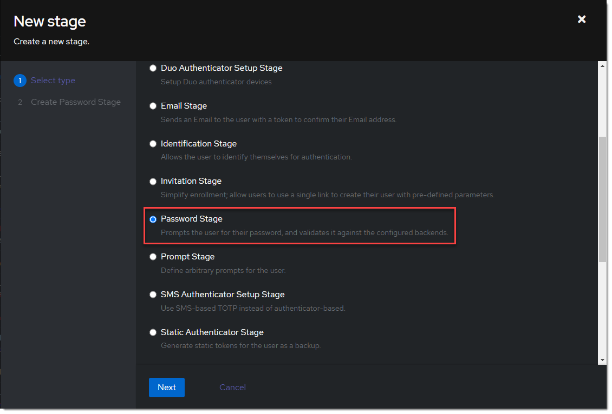
4. Name it something meaningful like `ldap-authentication-password`. Leave the defaults for Backends.
   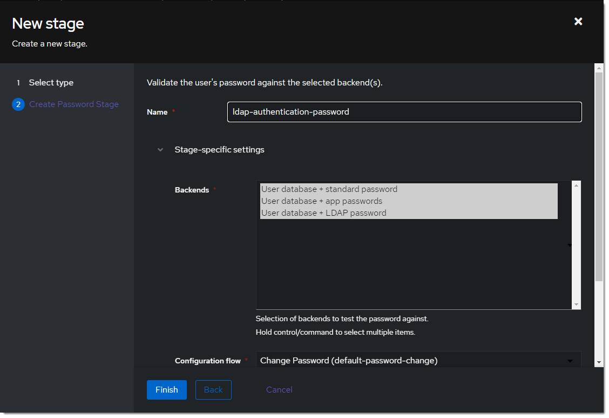
5. Create a new user login stage. _Flows & Stage_ -> _Stages_ -> _Create_
   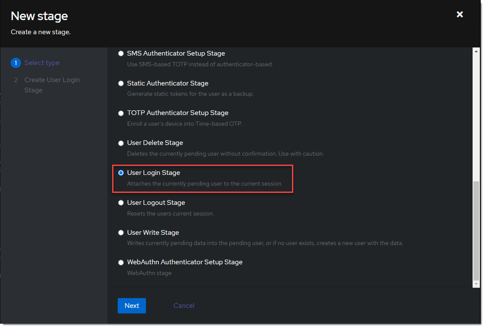
6. Name it something meaningful like `ldap-authentication-login`.
   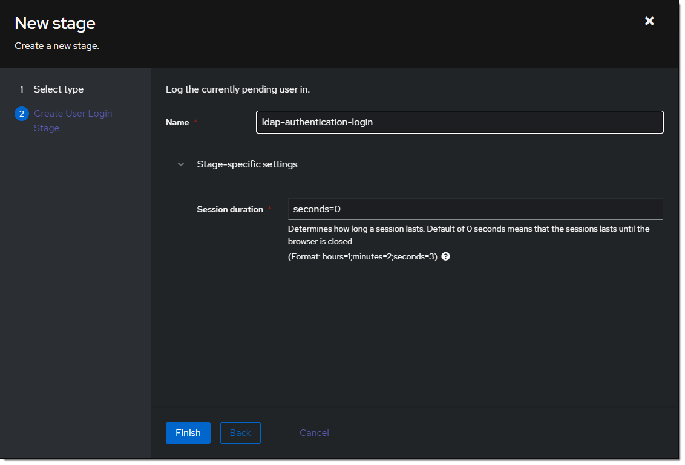

#### Create Custom Flow

1. Create a new authentication flow under _Flows & Stage_ -> _Flows_ -> _Create_, and name it something meaningful like `ldap-authentication-flow`
   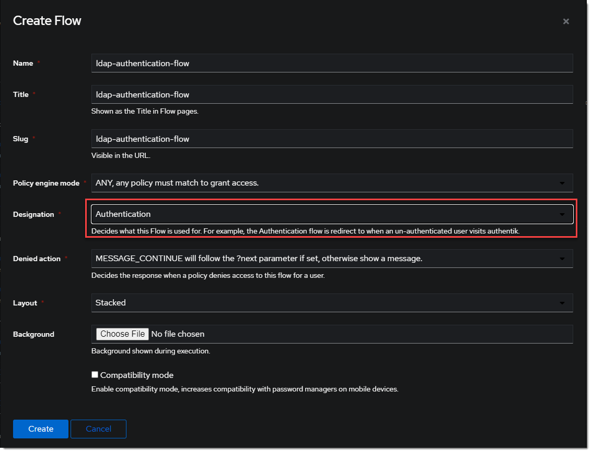
2. Click the newly created flow and choose _Stage Bindings_.
   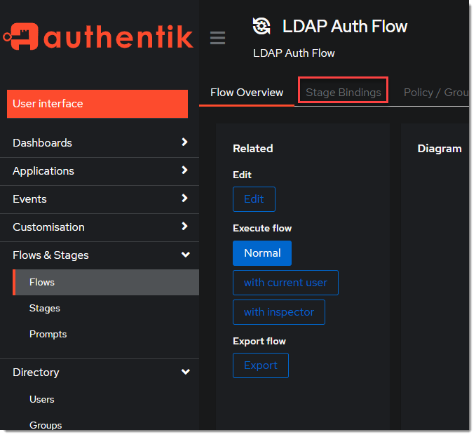
3. Click `Bind Stage` choose `ldap-identification-stage` and set the order to `10`.
   
4. Click `Bind Stage` choose `ldap-authentication-login` and set the order to `30`.
   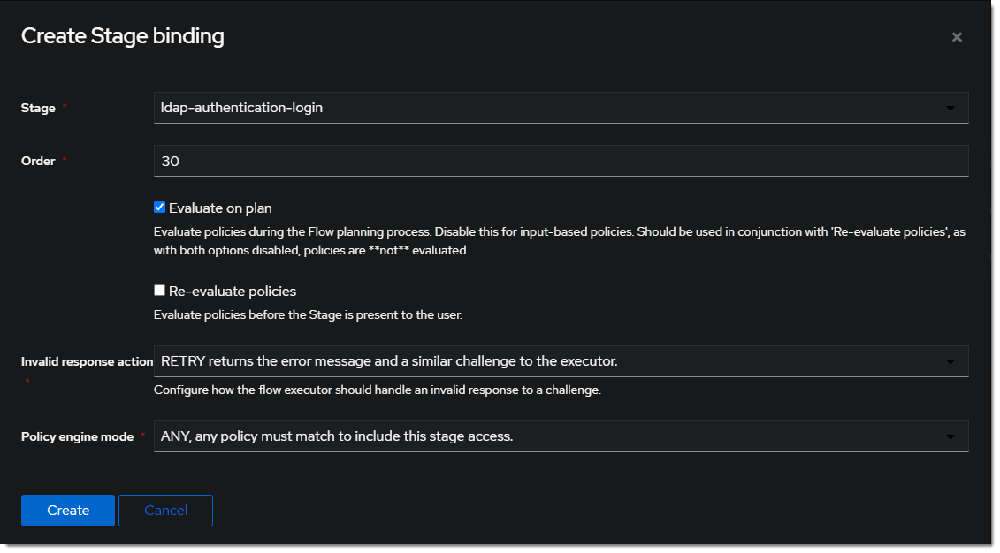
5. Edit the `ldap-identification-stage`.
   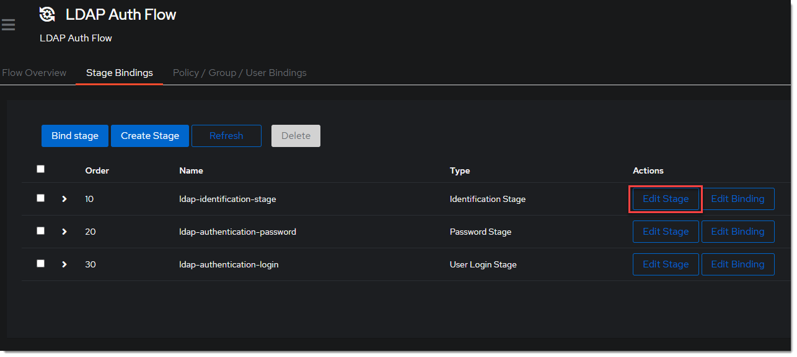
6. Change the Password stage to `ldap-authentication-password`.
   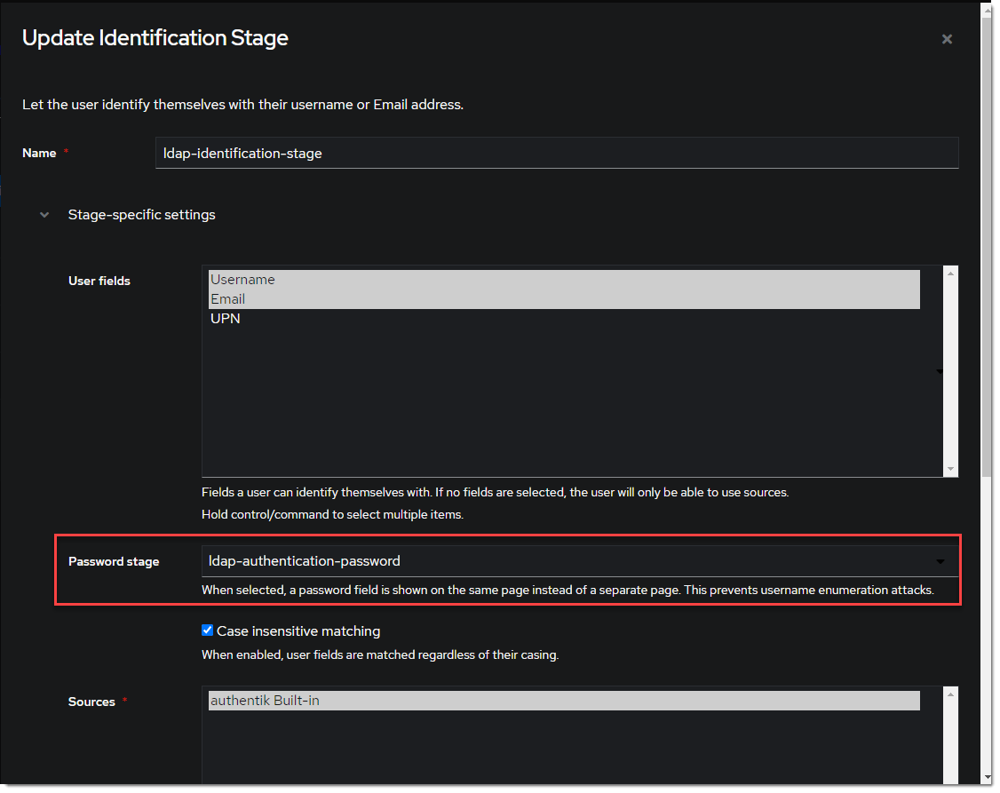

### Create LDAP Provider

1. Create the LDAP Provider under _Applications_ -> _Providers_ -> _Create_.
   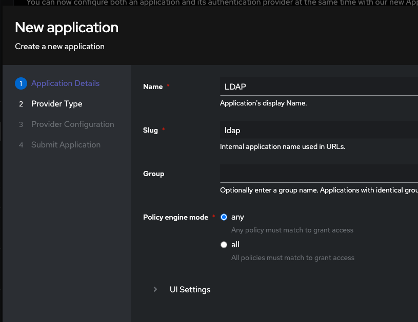
2. Name is something meaningful like `LDAP`, bind the custom flow created previously (or the default flow, depending on setup) and specify the search group created earlier.
   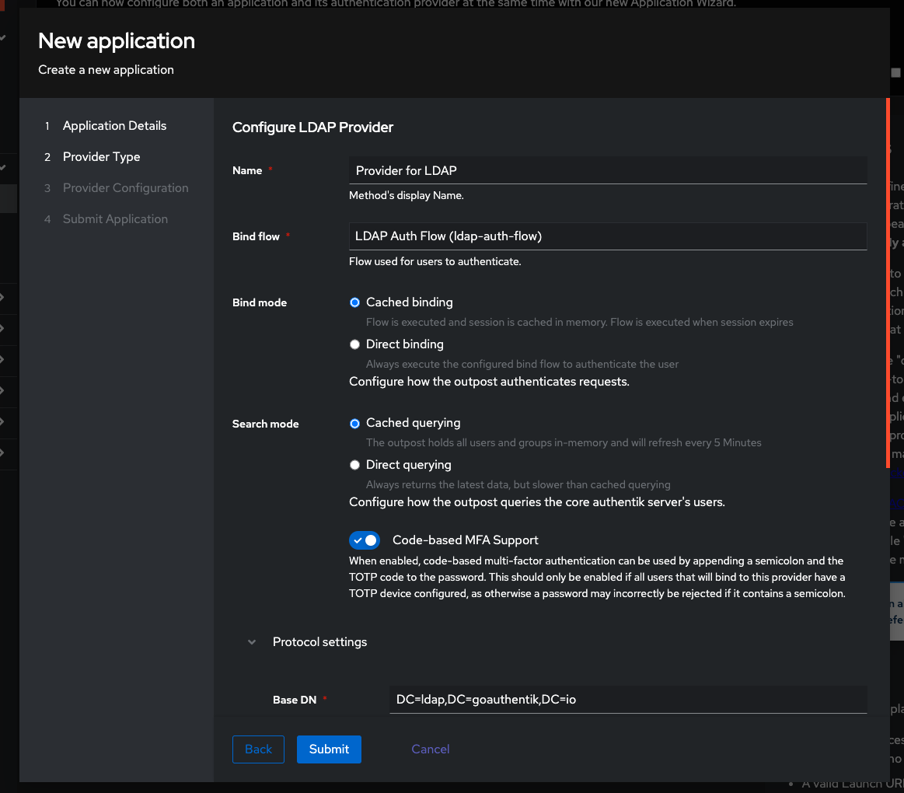

### Create LDAP Application

1. Create the LDAP Application under _Applications_ -> _Applications_ -> _Create_ and name it something meaningful like `LDAP`. Choose the provider created in the previous step.
   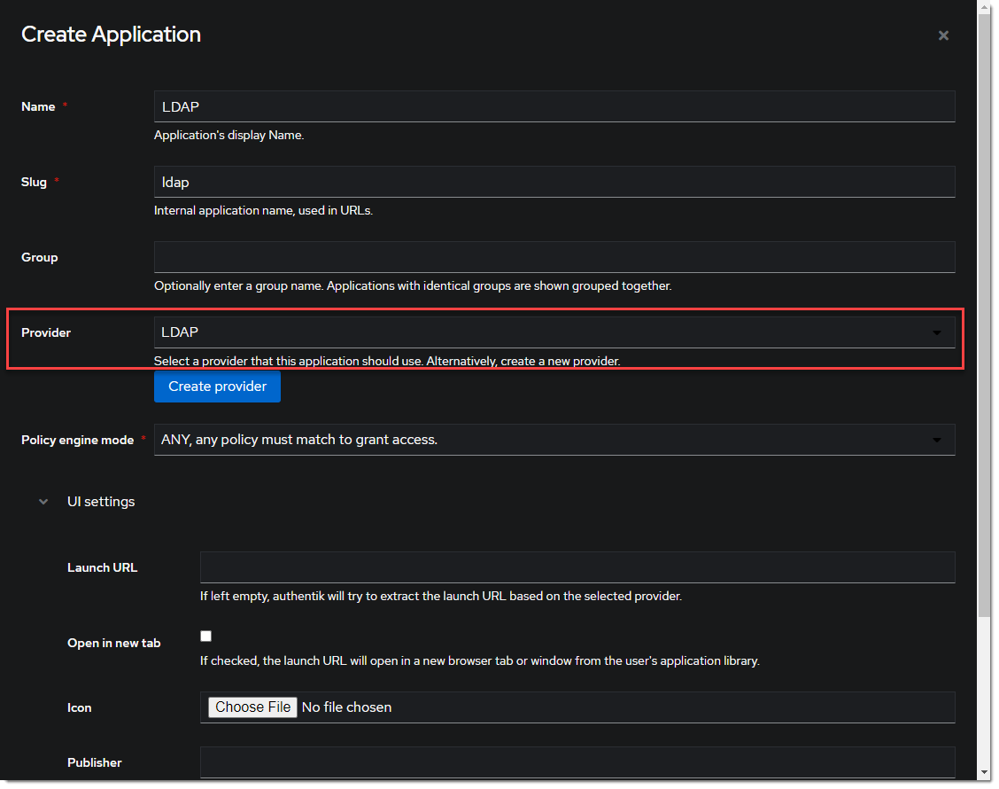

### Create LDAP Outpost

1. Create (or update) the LDAP Outpost under _Applications_ -> _Outposts_ -> _Create_. Set the Type to `LDAP` and choose the `LDAP` application created in the previous step.
   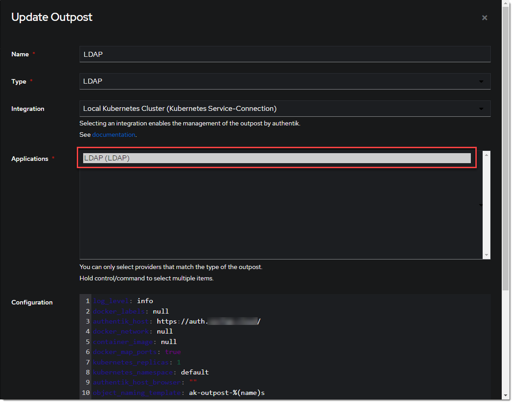

:::info
The LDAP Outpost selects different providers based on their Base DN. Adding multiple providers with the same Base DN will result in inconsistent access
:::

### ldapsearch Test

Test connectivity by using ldapsearch.

:::info
ldapsearch can be installed on Linux system with these commands

```
sudo apt-get install ldap-utils -y # Debian-based systems
sudo yum install openldap-clients -y # CentOS-based systems
```

:::

```
ldapsearch \
  -x \
  -H ldap://<LDAP Outpost IP address>:<Port number 389> \ # In production it is recommended to use SSL, which also requires `ldaps://` as the protocol and the SSL port
  -D 'cn=ldapservice,ou=users,DC=ldap,DC=goauthentik,DC=io' \
  -w '<ldapuserpassword>' \
  -b 'DC=ldap,DC=goauthentik,DC=io' \
  '(objectClass=user)'
```

:::info
This query will log the first successful attempt in an event in the _Events_ -> _Logs_ area, further successful logins from the same user are not logged as they are cached in the outpost.
:::
