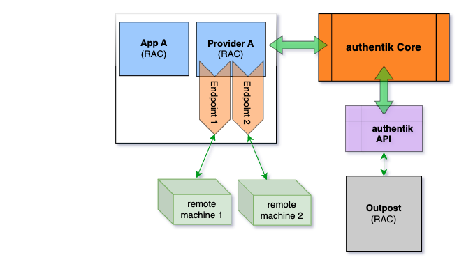

Enterprise

---

:::info
This feature is in technical preview, so please report any bugs on [GitHub](https://github.com/goauthentik/authentik/issues).
:::

:::info
This provider requires the deployment of the [RAC Outpost](../../outposts/).
:::

## About the Remote Access Control (RAC) Provider

The RAC provider allows users to access remote Windows, macOS, and Linux machines via [RDP](https://en.wikipedia.org/wiki/Remote_Desktop_Protocol)/[SSH](https://en.wikipedia.org/wiki/Secure_Shell)/[VNC](https://en.wikipedia.org/wiki/Virtual_Network_Computing). Just like other providers in authentik, the RAC provider is associated with an application that appears on a user's **My applications** page.

:::info
Note that with RAC, you create a single application that serves to connect with *all remote machines* that you want to configure for access via RAC.
:::

For instructions on creating a RAC provider, refer to the [Managing RAC providers](./how-to-rac.md) documentation. You can also view our [video on YouTube](https://www.youtube.com/watch?v=9wahIBRV6Ts) for setting up a RAC.

There are several components used with a RAC provider; let's take a closer look at the high-level configuration layout of these components and how they are managed using endpoints and connections.

The provider-application pair, the authentik server, and the authentik API are typical to all configurations. With RAC, there are some new components, namely the endpoints, the outpost, and of course the target remote machines.

When a user starts the RAC application, the app communicates with the authentik server, which then connects to an instance of the outpost (the exact instance is selected dynamically based on connection load). After the outpost is selected, then the authentik server sends the outpost the instructions (based on the data you defined in the endpoint) required to connect to the remote machine.

After the connection to the remote machine is made, the outpost sends a message back to the authentik server (via websockets), and the web browser opens the websocket connection to the remote machine.

### Endpoints

Unlike other providers, where one provider-application pair must be created for each resource you wish to access, the RAC provider handles this slightly differently. For each remote machine (computer/server) that should be accessible, you create an _Endpoint_ object within a single RAC provider. (And as mentioned above, a single provider-application pair is used for all remote connections.)

The _Endpoint_ object specifies the hostname/IP of the machine to connect to, as well as the protocol to use. Additionally it is possible to bind policies to _endpoint_ objects to restrict access. Users must have access to both the application that the RAC Provider is using as well as the individual endpoint.

Configuration such as credentials can be specified through _settings_, which can be specified on different levels and are all merged together when connecting:

1. Provider settings
2. Endpoint settings
3. Connection settings (see [Connections](#connections))
4. Provider property mapping settings
5. Endpoint property mapping settings

### Connections

Each connection is authorized through the policies that are bound to the application and the endpoint, and additional verification can be done with the authorization flow.

Additionally it is possible to modify the connection settings through the authorization flow. Configuration set in `connection_settings` in the flow plan context will be merged with other settings as shown above.

A new connection is created every time an endpoint is selected in the [User Interface](../../interfaces/user/customization.mdx). Once the user's authentik session expires, the connection is terminated. Additionally, the connection timeout can be specified in the provider, which applies even if the user is still authenticated. The connection can also be terminated manually.

## Capabilities

The following features are currently supported:

-   Bi-directional clipboard
-   Audio redirection (from remote machine to browser)
-   Resizing
