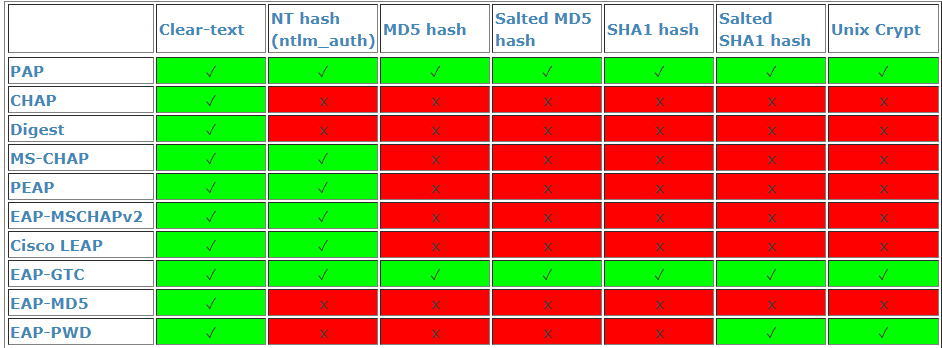

:::info
This feature is still in technical preview, so please report any Bugs you run into on [GitHub](https://github.com/goauthentik/authentik/issues)
:::

You can configure a Radius Provider for applications that don't support any other protocols or require Radius.

:::info
This provider requires the deployment of the [RADIUS Outpost](../../outposts/)
:::

Currently, only authentication requests are supported.

### Authentication flow

Authentication requests against the Radius Server use a flow in the background. This allows you to use the same policies and flows as you do for web-based logins.

The following stages are supported:

-   [Identification](../../flow/stages/identification/index.md)
-   [Password](../../flow/stages/password/index.md)
-   [Authenticator validation](../../flow/stages/authenticator_validate/index.md)

    Note: Authenticator validation currently only supports DUO, TOTP and static authenticators.

    For code-based authenticators, the code must be given as part of the bind password, separated by a semicolon. For example for the password `example-password` and the code `123456`, the input must be `example-password;123456`.

    SMS-based authenticators are not supported as they require a code to be sent from authentik, which is not possible during the bind.

-   [User Logout](../../flow/stages/user_logout.md)
-   [User Login](../../flow/stages/user_login/index.md)
-   [Deny](../../flow/stages/deny.md)

### Limitations

The RADIUS provider only supports the clear-text protocol:

This does not mean that passwords are stored in cleartext, they are hashed and salted in authentik. However as all protocols besides Clear-text, EAP-MD5 and EAP-PWD require the password to be stored in the database in clear text, they are not supported.
